# Embeddings and Retrieval

> Category: AI | Version: 1.0 | Date: June 2026 | Status: Active

How Hivemind produces and stores 768-dimensional sentence embeddings for session messages and wiki summaries, and how those vectors enable hybrid semantic-plus-lexical recall from the VFS.

**Related:**
- [`session-capture.md`](session-capture.md)
- [`wiki-summary-workers.md`](wiki-summary-workers.md)
- [`../data/memory-virtual-filesystem.md`](../data/memory-virtual-filesystem.md)
- [`../data/deeplake-tables-schema.md`](../data/deeplake-tables-schema.md)
- [`../architecture/system-overview.md`](../architecture/system-overview.md)
- [`../../../../docs/EMBEDDINGS.md`](../../../../docs/EMBEDDINGS.md)

---

## Why embeddings are optional

Hivemind is designed to install in one command and work immediately. Bundling the nomic-embed model (`nomic-embed-text-v1.5`, ~130 MB) with `@huggingface/transformers` plus `onnxruntime-node` and `sharp` would add roughly 600 MB to the install. That is 60x the size of the core plugin for a feature most users do not need on day one. So embeddings are off by default and installed separately.

Without embeddings, every `Grep` call over `~/.deeplake/memory/` uses BM25 / `ILIKE` matching on the `message` and `summary` text columns. That is fast and good enough for keyword-based recall. When embeddings are enabled, the same queries also score against the `message_embedding` and `summary_embedding` vectors, promoting semantically similar content even when it uses different words.

---

## Installation

The install command deposits the shared dependencies once into `~/.hivemind/embed-deps/` and symlinks every detected agent plugin to that directory, so the 600 MB cost is paid one time regardless of how many agents are wired up:

```bash
hivemind embeddings install
```

Re-running the command after adding a new agent adds the new symlink; the npm install is skipped because the packages are already cached. After installation, restart your agents. From the next session, captured messages and summaries will include embeddings.

---

## The daemon architecture

The embedding computation runs in a long-lived daemon process. Running an ONNX model through `@huggingface/transformers` carries a cold-start cost of several seconds the first time (model download and JIT) and occupies about 200 MB of RAM. Doing that inside the capture hook on every event would be prohibitive. The daemon loads the model once and then serves embed requests over a per-user Unix socket until it idles out.

```mermaid
flowchart LR
    captureHook["capture.ts\n(or wiki-worker.ts)"]
    embedClient["EmbedClient\n(src/embeddings/client.ts)"]
    unixSocket["Unix socket\n(/tmp/hivemind-embed-<uid>.sock)"]
    daemon["EmbedDaemon\n(src/embeddings/daemon.ts)"]
    nomicModel["NomicEmbedder\n(nomic-embed-text-v1.5)"]

    captureHook -- "embed(text, 'document')" --> embedClient
    embedClient -- "JSON request line" --> unixSocket
    unixSocket --> daemon
    daemon -- "inference" --> nomicModel
    nomicModel -- "768-dim vector" --> daemon
    daemon -- "JSON response line" --> unixSocket
    unixSocket -- "number[] | null" --> embedClient
```



The socket path is `/tmp/hivemind-embed-<uid>.sock` and the pidfile is `/tmp/hivemind-embed-<uid>.pid`. Both are per-user (keyed by the process UID) so different users on the same machine never share a daemon.

The daemon exits after `DEFAULT_IDLE_TIMEOUT_MS` (10 minutes) of inactivity so it does not consume RAM between sessions. The next embed call spawns a fresh one automatically.

---

## `EmbedClient`: self-healing connect-and-spawn

`EmbedClient` (in `src/embeddings/client.ts`) is the thin client used by hooks and workers. Its `embed(text, kind)` method is the only public API callers need. Key behaviors:

**Auto-spawn on miss.** If the daemon is not running, the client attempts to spawn it using an `O_EXCL` pidfile lock so concurrent callers do not race to spawn duplicates. The lock caller writes its own PID as a placeholder immediately, then the daemon overwrites it with its own PID during startup.

**Hello handshake and version check.** The first connection per `EmbedClient` instance sends a `hello` request. The daemon replies with `{ daemonPath, pid, protocolVersion }`. If the daemon's `daemonPath` file no longer exists on disk (the bundle that spawned it was garbage-collected by a marketplace upgrade), the client SIGTERMs the daemon, removes the sock and pid files, and lets the next call spawn a fresh one from the current bundle.

**Transformers-missing recycle.** If the daemon is alive but cannot resolve `@huggingface/transformers` from its bundle path (typical after an upgrade left an older daemon process alive without its node_modules), it returns an error message containing `hivemind embeddings install`. The client treats this as a stuck daemon, SIGTERMs it, and returns `null` for the current call. The next call spawns fresh.

**Non-blocking contract.** `embed()` always returns `number[] | null`. Hooks treat `null` as "skip the embedding column" and proceed with the INSERT. The embedding path never blocks or fails a capture.

---

## Protocol

The daemon and client communicate over the Unix socket using newline-delimited JSON. Each request includes an `op` field and an `id`:

| Op | Direction | Purpose |
|---|---|---|
| `hello` | client to daemon | Version handshake; daemon replies with `daemonPath`, `pid`, `protocolVersion` |
| `ping` | client to daemon | Health check; daemon replies with `{ ready, model, dims }` |
| `embed` | client to daemon | Produce a vector; daemon replies with `{ id, embedding: number[] }` |

Error responses always include `{ id, error: string }`. The client's timeout for any request is `DEFAULT_CLIENT_TIMEOUT_MS`.

---

## Storing embeddings

Two columns in the Deeplake schema carry embeddings:

| Table | Column | Populated by |
|---|---|---|
| `sessions` | `message_embedding` | `src/hooks/capture.ts` on every event |
| `memory` | `summary_embedding` | `src/hooks/wiki-worker.ts` when uploading a summary |

Both columns are nullable. When embeddings are disabled, the schema is unchanged and the column stores `NULL`. Enabling embeddings later fills new rows; old rows stay `NULL` and fall back to lexical ranking automatically.

The SQL helper `embeddingSqlLiteral(embedding)` in `src/embeddings/sql.ts` serializes the vector for insertion. When the input is `null`, it emits `NULL`; when it is a `number[]`, it emits the Deeplake tensor literal format.

---

## Lexical-only fallback

If `@huggingface/transformers` is not present, Hivemind silently degrades to lexical-only mode. Capture continues, rows land in Deeplake, `Grep` works via BM25 and `ILIKE`, and the embedding columns stay `NULL`. The hook log notes `embeddings: no-transformers` once at session start.

You can force lexical-only mode explicitly with `HIVEMIND_EMBEDDINGS=false`. This is useful in CI or air-gapped environments where the model download is not feasible.

---

## Configuration

| Env var | Default | Effect |
|---|---|---|
| `HIVEMIND_EMBEDDINGS` | `true` | Set to `false` to force lexical-only mode |
| `HIVEMIND_EMBED_DAEMON` | unset | Override the daemon entry path; resolved automatically when unset |
| `HIVEMIND_EMBED_DIMS` | `768` | Override output vector dimensionality (advanced) |
| `HIVEMIND_EMBED_IDLE_MS` | `600000` (10 min) | Daemon idle timeout before self-exit |
