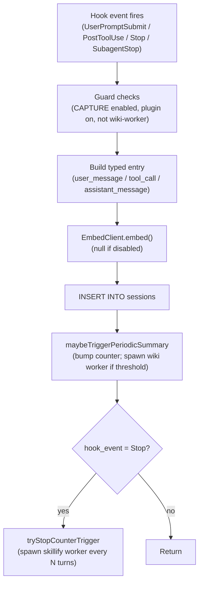

# Session Capture

> Category: AI | Version: 1.0 | Date: June 2026 | Status: Active

How every prompt, tool call, and assistant response becomes a structured row in the Deeplake `sessions` table, and how the capture path feeds the summary and skillify workers.

**Related:**
- [`wiki-summary-workers.md`](wiki-summary-workers.md)
- [`skillify-pipeline.md`](skillify-pipeline.md)
- [`embeddings-retrieval.md`](embeddings-retrieval.md)
- [`../architecture/session-lifecycle.md`](../architecture/session-lifecycle.md)
- [`../architecture/system-overview.md`](../architecture/system-overview.md)
- [`../data/deeplake-tables-schema.md`](../data/deeplake-tables-schema.md)
- [`../../../../docs/CAPTURE_TASKS.md`](../../../../docs/CAPTURE_TASKS.md)

---

## What capture does and why it works this way

Capture is the root of every other Hivemind feature. Without accurate, per-event rows in the `sessions` table, the wiki worker has nothing to summarize, the skillify miner has nothing to mine, and the VFS recall has nothing to serve.

The design is intentionally minimal: one INSERT per event, no batching, no concatenation. Batching would mean a crash mid-session drops an entire batch; concatenation means the worker that later reads the session must parse a compound blob rather than individual rows. The per-row design keeps writes atomic and readers simple.

Capture fires on four hook events in the Claude Code reference implementation: `UserPromptSubmit` (the user typed something), `PostToolUse` (a tool finished, captured asynchronously), `Stop` (the agent turn ended), and `SubagentStop` (a sub-agent finished). Each event carries a different payload and maps to a different row `type`.

---

## Entry point: `src/hooks/capture.ts`

The capture handler reads its input from stdin as a JSON object:

```typescript
interface HookInput {
  session_id: string;
  hook_event_name?: string;
  agent_id?: string;
  agent_type?: string;
  prompt?: string;            // UserPromptSubmit
  tool_name?: string;         // PostToolUse
  tool_input?: Record<string, unknown>;
  tool_response?: Record<string, unknown>;
  last_assistant_message?: string; // Stop / SubagentStop
  agent_transcript_path?: string;
  // ...
}
```

The handler dispatches on which payload fields are present and builds a typed entry:

- If `prompt` is set: `type = "user_message"`, `content = prompt`
- If `tool_name` is set: `type = "tool_call"`, stores `tool_input` and `tool_response` as JSON strings
- If `last_assistant_message` is set: `type = "assistant_message"`, `content = last_assistant_message`
- Otherwise: log and return without writing

All three branches share the same metadata block: `session_id`, `cwd`, `hook_event_name`, `agent_id`, `agent_type`, and a fresh ISO timestamp.

---

## The INSERT

The capture handler writes exactly one row to the `sessions` table per event. The SQL is built inline rather than using an ORM:

```sql
INSERT INTO "sessions" (
  id, path, filename, message, message_embedding,
  author, size_bytes, project, description,
  agent, plugin_version, creation_date, last_update_date
) VALUES (
  '<uuid>', '/sessions/<user>/<sessionId>.jsonl', '<filename>',
  '<json>'::jsonb, <embedding_or_null>,
  '<userName>', <byte_count>, '<project>', '<hook_event_name>',
  'claude_code', '<version>', '<ts>', '<ts>'
)
```

The `message` column is `jsonb`, so the entry object is serialized with `JSON.stringify` and only single-quotes are escaped (not backslashes or control characters) to preserve JSON structure. `sqlStr()` is deliberately not applied here because it would corrupt the JSON.

If the `sessions` table does not exist yet (first run or workspace switch mid-session), the handler catches the error, calls `api.ensureSessionsTable()` to create it with the schema from `src/deeplake-schema.ts`, and retries the INSERT once.

---

## Embedding the message

Every captured message can include a 768-dimensional `message_embedding` vector for semantic recall. The embedding is produced by calling `EmbedClient.embed(line, "document")` before the INSERT:

```typescript
const embedding = embeddingsDisabled()
  ? null
  : await new EmbedClient({ daemonEntry: resolveEmbedDaemonPath() }).embed(line, "document");
const embeddingSql = embeddingSqlLiteral(embedding);
```

If embeddings are disabled (via `HIVEMIND_EMBEDDINGS=false` or absent `@huggingface/transformers`), `embedding` is `null` and the column is written as SQL `NULL`. The schema is always compatible, so the feature can be enabled later without a migration.

The embedding client auto-spawns the nomic daemon on first use. The daemon path is resolved relative to the bundle directory so each plugin version uses its own daemon binary. See [`embeddings-retrieval.md`](embeddings-retrieval.md) for the full daemon lifecycle.

---

## Guard conditions

The handler exits immediately under several conditions to avoid spurious writes or recursive capture:

| Condition | Check |
|---|---|
| Capture disabled globally | `HIVEMIND_CAPTURE=false` |
| Plugin disabled by the user | `isHivemindPluginEnabled()` returns false |
| Agent CLI gate | `entrypointPassesOnlyCliGate()` returns false |
| Inside the wiki worker itself | `HIVEMIND_WIKI_WORKER=1` (set by the worker on spawn) |

The wiki worker sets `HIVEMIND_CAPTURE=false` in its environment so that the `claude -p` call it makes to generate the summary does not itself trigger another capture, which would create an infinite loop.

---

## Downstream triggers from capture

After the INSERT, capture does two more things before returning.

**Periodic summary.** `maybeTriggerPeriodicSummary` increments a per-session counter stored in `~/.claude/hooks/summary-state/<sessionId>.json`. When the counter crosses the `HIVEMIND_SUMMARY_EVERY_N_MSGS` threshold (default 50) or the elapsed time exceeds `HIVEMIND_SUMMARY_EVERY_HOURS` (default 2), it acquires a lock and spawns the wiki worker as a detached background process. The lock prevents two concurrent periodic workers for the same session.

**Stop-triggered skillify.** When `hook_event_name === "Stop"`, capture calls `tryStopCounterTrigger`, which increments a per-project counter and, every `HIVEMIND_SKILLIFY_EVERY_N_TURNS` turns (default 20), spawns the skillify worker. See [`skillify-pipeline.md`](skillify-pipeline.md) for what that worker does.



---

## Self-heal on marketplace upgrade

Marketplace auto-upgrades can leave the shared embeddings symlink pointing at a stale path. Capture runs `ensurePluginNodeModulesLink({ bundleDir })` once at module load to restore the symlink if it is broken. This is a best-effort operation: any error is swallowed so a broken symlink never blocks session capture.

---

## Configuration

| Env var | Default | Effect |
|---|---|---|
| `HIVEMIND_CAPTURE` | `true` | Set to `false` to disable all capture |
| `HIVEMIND_EMBEDDINGS` | `true` | Set to `false` to skip embedding and write `NULL` |
| `HIVEMIND_SUMMARY_EVERY_N_MSGS` | `50` | Message threshold for periodic summary trigger |
| `HIVEMIND_SUMMARY_EVERY_HOURS` | `2` | Time threshold for periodic summary trigger |
| `HIVEMIND_SKILLIFY_EVERY_N_TURNS` | `20` | Turn threshold for skillify worker trigger |
