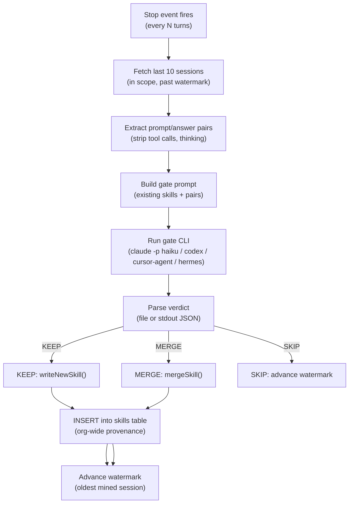

# Skillify Pipeline

> Category: AI | Version: 1.0 | Date: June 2026 | Status: Active

How Hivemind mines recent agent sessions to crystallize reusable `SKILL.md` files, propagate them to teammates, and keep the team's shared knowledge growing automatically.

**Related:**
- [`session-capture.md`](session-capture.md)
- [`wiki-summary-workers.md`](wiki-summary-workers.md)
- [`../collaboration/team-skills-sharing.md`](../collaboration/team-skills-sharing.md)
- [`../architecture/session-lifecycle.md`](../architecture/session-lifecycle.md)
- [`../architecture/system-overview.md`](../architecture/system-overview.md)
- [`../data/deeplake-tables-schema.md`](../data/deeplake-tables-schema.md)
- [`../../../../docs/SKILLIFY.md`](../../../../docs/SKILLIFY.md)

---

## The core idea

Recurring patterns in agent sessions are worth codifying. When multiple sessions show the same approach to a problem (a particular migration idiom, a common debugging sequence, a non-obvious tool invocation pattern), that knowledge should not be locked inside those session transcripts. Skillify extracts the pattern, writes it as a `SKILL.md`, and propagates the file to every agent on the team.

The pipeline has two halves. The first is local and happens at the end of every session: a stop-counter fires the skillify worker as a detached background process. The second is collaborative and happens at session start: every agent auto-pulls the latest skills from the Deeplake `skills` table into its own skill directory.

---

## Trigger: when the worker fires

The skillify worker fires on two triggers, both wired in `src/hooks/capture.ts` after each successful capture INSERT.

The **stop-counter trigger** increments a per-project counter after each `Stop` event. When the counter reaches `HIVEMIND_SKILLIFY_EVERY_N_TURNS` (default 20), it resets the counter and spawns the worker. The **session-end trigger** fires unconditionally at `Stop` / `SessionEnd` regardless of the counter, catching tail-of-session knowledge that the mid-session counter might miss.

Per-project counter state lives at `~/.deeplake/state/skillify/<project-key>.json`. The project key is the SHA-1 of `git config remote.origin.url`, falling back to the absolute path for non-git directories. This means the counter is isolated per project: heavy use in one repo never triggers premature mining in another.

A worker-lock mechanism prevents two concurrent skillify workers for the same project from running simultaneously. The lock is held in a file and released in the worker's `finally` block.

---

## Worker: `src/skillify/skillify-worker.ts`

The worker is spawned as a detached Node process with its configuration serialized to a temp JSON file. The invocation looks like:

```
node skillify-worker.js /tmp/hivemind-skillify-<uuid>/config.json
```

### Step 1: fetch candidate sessions

The worker queries the `sessions` table for the last 10 sessions in scope, ordered by the most recent message timestamp. "In scope" means:

- `scope=me`: filtered to `author = <userName>`
- `scope=team` with a populated team list: filtered to `author IN (<team>)`

The watermark (`state.lastDate`) prevents re-mining sessions already processed. Candidate sessions are filtered to exclude the session that triggered the worker (the in-flight session is not yet fully captured).

### Step 2: extract prompt/answer pairs

Each session's rows are fetched and passed through `extractPairs()` (from `src/skillify/extractors/`), which pairs user prompts with the agent's next assistant message, drops tool calls and thinking blocks, and returns `Pair[]` objects. Each pair carries its session ID and agent label. The pairs are then rendered into a text block, capped at 2,000 characters per pair and 40,000 characters total for the gate prompt.

### Step 3: build and run the gate prompt

The worker builds a gate prompt containing the existing project skills (capped at 30,000 characters) and the extracted pairs. The prompt instructs the gate model to return one of three verdicts:

| Verdict | Meaning |
|---|---|
| `KEEP <name> <body>` | Write a new skill file |
| `MERGE <existing-name> <merged-body>` | Update an existing skill, bump version |
| `SKIP <reason>` | Pattern is one-off, generic, or already covered |

KEEP fires only when the pattern recurs across at least three exchanges, is non-obvious, and is not already covered. The precision-over-recall stance is explicit in the prompt: a missed skill is invisible, but a false skill erodes trust.

The gate call shells out to the host agent's own CLI so no separate API key is needed:

| Agent | Gate command |
|---|---|
| claude_code | `claude -p <prompt> --no-session-persistence --model haiku --permission-mode bypassPermissions` |
| codex | `codex exec --dangerously-bypass-approvals-and-sandbox <prompt>` |
| cursor | `cursor-agent --print --model <model> --force --output-format text <prompt>` |
| hermes | `hermes -z <prompt> --provider <provider> -m <model> --yolo --ignore-user-config` |

The gate call runs synchronously with a 120-second timeout. The worker reads the verdict from the file the model was asked to write (`verdict.json` in the temp dir), or falls back to parsing the stdout if the model printed JSON instead.

### Step 4: write the skill file

On a `KEEP` verdict, `writeNewSkill()` creates a new `SKILL.md` under the configured skills root:

- `install=project`: `<cwd>/.claude/skills/<name>/SKILL.md`
- `install=global`: `~/.claude/skills/<name>/SKILL.md`

On a `MERGE` verdict, `mergeSkill()` opens the existing file, updates the body and bumps the version in the frontmatter. If the MERGE target does not exist locally (the gate hallucinated a name from the user's global skills), the worker falls back to `writeNewSkill()` so the body is not lost.

The `SKILL.md` includes YAML frontmatter with provenance metadata: `source_sessions`, `version`, `created_by_agent`, and timestamps.

### Step 5: record to the Deeplake skills table

After a successful local write, the worker inserts a row into the `skills` table for org-wide provenance. This is the mechanism by which teammates discover each other's mined skills. The INSERT uses the append-only pattern (never UPDATE) to sidestep Deeplake's UPDATE-coalescing quirk.

Cross-author merges auto-promote the scope from `me` to `team` in the recorded row, so future `pull` commands know the skill is co-owned.



---

## Watermark semantics

The watermark is set to the date of the **oldest** mined session, not the newest. This is deliberate: setting it to the newest session would permanently skip any session older than the LIMIT cutoff that did not fit into the current batch. Setting it to the oldest means the next run re-sees the same batch (yielding SKIP when nothing changed, which is harmless) but also picks up any older sessions it missed.

---

## Pull and auto-pull

Once a skill row exists in the `skills` table, any teammate can pull it with `hivemind skillify pull`. The pull writes to `~/.claude/skills/<name>--<author>/SKILL.md` (the `--<author>` suffix keeps cross-author skills with the same name disjoint) and fans out symlinks into the skill roots of every other detected agent (`~/.agents/skills/`, `~/.hermes/skills/`, `~/.pi/agent/skills/`) so all agents find the file without a separate copy.

Auto-pull runs at every session start. The pull is idempotent: it skips a file when the local version is at or newer than the remote. The call is bounded by a 5-second timeout and swallows all errors, so a slow or unavailable Deeplake never blocks a session from starting.

---

## Configuration

| Env var | Default | Effect |
|---|---|---|
| `HIVEMIND_SKILLIFY_EVERY_N_TURNS` | `20` | Stop-counter threshold for mid-session trigger |
| `HIVEMIND_SKILLS_TABLE` | `skills` | Deeplake table name for org-wide provenance |
| `HIVEMIND_SKILLIFY_WORKER` | unset | Recursion guard; set to `1` automatically inside the worker |
| `HIVEMIND_CURSOR_MODEL` | `auto` | (cursor only) Model passed to the gate call |
| `HIVEMIND_HERMES_PROVIDER` | `openrouter` | (hermes only) Provider for the gate call |
| `HIVEMIND_HERMES_MODEL` | `anthropic/claude-haiku-4-5` | (hermes only) Model for the gate call |
| `HIVEMIND_AUTOPULL_DISABLED` | unset | Set to `1` to disable auto-pull at session start |

Logs write to `~/.claude/hooks/skillify.log`. Each line shows the session pool mined, the gate verdict, and whether a file was written.
