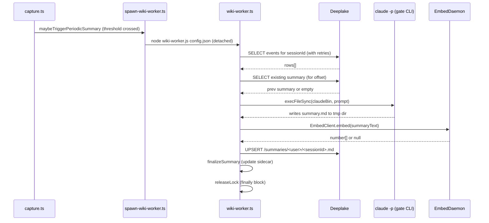

# Wiki Summary Workers

> Category: AI | Version: 1.0 | Date: June 2026 | Status: Active

How Hivemind generates, stores, and incrementally updates AI-written wiki summaries for each session, and how those summaries power the VFS recall surface.

**Related:**
- [`session-capture.md`](session-capture.md)
- [`embeddings-retrieval.md`](embeddings-retrieval.md)
- [`skillify-pipeline.md`](skillify-pipeline.md)
- [`../architecture/session-lifecycle.md`](../architecture/session-lifecycle.md)
- [`../architecture/system-overview.md`](../architecture/system-overview.md)
- [`../data/deeplake-tables-schema.md`](../data/deeplake-tables-schema.md)
- [`../../../../docs/SUMMARIES.md`](../../../../docs/SUMMARIES.md)

---

## What summaries are for

Raw session rows in the `sessions` table are precise but verbose. Searching across them for "what did we decide about the database schema last week" would require ranking thousands of individual messages. Summaries solve this by collapsing each session into a structured markdown document that names entities, decisions, files modified, and open questions. That document is what shows up when you `Grep` across `~/.deeplake/memory/` or follow links from `~/.deeplake/memory/index.md`.

Summaries also carry a `summary_embedding` vector so semantic recall can promote a session even when the search terms do not match the exact words used at the time.

---

## Trigger conditions

Each agent fires a wiki worker on two triggers:

| Trigger | When |
|---|---|
| **Final** | At session end: `Stop`, `SessionEnd`, or `session_shutdown`, once per session |
| **Periodic** | Mid-session, when messages since last summary reach `HIVEMIND_SUMMARY_EVERY_N_MSGS` (default 50) OR elapsed time since last summary reaches `HIVEMIND_SUMMARY_EVERY_HOURS` (default 2) |

The periodic threshold check lives inside `maybeTriggerPeriodicSummary()` in `src/hooks/capture.ts`. After each capture INSERT, the function bumps a per-session counter in `~/.claude/hooks/summary-state/<sessionId>.json` and calls `shouldTrigger()` to decide whether to proceed.

A lock file at `~/.claude/hooks/summary-state/<sessionId>.lock` prevents two workers from running concurrently for the same session. If the lock is already held (an earlier trigger's worker is still running), the new trigger is suppressed. The lock is always released in the worker's `finally` block.

A sidecar JSON at `~/.claude/hooks/summary-state/<sessionId>.json` tracks `{ lastSummaryAt, lastSummaryCount, totalCount }`. The directory is shared across all agents because session IDs are UUIDs and never collide. The file is never deleted, so resuming a session via `--resume` or `--continue` picks up the count from where it left off.

---

## Worker: `src/hooks/wiki-worker.ts`

The worker runs as a detached Node process, spawned by `src/hooks/spawn-wiki-worker.ts`. The spawn function serializes a `WorkerConfig` object to a temp JSON file and invokes:

```
node wiki-worker.js /tmp/hivemind-wiki-<uuid>/config.json
```

The worker sets `HIVEMIND_WIKI_WORKER=1` and `HIVEMIND_CAPTURE=false` in the subprocess environment to prevent the `claude -p` call inside from triggering its own capture loop.

### Step 1: fetch session events

The worker queries the `sessions` table for all rows belonging to the session, ordered by `creation_date` ascending:

```sql
SELECT message, creation_date FROM "sessions"
WHERE path LIKE '/sessions/%<sessionId>%'
ORDER BY creation_date ASC
```

Because capture hooks INSERT asynchronously, Deeplake's eventual-consistency model means rows can lag behind the `SessionEnd` event. The worker retries with linear backoff up to `HIVEMIND_WIKI_EVENT_RETRIES` (default 5) times at `HIVEMIND_WIKI_EVENT_BACKOFF_MS` (default 1500 ms) intervals before giving up.

If no events appear after all retries, the worker removes the "in progress" placeholder from the `memory` table (a row written by the SessionStart hook to reserve the slot) rather than leaving it stranded forever.

### Step 2: check for an existing summary

For resumed sessions, a prior summary may already exist. The worker queries the `memory` table for the session's summary row and, if found, reads the embedded `**JSONL offset**: N` marker to know how many events the previous summary already covered. This offset is passed to the gate prompt so the model can focus on events since the last checkpoint.

### Step 3: run the gate prompt

The worker builds a structured prompt from a template, substituting the temp JSONL path, the existing summary path, the session ID, the project name, the previous offset, and the total event count. It then shells out to the host agent's own CLI:

```typescript
const inv = buildClaudeInvocation(cfg.claudeBin, prompt);
execFileSync(inv.file, inv.args, {
  timeout: 120_000,
  env: { ...process.env, HIVEMIND_WIKI_WORKER: "1", HIVEMIND_CAPTURE: "false" },
});
```

The gate CLI writes the generated markdown to a temp file (`summary.md` in the worker's temp dir). Using the host CLI means no separate API key is needed.

### Step 4: embed and upload

If the temp summary file exists and is non-empty, the worker embeds the text via `EmbedClient.embed(text, "document")` (returns `null` if embeddings are disabled) and uploads the summary to the `memory` table:

```
memory table path: /summaries/<userName>/<sessionId>.md
```

The upload is an UPSERT keyed on the `path` column. The `description` column stores a short excerpt of the summary, and the `summary_embedding` column stores the vector (or `NULL`).

After a successful upload, the sidecar is updated via `finalizeSummary(sessionId, jsonlLines)` to record the new baseline count.



---

## Error handling and resilience

**Retries on empty events.** The five-attempt linear backoff ensures that sessions captured under heavy load (many concurrent agent sessions) still get summarized even when Deeplake read consistency lags behind the INSERT timestamps.

**No orphan placeholders.** If events never arrive, the worker deletes the "in progress" placeholder row. The guard `AND description = 'in progress'` means a concurrent worker that already wrote a real summary is never clobbered.

**Exponential backoff on API errors.** The worker's `query()` helper retries on HTTP 401, 403, 429, 500, 502, and 503, with exponential backoff up to 30 seconds plus jitter. Cloudflare rate-limit 403s from IP bursts can take 30-60 seconds to clear, so the jitter matters.

**Summary embedding failures are non-fatal.** If `EmbedClient.embed()` throws, the worker logs the error, writes `NULL` for the embedding, and proceeds with the upload. A summary without an embedding is still searchable via lexical ranking.

---

## Per-agent variations

The wiki worker is bundled inside each per-agent plugin. The only variation is the gate CLI:

| Agent | Gate CLI |
|---|---|
| claude_code | `claude -p <prompt> --no-session-persistence --model <model>` |
| codex | `codex exec --dangerously-bypass-approvals-and-sandbox <prompt>` |
| cursor | `cursor-agent --print --model <model> --force --output-format text <prompt>` |
| hermes | `hermes -z <prompt> --provider <provider> -m <model> --yolo --ignore-user-config` |
| pi | `pi --print --provider <provider> --model <model> <prompt>` |

For pi specifically, the wiki worker is bundled separately at `~/.pi/agent/hivemind/wiki-worker.js` (deposited by `hivemind pi install`). The other agents ship the worker inside their per-agent plugin bundle.

---

## Configuration

| Env var | Default | Effect |
|---|---|---|
| `HIVEMIND_SUMMARY_EVERY_N_MSGS` | `50` | Message threshold for periodic trigger |
| `HIVEMIND_SUMMARY_EVERY_HOURS` | `2` | Time threshold for periodic trigger |
| `HIVEMIND_WIKI_EVENT_RETRIES` | `5` | Retry attempts when no session events are found |
| `HIVEMIND_WIKI_EVENT_BACKOFF_MS` | `1500` | Linear backoff base for event fetch retries |
| `HIVEMIND_CURSOR_MODEL` | `auto` | (cursor) Model passed to `cursor-agent --print --model` |
| `HIVEMIND_HERMES_PROVIDER` | `openrouter` | (hermes) Provider for the gate call |
| `HIVEMIND_HERMES_MODEL` | `anthropic/claude-haiku-4-5` | (hermes) Model for the gate call |
| `HIVEMIND_PI_PROVIDER` | `google` | (pi) Provider for the gate call |
| `HIVEMIND_PI_MODEL` | `gemini-2.5-flash` | (pi) Model for the gate call |
| `HIVEMIND_CAPTURE` | `true` | Set to `false` to disable capture and summary generation |

Worker activity logs to `~/.claude/hooks/wiki.log`. Each line shows the session being processed, the event count, the gate exit code, and the upload result.
