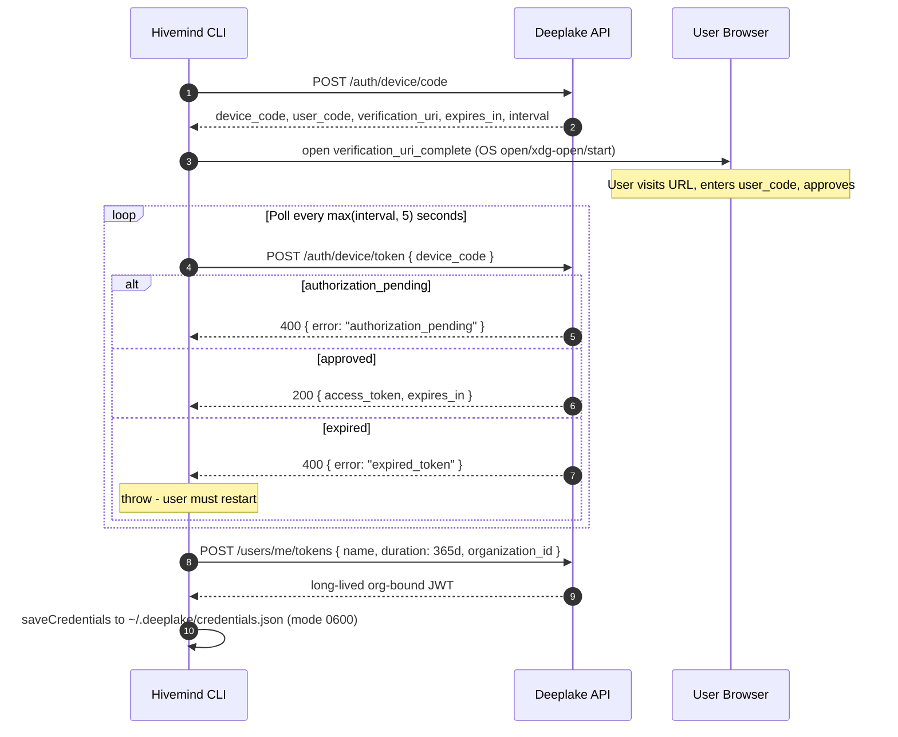
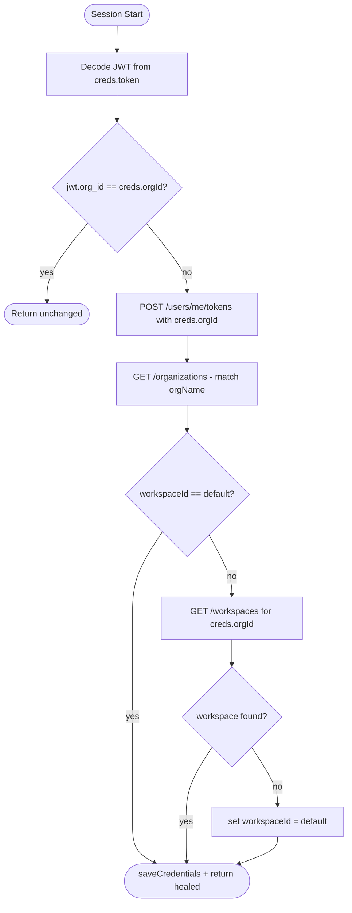

# Auth Architecture

> Category: Auth | Version: 1.0 | Date: June 2026 | Status: Active

Explains how Hivemind authenticates users and manages multi-org/workspace state: the OAuth 2.0 Device Authorization Flow, JWT-based org selection, long-lived API token minting, and the drift-repair mechanism that keeps credentials consistent across org switches.

**Related:**
- [`../security/credential-storage.md`](../security/credential-storage.md)
- [`../security/trust-boundaries.md`](../security/trust-boundaries.md)
- [`../multi-tenant/org-workspace-model.md`](../multi-tenant/org-workspace-model.md)
- [`../architecture/system-overview.md`](../architecture/system-overview.md)
- [`../operations/cli-command-architecture.md`](../operations/cli-command-architecture.md)
- [`../overview.md`](../overview.md)

---

## Why this exists

Hivemind runs inside coding agents (Claude Code, Codex, Cursor, etc.) as a plugin or hook. It must authenticate without prompting for a password inside a non-interactive terminal. The OAuth 2.0 Device Authorization Flow (RFC 8628) solves this: the user visits a browser URL on any device while the CLI polls for an approval signal. No password ever passes through the plugin process.

Once authenticated, every subsequent API call carries a long-lived, org-bound JWT that the Deeplake backend validates. The credentials are persisted locally so re-authentication is rare (one year by default).

---

## Device Authorization Flow

The flow lives in `src/commands/auth.ts` and is initiated by `login()` -> `deviceFlowLogin()`.



The short-lived `access_token` from step 5 is used only for the `/users/me/tokens` mint (step 6). It is never written to disk. The persisted credential is always the org-bound 365-day token produced in step 6.

**Token naming**: the `name` field sent to `/users/me/tokens` follows the pattern `deeplake-plugin-<date>` (for initial login) or `deeplake-plugin-switch-<Date.now()>` (for org switches). Deeplake's backend rejects duplicate `(user_id, name)` pairs with a misleading 500, so org-switch names include millisecond resolution to avoid collisions on the same calendar day.

---

## Org Selection Priority

After obtaining a token, `saveCredentialsFromToken()` resolves which organization to bind the credential to. The priority order is intentional and documented:

| Priority | Source | When used |
|---|---|---|
| 1st | `HIVEMIND_ORG_ID` env var | Explicit override; always wins |
| 2nd | `org_id` JWT claim (only for `skipTokenMint=true` paths) | API token pasted via `--token` or `HIVEMIND_TOKEN` |
| 3rd | `orgs[0]` from `GET /organizations` | Device flow fallback; overridden by the upcoming mint |

For multi-org accounts on the device flow path, `orgs[0]` is selected and then a token is minted bound to that org. The user can switch later with `hivemind org switch`. For the `--token` path, priority 2 extracts the `org_id` claim so a pre-minted API key routes to the correct org without any user interaction.

---

## JWT Decoding

`decodeJwtPayload(token: string)` extracts the payload from any JWT without cryptographic verification:

```
parts = token.split(".")          // header.payload.signature
payload = base64url_decode(parts[1])
return JSON.parse(payload)        // Record<string, unknown>
```

The decode is intentionally verify-free. It is used only to read the `org_id` claim for routing decisions (not for access control). Signature verification happens on the Deeplake API server for every authenticated request. The JWT never bypasses the server-side gate.

The `org_id` claim carries the organization the token was minted against. This is the single source of truth used by `healDriftedOrgToken` to detect credential drift.

---

## Org and Workspace Switching

### Org switch

`switchOrg(orgId, orgName)` remints a new org-bound token before updating the credentials file. The sequence:

1. Call `POST /users/me/tokens` with `organization_id: target_orgId` using the current token.
2. Resolve workspace carry-over: check whether the currently-active `workspaceId` exists in the target org. If not found, reset to `"default"`.
3. Call `saveCredentials` with the new token, orgId, orgName, and resolved workspaceId.

This ensures `creds.orgId` and `creds.token`'s `org_id` JWT claim are always aligned after a switch.

### Workspace switch

`switchWorkspace(workspaceId)` is simpler: it updates only `creds.workspaceId` in the local credentials file. No new token is minted because workspace context is passed to Deeplake via the `X-Activeloop-Org-Id` header per request, not baked into the JWT.

---

## Drift Healing

A legacy regression caused `org switch` to rewrite only `orgId` without reminting the token. Any session started with such drifted credentials would have `creds.orgId != jwt(token).org_id`.

`healDriftedOrgToken(creds)` runs at session start and detects this condition:



The heal is best-effort: token mint failure logs a warning but does not block the session. Both the `orgName` realign and the `workspaceId` realign run in independent try/catch blocks so a transient failure on one does not skip the other.

---

## Environment-Variable and Token-Flag Paths

The `--token <value>` CLI flag and the `HIVEMIND_TOKEN` environment variable bypass the device flow entirely. Both paths call `saveCredentialsFromToken(token, apiUrl, { skipTokenMint: true })`. The token is assumed to be long-lived and org-bound already. The org is resolved from the `org_id` JWT claim (priority 2 from Section 3).

Headless / CI installs use this path. The token is never echoed to stdout; it is written directly to `~/.deeplake/credentials.json`.

---

## Auth Log Routing

By default all auth messages go to `process.stderr` (safe for hook contexts, which may parse stdout). When `auth-login.ts` runs as a direct CLI command, it overrides `authLog` to `console.log` so messages surface to the terminal user. This separation ensures hooks never accidentally pollute a structured JSON stdout stream with login UI text.
