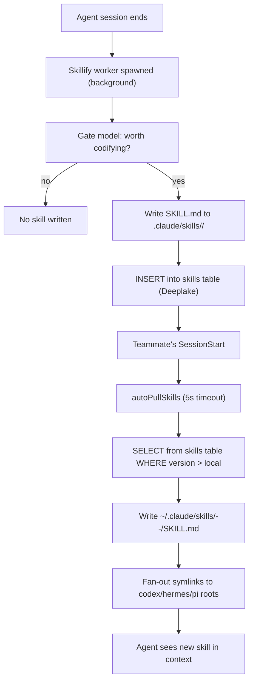

# Team Skills Sharing

> Category: Collaboration | Version: 1.0 | Date: June 2026 | Status: Active

How Hivemind mines reusable skills from agent sessions, publishes them to the org's shared Deeplake table, and automatically distributes them to every teammate's agents on the next session start.

**Related:**
- [`../ai/skillify-pipeline.md`](../ai/skillify-pipeline.md)
- [`../architecture/system-overview.md`](../architecture/system-overview.md)
- [`../multi-tenant/org-workspace-model.md`](../multi-tenant/org-workspace-model.md)
- [`../frontend/cursor-extension-architecture.md`](../frontend/cursor-extension-architecture.md)
- [`../data/deeplake-tables-schema.md`](../data/deeplake-tables-schema.md)
- [`../../../../docs/SKILLIFY.md`](../../../../docs/SKILLIFY.md)

---

## The core loop

Team skills sharing is a four-step cycle that runs automatically in the background whenever Hivemind is installed:

1. **Mine.** At session end (and periodically mid-session), a background worker reads recent session rows from Deeplake, asks a gate model whether the activity is worth codifying, and writes a `SKILL.md` to the local `.claude/skills/` directory.
2. **Publish.** Mined skills are inserted into the org's shared `skills` Deeplake table as versioned rows. Every edit appends a new version (`v=N+1`); readers always take `ORDER BY version DESC`.
3. **Pull.** On every `SessionStart`, the auto-pull module queries the `skills` table for all users in the org and writes any newer remote skills to the local install root.
4. **Propagate.** Fan-out symlinks point every non-Claude agent's skills root (`~/.codex/skills/`, `~/.hermes/skills/`, etc.) at the canonical `~/.claude/skills/<name>--<author>/` directory, so a pulled skill is immediately available to all agents without running a separate install command.

---

## Scope configuration

The skillify worker respects a scope setting persisted in `~/.deeplake/state/skillify/config.json`:

```typescript
type Scope = "me" | "team";
type InstallLocation = "project" | "global";

interface ScopeConfig {
  scope: Scope;
  team: string[];      // Deeplake usernames to mine from, when scope = "team"
  install: InstallLocation;
}
```

The default scope is `"me"` with `install = "project"`, meaning the worker mines only from the current user's sessions and writes skills into `<cwd>/.claude/skills/`.

Setting scope to `"team"` and populating `team` with colleagues' usernames tells the worker to mine from those users' sessions as well. The CLI command is `hivemind skillify scope team --users alice,bob`. A legacy third value `"org"` (mine from every workspace user) was removed from the CLI but is silently coerced to `"team"` on read for backward compatibility with existing config files.

Setting `install = "global"` writes skills to `~/.claude/skills/`, making them visible across all projects on the machine. The auto-pull always uses `install = "global"` so pulled teammate skills are available everywhere.

---

## Auto-pull at session start

The auto-pull runs on every `SessionStart` hook for every agent that Hivemind supports. It is intentionally not throttled: because `runPull` is idempotent (skipping any skill whose local version is at-or-newer than the remote version), the only cost per call is one SQL round-trip plus `existsSync` syscalls. This makes teammate-mined skills visible within seconds of publication, rather than within the 30-minute polling window an older design used.

The auto-pull is bounded by a 5-second timeout. A slow or unreachable Deeplake backend never blocks `SessionStart` past that limit. All errors are swallowed; the pull result is informational only.

Hard opt-out is available via `HIVEMIND_AUTOPULL_DISABLED=1`. Unauthenticated sessions skip the pull silently without logging a warning.

### Early exit when table is absent

On a fresh workspace, the `skills` table does not exist yet (it is created lazily by the first `INSERT`). The auto-pull uses a "trusted table list" path to detect this: it calls `api.knownTablesOrNull()` to fetch the list of existing tables, and if `skills` is absent, skips the `SELECT` entirely. This prevents a `42P01 relation does not exist` error from appearing in the Deeplake server logs on every `SessionStart` for new users.

---

## Skill directory layout

Pulled skills land on disk with a `<name>--<author>` directory name under the install root:

```
~/.claude/skills/
  deploy--alice/
    SKILL.md          (pulled from alice; version 3)
  deploy/
    SKILL.md          (locally mined by current user; version 2)
  test-setup--bob/
    SKILL.md          (pulled from bob)
```

The `--<author>` suffix serves three purposes: Claude Code's skill loader scans one directory deep and sees all skills without a separate discovery step; cross-author name collisions stay disjoint on disk (two people can both author a `deploy` skill without clobbering each other); and the directory name self-documents provenance at a glance.

A locally-mined skill for the same name as a pulled skill coexists cleanly: the locally-mined copy lives at `deploy/` while the pulled copy lives at `deploy--alice/`. When the local user's worker mines a skill that improves on their own copy, it writes to `deploy/` and does not disturb `deploy--alice/`.

Skills with an empty `author` field in the `skills` table are skipped during pull: writing them to `<root>/<name>/` would silently clobber the user's locally-mined slot for that skill name, breaking the coexistence guarantee.

---

## Fan-out symlinks

When a skill is pulled for a global install, the pull engine creates symlinks in every detected non-Claude agent skills root so the pulled skill is immediately visible without separate install commands:

```
~/.codex/skills/deploy--alice  ->  ~/.claude/skills/deploy--alice/
~/.hermes/skills/deploy--alice ->  ~/.claude/skills/deploy--alice/
~/.pi/skills/deploy--alice     ->  ~/.claude/skills/deploy--alice/
```

Detected agent roots are discovered by `detectAgentSkillsRoots`, which checks for the presence of known agent directories under the user's home directory. Fan-out is only done for global installs; project-local pulls (`<cwd>/.claude/skills/`) are not fanned out.

The fan-out is idempotent: re-running the same pull with the same set of detected roots is a no-op for links that already point at the correct canonical path. Stale links (pointing at a different canonical path, for example after `HOME` was moved) are unlinked and recreated.

### Backfill on agent install

A user who installs a new agent (Codex, Hermes, pi) after having already pulled skills would find their existing pulled skills invisible to the new agent because the per-row fan-out only fires on rows whose action is `"wrote"`. Up-to-date skills take the `"skipped"` path, which never runs fan-out.

`backfillSymlinks` closes this gap: at the end of every pull run (except dry-runs and project-local pulls), it scans the manifest for all globally-installed entries and ensures each has a symlink in every currently-detected agent root. The cost is roughly one `lstat` syscall per (entry, detected root) pair. For a typical fleet of 50 skills and 3 agent roots that is about 150 syscalls, negligible compared to the SQL round-trip.

---

## Version conflict handling

`decideAction` determines what to do when a remote skill exists locally:

| Condition | Action |
|---|---|
| Local file absent | Write |
| Remote version > local version | Backup existing to `SKILL.md.bak`, then write |
| Remote version <= local version (no `--force`) | Skip |
| `--force` flag set | Backup existing, then write regardless of version |

The `--force` flag is available via `hivemind skillify pull --force`. Dry-run mode (`--dry-run`) reports what would have been written without touching the filesystem.

---

## Cross-author merge and scope promotion

When the skillify worker discovers a remote skill from a different author and proposes merging it with the user's own copy, the resulting merged skill is published with scope `"team"` and the original author plus `"skillopt"` marker appended to the `contributors` array. This is the cross-author merge path introduced to handle the ambiguous-lineage case where two users independently build the same capability.

The `SKILLOPT_CONTRIBUTOR = "skillopt"` marker is stamped on every skill that the SkillOpt improvement loop touches, so provenance always records when the automated loop contributed to a skill's evolution, distinct from a human contributor.

---

## Manifest tracking

Every pull writes a record to the local pull manifest so `hivemind skillify unpull` can identify and reverse pull-managed entries without relying on the `--<author>` directory naming heuristic. The manifest records the `dirName`, `name`, `author`, `projectKey`, `remoteVersion`, `install`, `installRoot`, `pulledAt`, and the list of symlinks created by fan-out.

When `recordPull` fails (for example due to a transient write error), the skill is still on disk but the manifest does not have an entry. The `manifestError` field in the pull result entry surfaces this condition so the CLI can warn the user. A subsequent successful re-pull will populate the manifest entry.

---

## Mermaid: end-to-end skill lifecycle


