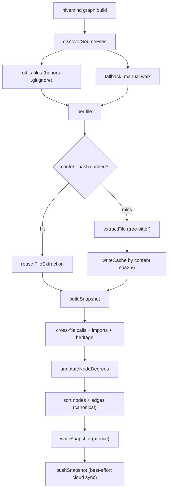
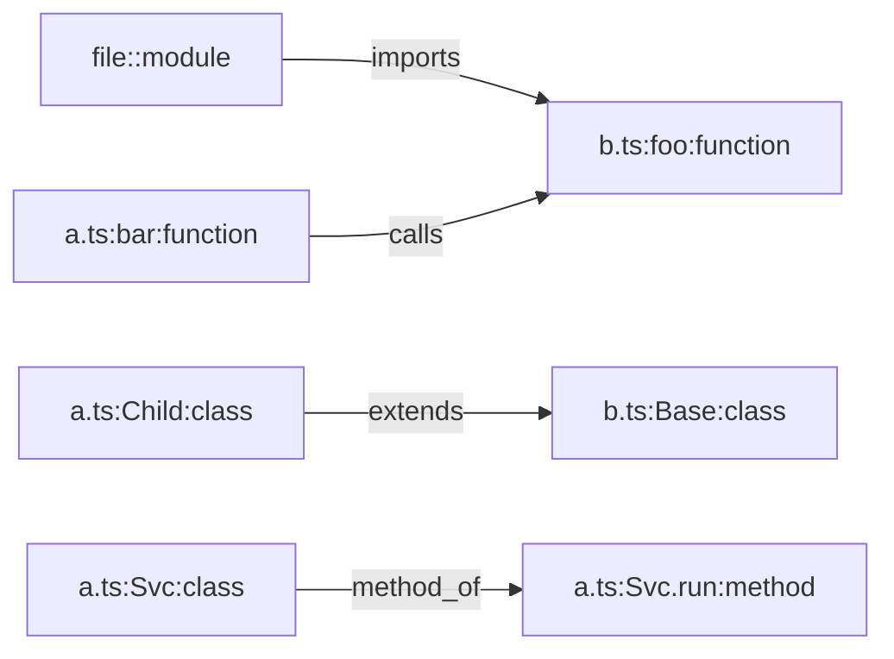

# Codebase Graph

> Category: Data | Version: 1.0 | Date: June 2026 | Status: Active

How Hivemind builds a live graph of files, symbols, and edges from source code: the discover-extract-snapshot build pipeline, the tree-sitter extractors for nine languages, cross-file resolution, content-addressed caching, deterministic snapshot hashing, cloud push and pull through the `codebase` table, and the synthesized `graph/` query surface agents read.

**Related:**
- [`deeplake-tables-schema.md`](deeplake-tables-schema.md)
- [`memory-virtual-filesystem.md`](memory-virtual-filesystem.md)
- [`../ai/embeddings-retrieval.md`](../ai/embeddings-retrieval.md)
- [`../architecture/system-overview.md`](../architecture/system-overview.md)
- [`../architecture/session-lifecycle.md`](../architecture/session-lifecycle.md)
- [`../overview.md`](../overview.md)

---

## Why a code graph

Recall over raw conversation traces tells an agent what was discussed; a code graph tells it how the code is actually wired. The graph subsystem (`src/graph/`) extracts files, symbols, and relationships directly from source so an agent can ask "who calls this function", "what is the blast radius of changing this symbol", or "walk me through this subsystem" and get answers grounded in the current checkout rather than in prose.

The output deliberately mirrors the NetworkX node-link JSON format (a directed multigraph) so any tool that already understands NetworkX graphs can consume a snapshot. The feature is AST-only: it uses tree-sitter parsers, never an LSP, a type checker, or an LLM, which keeps builds fast and deterministic. Nine languages are supported: TypeScript, JavaScript, Python, Go, Rust, Java, Ruby, C, and C++.

---

## The build pipeline

`hivemind graph build` walks the repo, extracts every supported source file, aggregates the results into one snapshot, and writes it to disk under `~/.hivemind/graphs/<repo-key>/`.



Source discovery prefers git's own ignore engine: `git ls-files --cached --others --exclude-standard -z` lists tracked plus untracked-not-ignored files, honoring `.gitignore` exactly (anchoring and nested rules included). A user-editable ignore set (`~/.deeplake/graph-ignore.json`) is applied as a safety net for directories the repo happens to track. When git is unavailable (a loose source directory), discovery falls back to a manual recursive walk that skips dotfiles and ignored directory names. Source files are recognized by extension; `.d.ts` declarations are excluded because they carry no implementation.

Each file is content-hashed and looked up in the per-repo cache before extraction. The repo key is derived from the normalized git remote URL, so the same project resolves to the same storage directory across checkouts.

---

## Extraction: per-file, language-routed

`extractFile` routes a file to the language-appropriate extractor by extension. Every extractor produces the same `FileExtraction` shape, which keeps the snapshot builder and the cross-file passes language-agnostic.

```typescript
export function extractFile(sourceCode: string, relativePath: string): FileExtraction {
  const lower = relativePath.toLowerCase();
  if (isPythonPath(lower)) return extractPython(sourceCode, relativePath);
  if (/\.[cm]?jsx?$/.test(lower)) return extractJavaScript(sourceCode, relativePath);
  if (lower.endsWith(".go")) return extractGo(sourceCode, relativePath);
  if (lower.endsWith(".rs")) return extractRust(sourceCode, relativePath);
  if (lower.endsWith(".java")) return extractJava(sourceCode, relativePath);
  if (lower.endsWith(".rb")) return extractRuby(sourceCode, relativePath);
  if (/\.(cpp|cc|cxx|hpp)$/.test(lower)) return extractCpp(sourceCode, relativePath);
  if (/\.[ch]$/.test(lower)) return extractC(sourceCode, relativePath);
  return extractTypeScript(sourceCode, relativePath);
}
```

A `FileExtraction` carries the nodes and edges found in that file, any tree-sitter parse errors (so a malformed file is reported and skipped rather than silently lost), and two optional cross-file inputs the TypeScript extractor populates: `raw_calls` (call sites that could not be resolved within the file) and `import_bindings` (the file's imports, each tagged named, default, or namespace, with a `type_only` flag).

---

## The node and edge model

A node represents one code construct. Its `id` is globally unique within a snapshot, formatted `<source_file>:<symbol_name>:<kind>`, and a module node uses `<source_file>::module`.

| Node field | Meaning |
|---|---|
| `id` | Unique key, `<file>:<symbol>:<kind>` |
| `label` | Display name |
| `kind` | `function`, `class`, `method`, `interface`, `type_alias`, `enum`, `const`, `variable`, or `module` |
| `source_file` | Repo-relative path, forward slashes |
| `source_location` | `L<line>` or `L<line>-<endLine>` |
| `language` | One of the nine supported languages |
| `exported` | Whether the symbol is exported |
| `signature`, `doc` | Intrinsic AST metadata (optional) |
| `fan_in`, `fan_out`, `is_entrypoint` | Derived after resolution (optional) |

Edges are directed and typed. The `relation` is one of `imports`, `calls`, `extends`, `implements`, or `method_of`, and each edge carries a `confidence` of `EXTRACTED`, `INFERRED`, or `AMBIGUOUS` (current edges are almost entirely `EXTRACTED` because they are concrete AST facts). An optional `ord` disambiguates multigraph edges that share the same source, target, and relation (a function calling another twice).



---

## Cross-file resolution

After every file is extracted, `buildSnapshot` runs three resolution passes that turn per-file placeholders into real cross-file edges. Resolution is high-confidence only; ambiguous cases are dropped, not guessed.

The calls pass (`resolveCrossFileCalls`) matches each unresolved `raw_call` against the file's import bindings and the global export index. It emits an edge only for a named import (including `as` aliases) whose matching export exists in a resolvable local file, or a namespace call `ns.foo()` where `ns` is `import * as ns from "./local"` and the local file exports `foo`. Default imports, bare (npm) specifiers, tsconfig path aliases, barrel re-exports, instance dispatch, and dynamic `import()` are deliberately skipped.

The imports pass (`repointImportEdges`) repoints an `imports` edge from a placeholder `external:<specifier>` to the real module node when the specifier is relative and resolves to a known repo file; bare and unresolvable specifiers keep their `external:` target so "our code versus a dependency" stays distinguishable. The heritage pass (`resolveHeritageEdges`) resolves `extends` and `implements` placeholders to a same-file declaration or a named-import cross-file base type.

Module resolution (`resolveModule`) tries the common TS suffixes in a deterministic order (the explicit extension first, then the importer's own family, then the other), and falls through to `index` files. Python files route to `resolvePythonModule`, which handles dot-relative imports by climbing package levels and dotted-absolute imports by anchoring on a unique path suffix; an ambiguous suffix match is dropped.

Once edges are fully resolved, `annotateNodeDegrees` sets `fan_in`, `fan_out`, and `is_entrypoint` (`exported && fan_in === 0`) from the complete edge set, so degrees reflect cross-file relationships rather than just intra-file ones.

---

## Snapshots: deterministic and content-addressed

A snapshot is canonicalized before it is hashed or written. `buildSnapshot` sorts nodes by `id` and edges by `(source, target, relation, ord)`, and `canonicalJSON` serializes with object keys sorted at every nesting level and no inserted whitespace. The same code therefore always serializes to the same bytes.

The content hash covers only the stable fields:

```typescript
export function computeSnapshotSha256(snapshot: GraphSnapshot): string {
  const stable = {
    directed: snapshot.directed,
    multigraph: snapshot.multigraph,
    graph: snapshot.graph,
    nodes: snapshot.nodes,
    links: snapshot.links,
  };
  return createHash("sha256").update(canonicalJSON(stable)).digest("hex");
}
```

The `observation` field (timestamp, branch, worktree path, generator version, file counts) is deliberately excluded so two builds of identical code on different worktrees, branches, or at different times produce the same `snapshot_sha256` and dedup correctly. Any new field that is volatile must go into `observation`, never into `graph`, or this hash silently breaks dedup.

`writeSnapshot` writes atomically (temp file plus `renameSync` in the same directory, so a crash leaves either the old file or the new one, never a partial). The snapshot lands at `<baseDir>/snapshots/<commit-sha>.json`, or `<snapshot-sha256>.json` when there is no commit context. Per-worktree singletons (`latest-commit.txt` and `.last-build.json`) live under `worktrees/<worktree-id>/` so two checkouts of the same repo on one machine do not clobber each other's metadata, while snapshots, the cache, and `history.jsonl` stay shared at the repo level. The worktree id is a sha256 of the absolute worktree path, truncated to 16 characters.

---

## Caching: content-addressed, self-healing

The per-file cache turns a full rebuild from seconds into tens of milliseconds when only one file changed. Its key is the sha256 of the file content, not the path, so identical content across files, branches, or users shares one entry.

```
~/.hivemind/graphs/<repo-key>/.cache/<content-sha256>.json
```

Because the cache is content-addressed, invalidation is automatic: different content yields a different key, so a stale read is impossible. A `CACHE_SCHEMA_VERSION` embedded in each entry lets an extractor-output change invalidate old entries wholesale, since readers ignore mismatched-schema entries and fall through to re-extraction. On a cache hit after a rename or copy, `readCache` rewrites every `source_file` field, every edge id prefix, and every module node label to the caller's current path, so a reused entry never leaks the original path back into the snapshot. Corrupt entries fail validation and fall through to a fresh extraction that overwrites them.

---

## Cloud sync: push and pull

A successful build pushes the snapshot to the `codebase` table (see [`deeplake-tables-schema.md`](deeplake-tables-schema.md)) when the user is authenticated. Push is best-effort: the local snapshot is the source of truth, and any failure logs without blocking the build. Push is skipped silently when there is no auth, no commit context, or `HIVEMIND_GRAPH_PUSH=0`.

`pushSnapshot` uses SELECT-before-INSERT with drift detection: it selects the row for the full identity key `(org, workspace, repo, user, worktree, commit)`. If a row exists with a matching `snapshot_sha256` it is a no-op (`already-current`); if it exists with a different hash it logs a `drift` warning and refuses to overwrite, because the same commit producing different content means extractor-version drift that a human should investigate. With no existing row it inserts, storing the canonical bytes in `snapshot_jsonb`. Because the identity key has no server-side UNIQUE constraint, the function re-selects after insert and reports `inserted-with-duplicate-race` if more than one row is found, making the race observable rather than silent; the SessionEnd auto-build path also takes a cross-process build lock to serialize the most common concurrent caller.

`pullSnapshot` answers the opposite question: the freshest snapshot of the current HEAD for this user, from any worktree. It relaxes the identity key to drop `worktree_id` and takes `ORDER BY ts DESC LIMIT 1`, because identical source content extracts to identical bytes regardless of which checkout produced it. Before writing anything to disk it validates the payload shape and recomputes the stable-field hash, refusing a payload whose hash does not match the claimed `snapshot_sha256` so a corrupt row never poisons the local cache. It also gates the local-newer comparison on the local build referring to the same commit, so checking out an older commit correctly pulls rather than wrongly reporting "local newer".

---

## The query surface

Agents read the graph through the synthesized `graph/` subtree of the memory mount (the bridge is described in [`memory-virtual-filesystem.md`](memory-virtual-filesystem.md)). `handleGraphVfs` reads only the local snapshot and renders text on the fly:

| Endpoint | Returns |
|---|---|
| `index.md` | Overview: commit, node and edge counts, node and edge kind breakdowns, top files, limitations |
| `find/<pattern>` | Case-insensitive substring search on node id and label, numbered handles, fuzzy fallback on no match |
| `query/<pattern>` | The 2-in-1: find plus a 1-hop neighbor expansion of the top matches grouped by relation |
| `show/<handle-or-pattern>` | Full node detail plus incoming and outgoing edges grouped by relation |
| `impact/<pattern>` | Transitive dependents (blast radius) of a symbol |
| `neighborhood/<file>` | Symbols in a file plus their cross-file neighbors |
| `layers` | Architectural subsystem grouping by path heuristic |
| `tour` | Deterministic dependency-ordered walkthrough |
| `path/<from>/<to>` | Shortest path between two symbol patterns |

Search ranks exact label over prefix over id-contains over label-contains, tie-broken by id. A single token with no substring hit falls back to a bounded zero-dependency Levenshtein fuzzy match (typo tolerance like `pushSnaphot` to `pushSnapshot`). `find/` persists numbered handles per worktree in `.find-handles.json` so a follow-up `show/<N>` resolves the right node, and `show/` re-validates that the handle still points at a node present in the current snapshot.

The renderers carry an honest caveat: cross-file `calls` are resolved only for relative named and namespace imports, so a node reading "Incoming (0)" is not proof of dead code (a caller may reach it through an unresolved import path), and a snapshot whose source files have been edited since the build is stale and should be cross-checked against live source.

---

## Inspecting history

Beyond the live query surface, the CLI exposes the build record. `hivemind graph diff <sha1> <sha2>` loads two snapshots by commit and prints added and removed node and edge counts with examples. `hivemind graph history` tails the per-repo `history.jsonl`, an append-only audit log where each entry is self-describing (its own commit, hash, counts, and trigger), which is why entries from different worktrees can interleave safely. `hivemind graph init` installs a managed post-commit hook that rebuilds after each commit, and `hivemind graph pull` fetches a teammate's cloud snapshot for the current HEAD. Together these keep the on-disk graph current with minimal manual intervention while the local snapshot remains the authoritative source for every read.
