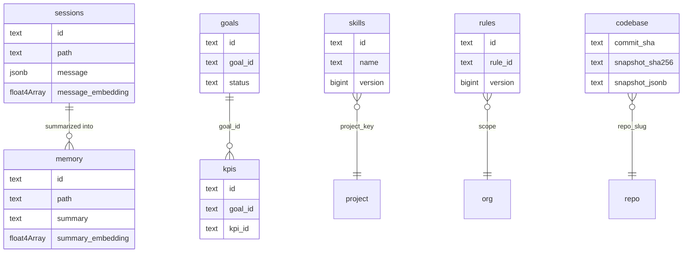
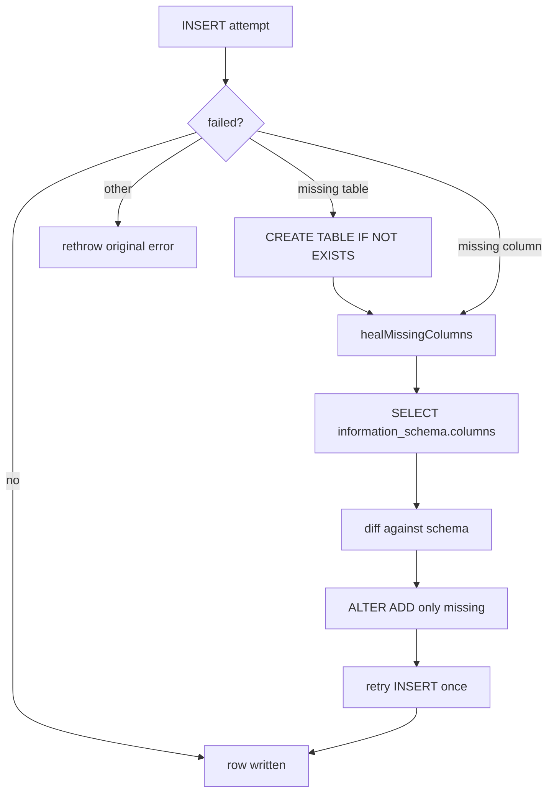

# Deeplake Tables Schema

> Category: Data | Version: 1.0 | Date: June 2026 | Status: Active

The canonical reference for every Deeplake table Hivemind owns: the full column DDL, the two write patterns that sidestep Deeplake's UPDATE quirk, the lazy schema-healing primitive, and the SQL-escaping rules that stand in for parameterized queries.

**Related:**
- [`memory-virtual-filesystem.md`](memory-virtual-filesystem.md)
- [`codebase-graph.md`](codebase-graph.md)
- [`../auth/auth-architecture.md`](../auth/auth-architecture.md)
- [`../architecture/system-overview.md`](../architecture/system-overview.md)
- [`../architecture/session-lifecycle.md`](../architecture/session-lifecycle.md)
- [`../overview.md`](../overview.md)

---

## Why the schema is defined in one place

Every durable byte Hivemind stores lives in a Deeplake table, and `src/deeplake-schema.ts` is the single source of truth for what those tables look like. Each table is described as an array of `{ name, sql }` column definitions, and both the `CREATE TABLE` path and the lazy schema-healing path iterate over that same array. Adding a column means one edit in one file; there is no second mirror in an `ensure` or `ALTER` routine that could drift out of sync.

This matters because Deeplake tables are created lazily, on first write, by whichever hook process happens to run first. A long-lived API client and a short-lived capture worker can both try to create or extend the same table concurrently. Centralizing the column list lets both paths heal toward the same target schema deterministically, regardless of who wins the race.

Two cross-cutting facts shape every table below. First, Deeplake's HTTP query endpoint does not support parameterized queries, so all values are escaped and interpolated by hand (see the SQL-safety section). Second, Deeplake has an UPDATE-coalescing quirk: two rapid UPDATEs to the same row within microseconds can silently drop one. Tables that expect concurrent edits therefore use an append-only, version-bumped pattern instead of in-place UPDATE.

---

## The seven tables at a glance

Hivemind owns seven tables. Their logical relationships (Deeplake enforces no foreign keys; all joins are logical) look like this:



| Table | Purpose | Write pattern |
|---|---|---|
| `sessions` | Raw per-turn agent events (one row per event) | Append-only INSERT |
| `memory` | Wiki summaries and VFS file rows | UPDATE-or-INSERT keyed by `path` |
| `skills` | Mined `SKILL.md` versions | Append-only, version-bumped |
| `rules` | Org-wide principles | Append-only, version-bumped |
| `goals` | User-tracked objectives | UPDATE-or-INSERT keyed by `goal_id` |
| `kpis` | Metrics attached to a goal | UPDATE-or-INSERT keyed by `(goal_id, kpi_id)` |
| `codebase` | Code-graph snapshots | SELECT-before-INSERT, per identity key |

---

## Memory and sessions: the capture and recall substrate

The `memory` table holds wiki summaries written by the SessionStart and SessionEnd workers, plus every file the virtual filesystem materializes. Its `summary` column is the file body; `summary_embedding` is the optional 768-dimension nomic vector that powers semantic recall.

```sql
CREATE TABLE IF NOT EXISTS "memory" (
  id                TEXT NOT NULL DEFAULT '',
  path              TEXT NOT NULL DEFAULT '',
  filename          TEXT NOT NULL DEFAULT '',
  summary           TEXT NOT NULL DEFAULT '',
  summary_embedding FLOAT4[],
  author            TEXT NOT NULL DEFAULT '',
  mime_type         TEXT NOT NULL DEFAULT 'text/plain',
  size_bytes        BIGINT NOT NULL DEFAULT 0,
  project           TEXT NOT NULL DEFAULT '',
  description       TEXT NOT NULL DEFAULT '',
  agent             TEXT NOT NULL DEFAULT '',
  plugin_version    TEXT NOT NULL DEFAULT '',
  creation_date     TEXT NOT NULL DEFAULT '',
  last_update_date  TEXT NOT NULL DEFAULT ''
) USING deeplake;
```

The `sessions` table holds the raw event stream: one row per UserPromptSubmit, PostToolUse, Stop, or SubagentStop event. Its `message` column is `JSONB` rather than `TEXT` because each row carries a structured payload (prompt, tool input, tool response). A single conversation produces many rows, so readers concatenate by `path` ordered by `creation_date`.

```sql
CREATE TABLE IF NOT EXISTS "sessions" (
  id                TEXT NOT NULL DEFAULT '',
  path              TEXT NOT NULL DEFAULT '',
  filename          TEXT NOT NULL DEFAULT '',
  message           JSONB,
  message_embedding FLOAT4[],
  author            TEXT NOT NULL DEFAULT '',
  mime_type         TEXT NOT NULL DEFAULT 'application/json',
  size_bytes        BIGINT NOT NULL DEFAULT 0,
  project           TEXT NOT NULL DEFAULT '',
  description       TEXT NOT NULL DEFAULT '',
  agent             TEXT NOT NULL DEFAULT '',
  plugin_version    TEXT NOT NULL DEFAULT '',
  creation_date     TEXT NOT NULL DEFAULT '',
  last_update_date  TEXT NOT NULL DEFAULT ''
) USING deeplake;
```

The capture path INSERTs a single row per event and never concatenates into an existing row, which is the deliberate fix for the write-race the wiki worker once hit. How these two tables are surfaced as a browsable filesystem is the subject of [`memory-virtual-filesystem.md`](memory-virtual-filesystem.md).

---

## Skills and rules: append-only version history

Skills and rules both expect edits over time and both want an audit trail, so they share the same shape: every write INSERTs a fresh row with `version` bumped by one, and readers take the highest version per logical key (`ORDER BY version DESC LIMIT 1`). This is the explicit countermeasure to the UPDATE-coalescing quirk. Two rapid edits become two distinct rows rather than two UPDATEs that fight over one row.

```sql
CREATE TABLE IF NOT EXISTS "skills" (
  id              TEXT NOT NULL DEFAULT '',
  name            TEXT NOT NULL DEFAULT '',
  project         TEXT NOT NULL DEFAULT '',
  project_key     TEXT NOT NULL DEFAULT '',
  local_path      TEXT NOT NULL DEFAULT '',
  install         TEXT NOT NULL DEFAULT 'project',
  source_sessions TEXT NOT NULL DEFAULT '[]',
  source_agent    TEXT NOT NULL DEFAULT '',
  scope           TEXT NOT NULL DEFAULT 'me',
  author          TEXT NOT NULL DEFAULT '',
  contributors    TEXT NOT NULL DEFAULT '[]',
  description     TEXT NOT NULL DEFAULT '',
  trigger_text    TEXT NOT NULL DEFAULT '',
  body            TEXT NOT NULL DEFAULT '',
  version         BIGINT NOT NULL DEFAULT 1,
  created_at      TEXT NOT NULL DEFAULT '',
  updated_at      TEXT NOT NULL DEFAULT ''
) USING deeplake;
```

The current state for a `(project_key, name)` pair is the most recent row. The `source_sessions` and `contributors` columns store JSON-encoded arrays as text; readers parse them back and fall back to `[author]` when `contributors` is an empty array (a legacy-caller shape that still round-trips).

```sql
CREATE TABLE IF NOT EXISTS "rules" (
  id             TEXT NOT NULL DEFAULT '',
  rule_id        TEXT NOT NULL DEFAULT '',
  text           TEXT NOT NULL DEFAULT '',
  scope          TEXT NOT NULL DEFAULT 'team',
  status         TEXT NOT NULL DEFAULT 'active',
  assigned_by    TEXT NOT NULL DEFAULT '',
  version        BIGINT NOT NULL DEFAULT 1,
  created_at     TEXT NOT NULL DEFAULT '',
  agent          TEXT NOT NULL DEFAULT 'manual',
  plugin_version TEXT NOT NULL DEFAULT ''
) USING deeplake;
```

A rule edit INSERTs version+1; the latest per `rule_id` wins. Rules feed the SessionStart context block alongside goals.

---

## Goals and KPIs: path-encoded, UPDATE-or-INSERT

Goals and KPIs are backed by the virtual filesystem path conventions, and the path is the source of truth for their structural fields. A goal lives at `memory/goal/<owner>/<status>/<goal_id>.md`; a KPI lives at `memory/kpi/<goal_id>/<kpi_id>.md`. The `content` column stores only the human-readable markdown body, so there is nothing to drift between the path-encoded fields and the row body.

```sql
CREATE TABLE IF NOT EXISTS "goals" (
  id             TEXT NOT NULL DEFAULT '',
  goal_id        TEXT NOT NULL DEFAULT '',
  owner          TEXT NOT NULL DEFAULT '',
  status         TEXT NOT NULL DEFAULT 'opened',
  content        TEXT NOT NULL DEFAULT '',
  version        BIGINT NOT NULL DEFAULT 1,
  created_at     TEXT NOT NULL DEFAULT '',
  updated_at     TEXT NOT NULL DEFAULT '',
  agent          TEXT NOT NULL DEFAULT 'manual',
  plugin_version TEXT NOT NULL DEFAULT ''
) USING deeplake;
```

Unlike skills and rules, the goals and KPIs tables hold one row per logical key forever. A status transition, an owner reassignment, or a body edit mutates the same row in place via UPDATE rather than inserting a new version. The `version` column survives as a vestigial `1`, kept so the audit-trail pattern can be reinstated without a migration. This is a deliberate v1 trade-off: one row per goal makes the Deeplake table view obvious and bootstrap queries simple, at the cost of no audit trail and exposure to the UPDATE-coalescing quirk for two writes that hit the same row within microseconds. For the single-user and small-team workflow this was an accepted choice.

The status enum is `opened`, `in_progress`, or `closed`, mirroring the path folder names. The `created_at` timestamp is preserved across edits (a status change records its time in `updated_at`) so goals stay in stable creation order in listings.

```sql
CREATE TABLE IF NOT EXISTS "kpis" (
  id             TEXT NOT NULL DEFAULT '',
  goal_id        TEXT NOT NULL DEFAULT '',
  kpi_id         TEXT NOT NULL DEFAULT '',
  content        TEXT NOT NULL DEFAULT '',
  version        BIGINT NOT NULL DEFAULT 1,
  created_at     TEXT NOT NULL DEFAULT '',
  updated_at     TEXT NOT NULL DEFAULT '',
  agent          TEXT NOT NULL DEFAULT 'manual',
  plugin_version TEXT NOT NULL DEFAULT ''
) USING deeplake;
```

A KPI is keyed by `(goal_id, kpi_id)`. Owner is intentionally not stored on the KPI; it is derived from the parent goal by a logical join on `goal_id`, which avoids a multi-file cascade move whenever a goal is reassigned between owners. The body is free markdown, by convention carrying `target:`, `current:`, and `unit:` lines that the commit-extract worker mutates.

How these path conventions are parsed and dispatched is detailed in [`memory-virtual-filesystem.md`](memory-virtual-filesystem.md).

---

## Codebase: snapshot rows for the code graph

The `codebase` table stores one row per `(org, workspace, repo, user, worktree, commit)` identity. The `snapshot_jsonb` column holds the canonical NetworkX node-link JSON written to disk, and `snapshot_sha256` both dedups identical content and detects extractor-version drift, because the same commit with the same extractor should always produce the same hash.

```sql
CREATE TABLE IF NOT EXISTS "codebase" (
  org_id            TEXT NOT NULL DEFAULT '',
  workspace_id      TEXT NOT NULL DEFAULT '',
  repo_slug         TEXT NOT NULL DEFAULT '',
  user_id           TEXT NOT NULL DEFAULT '',
  worktree_id       TEXT NOT NULL DEFAULT '',
  commit_sha        TEXT NOT NULL DEFAULT '',
  parent_sha        TEXT NOT NULL DEFAULT '',
  branch            TEXT NOT NULL DEFAULT '',
  ts                TIMESTAMP,
  pushed_by         TEXT NOT NULL DEFAULT '',
  snapshot_sha256   TEXT NOT NULL DEFAULT '',
  snapshot_jsonb    TEXT NOT NULL DEFAULT '',
  node_count        BIGINT NOT NULL DEFAULT 0,
  edge_count        BIGINT NOT NULL DEFAULT 0,
  generator         TEXT NOT NULL DEFAULT 'hivemind-graph',
  generator_version TEXT NOT NULL DEFAULT '',
  schema_version    BIGINT NOT NULL DEFAULT 1
) USING deeplake;
```

The identity key has no server-side UNIQUE constraint in the current schema, so the push path uses a SELECT-before-INSERT pattern and re-verifies after insert to make any concurrent-writer race observable. The full build, push, and pull lifecycle is covered in [`codebase-graph.md`](codebase-graph.md).

---

## SQL safety: escaping in place of parameters

Because the Deeplake query endpoint does not bind parameters, `src/utils/sql.ts` provides three escaping helpers that every query builder must use before interpolating a value.

```typescript
export function sqlStr(value: string): string {
  return value
    .replace(/\\/g, "\\\\")
    .replace(/'/g, "''")
    .replace(/\0/g, "")
    .replace(/[\x01-\x08\x0b\x0c\x0e-\x1f\x7f]/g, "");
}
```

`sqlStr` escapes a value for a single-quoted literal: it doubles backslashes and single quotes, drops NUL bytes, and strips control characters. `sqlLike` layers on `%` and `_` escaping for use inside `LIKE`/`ILIKE` patterns. `sqlIdent` validates a table or column name against `^[a-zA-Z_][a-zA-Z0-9_]*$` and throws on anything else, so identifiers are never interpolated unchecked.

```typescript
export function sqlIdent(name: string): string {
  if (!/^[a-zA-Z_][a-zA-Z0-9_]*$/.test(name)) {
    throw new Error(`Invalid SQL identifier: ${JSON.stringify(name)}`);
  }
  return name;
}
```

Text bodies that may contain escape sequences are written with the `E'...'` string form so the doubled-backslash escaping round-trips correctly; this is why the VFS flush path emits `summary = E'${text}'` rather than a plain literal.

---

## Schema healing: converging on the target columns

When a write fails because the table or a column is missing, the writer does not blindly recreate everything. It runs a targeted heal pass: one `SELECT` against `information_schema.columns` reads the current column set, the result is diffed against the schema definition, and only the genuinely missing columns are added with `ALTER TABLE ADD COLUMN`. The pass never blanket-ALTERs and never uses `IF NOT EXISTS`; the single tolerated race ("already exists" from a concurrent writer) is caught and re-verified with a second SELECT.



A guard at module load (`validateSchema`) rejects any `NOT NULL` column that lacks a `DEFAULT`, because `ALTER TABLE ADD COLUMN ... NOT NULL` on a populated table fails without a value to backfill. This catches a missing default at startup rather than in production healing. The `healMissingColumns` result returns both `missing` (what the diff found) and `altered` (what this call actually ran), which lets a short-lived worker distinguish "schema was already current" from "the ALTER lost every race", and decide whether the original error came from a column outside the schema's knowledge (in which case it rethrows rather than looping on a hopeless retry).

Error classification lives in the same module. `isMissingTableError` matches the "relation does not exist" family while explicitly excluding permission errors and any message mentioning `column` (which routes to the column branch instead). `isMissingColumnError` matches the missing-column wording. Both return false for permission-denied messages so a credentials problem never gets misread as a schema gap.

---

## Reading the current state

The read patterns follow directly from the write patterns:

- `memory`: read the row for a `path` directly (`SELECT summary FROM "memory" WHERE path = '...'`).
- `sessions`: read all rows for a `path` ordered by `creation_date` and concatenate the messages.
- `skills` and `rules`: take the highest `version` per logical key.
- `goals` and `kpis`: read the single row per key, ordered by `created_at DESC` at bootstrap.
- `codebase`: SELECT by the identity key; the pull path relaxes the key to drop `worktree_id` and takes `ORDER BY ts DESC LIMIT 1` for the freshest snapshot of a commit.

These conventions keep every table internally consistent under concurrent hook processes without relying on database transactions, which Deeplake does not expose at this layer.
