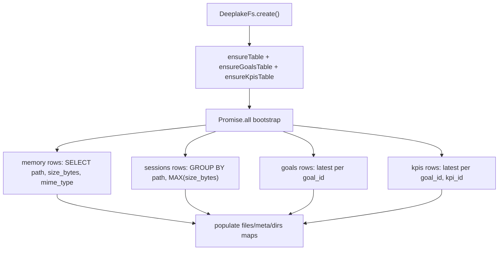
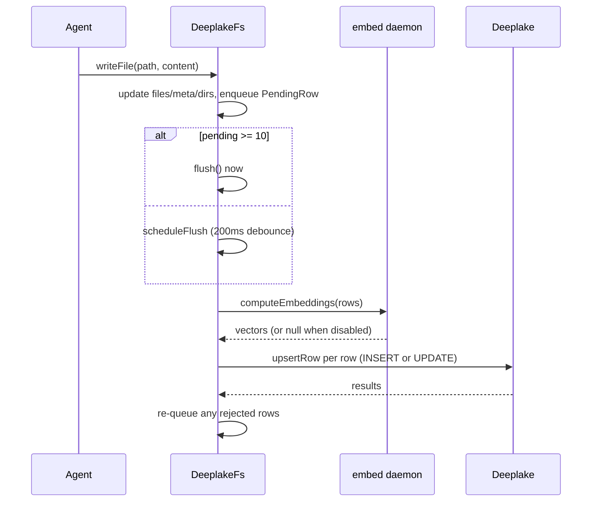
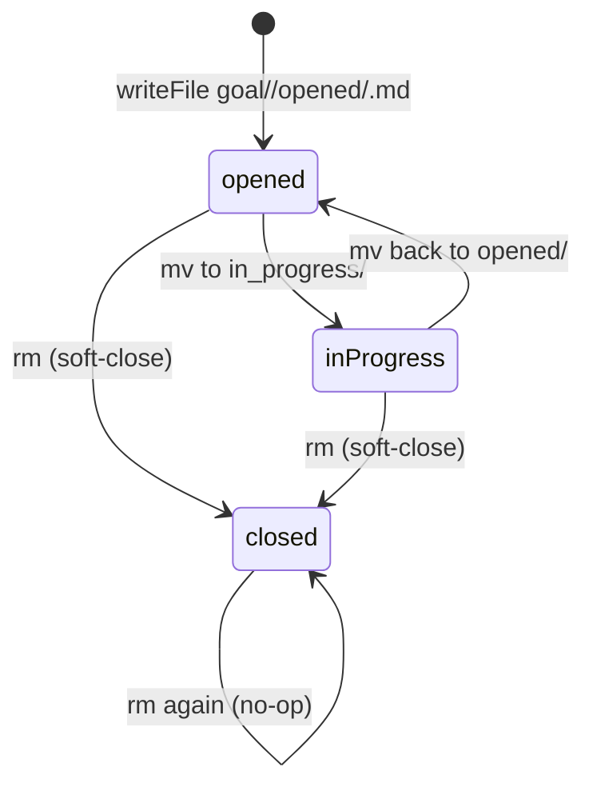

# Memory Virtual Filesystem

> Category: Data | Version: 1.0 | Date: June 2026 | Status: Active

How Hivemind makes a team-shared Deeplake database look like an ordinary directory at `~/.deeplake/memory/`: the `DeeplakeFs` intercept, path-routed dispatch to the goals and KPIs tables, batched writes with debounced flush, the synthesized `index.md`, and the read-only sessions and graph bridges.

**Related:**
- [`deeplake-tables-schema.md`](deeplake-tables-schema.md)
- [`codebase-graph.md`](codebase-graph.md)
- [`../security/trust-boundaries.md`](../security/trust-boundaries.md)
- [`../architecture/session-lifecycle.md`](../architecture/session-lifecycle.md)
- [`../architecture/system-overview.md`](../architecture/system-overview.md)
- [`../ai/embeddings-retrieval.md`](../ai/embeddings-retrieval.md)
- [`../overview.md`](../overview.md)

---

## Why a filesystem over a database

Coding agents already know how to `cat`, `ls`, `grep`, and `find`. Hivemind leans on that fluency: instead of teaching every assistant a new recall API, it presents memory as files under `~/.deeplake/memory/` and intercepts the shell commands that touch that mount. From the agent's point of view it is browsing files; underneath, each operation is a SQL query against the `sessions`, `memory`, `goals`, and `kpis` tables described in [`deeplake-tables-schema.md`](deeplake-tables-schema.md).

There are two consumers of this intercept. The PreToolUse hook rewrites Claude Code Bash, Read, Grep, and Glob commands one-shot and stateless. The standalone deeplake-shell exposes the same mount through a long-lived `DeeplakeFs` object that implements the `IFileSystem` interface from `just-bash`. Both produce the same view; this document focuses on the `DeeplakeFs` implementation in `src/shell/deeplake-fs.ts`, which is the richer of the two.

The mount is not a literal directory. No real files exist at these paths. Every read either hits an in-memory cache, a pending-write buffer, or a SQL query, and every write is buffered and flushed to Deeplake on a timer.

---

## Anatomy of DeeplakeFs

`DeeplakeFs` keeps four maps that together model the tree:

- `files`: path to `Buffer` (content) or `null` (the row exists but its body has not been fetched yet).
- `meta`: path to size, mime type, and mtime.
- `dirs`: directory path to the set of immediate child names.
- `pending`: paths written but not yet flushed to SQL.

A `flushed` set tracks which paths have already been INSERTed at least once, so a later flush of the same path uses UPDATE rather than a second INSERT. The constructor seeds the tree with the mount point and its parent.

At construction the factory `create()` bootstraps four sources in parallel before returning, so `ls` and `cat` work immediately against the cache:



The memory bootstrap reads `path, size_bytes, mime_type` ordered by path and registers each row as an unfetched file (`files.set(p, null)`). Crucially, it skips any goal-shaped or KPI-shaped path when the dedicated tables are configured, because those rows belong exclusively to the structured tables. Surfacing the generic-table copies would re-inject phantom goals into the VFS namespace that the `hivemind goal list` CLI (which reads only the structured table) would not see.

The sessions bootstrap groups by `path` and takes `MAX(size_bytes)`, a workaround for a Deeplake behavior where `SUM(size_bytes)` returns NULL when combined with `GROUP BY path`. For the single-row-per-file layout MAX equals SUM; for multi-row layouts it under-reports but stays positive so files never look like empty placeholders.

---

## Path classification: three destinations

Every read and write is first classified by `classifyPath` (from `src/shell/goal-paths.ts`) into one of three kinds:

| Kind | Path shape | Backing table |
|---|---|---|
| `goal` | `memory/goal/<owner>/<status>/<goal_id>.md` | `goals` |
| `kpi` | `memory/kpi/<goal_id>/<kpi_id>.md` | `kpis` |
| `memory` | anything else | `memory` |

The classifier strips any leading mount prefix by finding the last `/memory/` occurrence in the path, which lets it accept every shape an agent might produce: a mount-relative `/goal/...`, a test mount `/memory/goal/...`, a shell redirect `~/.deeplake/memory/goal/...`, or a host-absolute `/home/<user>/.deeplake/memory/goal/...`. The status component must be one of `opened`, `in_progress`, or `closed`, and the filename must end in `.md`; anything malformed falls back to `memory` so the generic path handles it.

```typescript
export function classifyPath(p: string): PathKind {
  const segs = segmentsUnderMemory(p);
  if (!segs) return "memory";
  if (segs[0] === "goal") {
    if (segs.length === 4 && segs[3].endsWith(".md") && VALID_STATUS.has(segs[2])) {
      return "goal";
    }
    return "memory";
  }
  if (segs[0] === "kpi") {
    if (segs.length === 3 && segs[2].endsWith(".md")) return "kpi";
    return "memory";
  }
  return "memory";
}
```

The path encoding is the source of truth: `decomposeGoalPath` extracts `owner`, `status`, and `goal_id` from the path, and the row's `content` column stores only the markdown body. `composeGoalPath` and `composeKpiPath` rebuild the canonical mount-relative path (no mount prefix) that both the cache and the DB rows use.

---

## Writes: batch, debounce, flush

Writes do not hit SQL immediately. `writeFile` updates the in-memory cache and tree, then enqueues a `PendingRow` and either flushes right away (when `pending.size` reaches the batch size of 10) or schedules a debounced flush 200 ms out. This coalesces the bursty write pattern of an agent editing several files in quick succession into a handful of round-trips.



The flush is serialized through a promise chain (`flushChain`) so two flushes never interleave. `_doFlush` drains the pending map, computes embeddings for the batch (skipping the daemon hop entirely when embeddings are globally disabled, writing NULL for the vector columns), and upserts every row in parallel via `Promise.allSettled`. Any row that fails is re-queued for the next flush unless a newer version was written in the meantime, and the flush throws so callers know some writes were deferred.

`upsertRow` dispatches by path kind. Goal and KPI writes route to `upsertGoalRow` / `upsertKpiRow`, which do their own SELECT-then-UPDATE-or-INSERT keyed by `goal_id` (or `goal_id, kpi_id`). The generic memory path branches on the `flushed` set: a path already flushed gets an UPDATE of `summary`, `summary_embedding`, `mime_type`, `size_bytes`, and `last_update_date` (plus optional `project` and `description`); a fresh path gets a full INSERT with a new UUID. Text bodies are escaped with `sqlStr` and written with the `E'...'` literal form (see [`deeplake-tables-schema.md`](deeplake-tables-schema.md)).

`appendFile` takes a fast path that avoids a read-back: when the file already exists it issues a SQL-level concatenation (`summary = summary || E'...'`) and invalidates the content cache so the next read fetches fresh data. This makes append O(1) per call rather than read-modify-write.

---

## Reads: cache, pending, sessions, SQL

`readFile` resolves content through a fixed precedence. It first checks the graph VFS bridge (covered below), then the synthesized `index.md`, then the content cache, then the pending-write buffer, then the sessions concatenation, and finally a direct SQL read of the `summary` column.

Session files are special. A session path lives in the `sessions` table as many rows (one per turn), so a read concatenates them: `SELECT message FROM "<sessions>" WHERE path = '...' ORDER BY creation_date ASC`, normalized and joined with newlines. Session files are read-only at the VFS layer; `writeFile`, `appendFile`, `rm`, `cp`, and `mv` all reject session paths with `EPERM`, because they are an append-only event log owned by the capture hook.

The `index.md` at the mount root is virtual. If no real row exists for `/index.md`, `generateVirtualIndex` builds one on the fly. It fetches the 50 most-recent summary rows (one extra beyond the cap to detect "more available") and the 50 most-recent session rows grouped by path, then hands both to the pure renderer `buildVirtualIndexContent` in `src/hooks/virtual-table-query.ts`. That renderer is the single source of truth shared by the deeplake-shell and the stateless PreToolUse hook path; it emits a two-section markdown table (memory summaries and raw sessions) with a per-section truncation notice pointing the agent at Grep for older rows.

`prefetch` warms the cache for many paths with one query each for the memory and sessions tables, batched at 50 paths per `IN (...)` clause, so a directory walk does not fan out into one query per file.

---

## Goal lifecycle through filesystem verbs

The goals table is mutated entirely through filesystem operations, with `rm` and `mv` carrying special meaning rather than their literal POSIX semantics.

`rm` on a goal path is a soft-close, not a delete. It writes the goal's content to the canonical `closed/<goal_id>.md` path (status flipped to `closed`) via `upsertGoalRow`, moves the cache entry from the source folder to the closed folder, and removes the old tree entry so a subsequent `ls` of `opened/` or `in_progress/` reflects the absence. The audit trail is preserved: the row still exists, just with `status = 'closed'`. `rm` on an already-closed goal is a no-op for the same reason, so an agent cannot accidentally wipe history.

`mv` between two goal paths is a status transition. It enforces the invariant that only the status component may change: the `goal_id` and `owner` must match, or the operation fails with `EPERM`. This avoids the cp-then-rm dance that would otherwise double-write to the goals table.



Both operations preserve `created_at` and record the edit time in `updated_at`, keeping goals in stable creation order in listings.

---

## The graph VFS bridge

A subtree at `<mount>/graph/` is not backed by any table at all. It is a synthesized read-only view over the local codebase-graph snapshot, dispatched by `handleGraphVfs` in `src/graph/vfs-handler.ts`. `DeeplakeFs` detects the `/graph/` prefix before its normal cache check, strips it, and delegates. The dispatcher is pure: it reads only the local snapshot file for the shell's current working directory and makes zero network calls.

```typescript
function readGraphFile(p: string, cwd: string): string {
  const sub = graphSubpathOf(p);
  const r = handleGraphVfs(sub, cwd);
  if (r.kind === "ok") return r.body;
  if (r.kind === "no-graph") return `(no-graph) ${r.message}`;
  throw fsErr("ENOENT", `${r.message}`, p);
}
```

The bridge keeps the FS contract honest. The `no-graph` result (no snapshot built yet for this cwd) is rendered as the file body rather than thrown as `ENOENT`, because the path conceptually exists and is reporting its own emptiness, mirroring how `/index.md` behaves when no rows exist. The `exists`, `stat`, and `realpath` methods are aligned so that `/graph`, `/graph/find`, and `/graph/show` are always-true directories while a leaf path only exists when the dispatcher returns `ok` or `no-graph`, never for an unknown endpoint. The query surface those paths expose is documented in [`codebase-graph.md`](codebase-graph.md).

---

## What the agent never sees

The intercept hides three things the agent would otherwise trip over. It hides write batching: a `cat` immediately after a `Write` reads from the pending buffer, so the agent sees its own write even before it reaches Deeplake. It hides the multi-row session layout: a session "file" is dozens of rows concatenated transparently. And it hides the goals and KPIs structured tables behind plain markdown files, so the agent manages objectives with `Write` and `mv` while the CLI reads the same state from typed columns. The result is that recall feels like browsing a directory while every operation is really a query against a team-shared, multi-tenant database.
