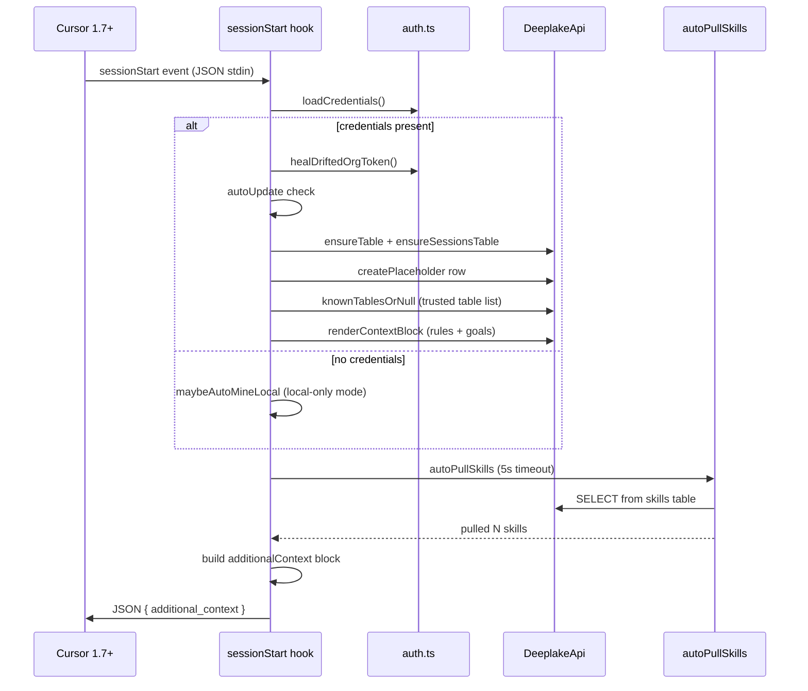

# Cursor Extension Architecture

> Category: Frontend | Version: 1.0 | Date: June 2026 | Status: Active

How Hivemind wires into Cursor 1.7+ via hooks.json, what each hook does, and how the session-start context block presents auth state and org identity to the agent.

**Related:**
- [`../plugins/integration-model.md`](../plugins/integration-model.md)
- [`../plugins/hook-lifecycle.md`](../plugins/hook-lifecycle.md)
- [`../architecture/system-overview.md`](../architecture/system-overview.md)
- [`../architecture/session-lifecycle.md`](../architecture/session-lifecycle.md)
- [`../multi-tenant/org-workspace-model.md`](../multi-tenant/org-workspace-model.md)
- [`../collaboration/team-skills-sharing.md`](../collaboration/team-skills-sharing.md)

---

## Why the Cursor integration exists

Cursor 1.7 introduced a `hooks.json` mechanism that fires TypeScript/Node scripts at named lifecycle events. Hivemind uses this surface as its Cursor integration shim: the same capture, recall, wiki-summary, and skillify mechanics that power the Claude Code plugin are re-expressed here, normalising Cursor's event payload shapes into the shared `HookInput` format consumed by `src/` core.

The Cursor integration is the fourth integration in the fleet (after Claude Code, Codex, and OpenClaw). Its hooks live at `src/hooks/cursor/` and are built by `npm run build` into `harnesses/cursor/bundle/`.

---

## Hook inventory

Cursor fires five hooks relevant to Hivemind. Each maps to one compiled Node script:

| Cursor event | Script | What it does |
|---|---|---|
| `sessionStart` | `session-start.ts` | Recalls context, injects auth state, auto-pulls skills, spawns graph worker |
| `beforeSubmitPrompt` | `capture.ts` | Writes the user's prompt as a `user_message` row in the `sessions` table |
| `postToolUse` | `capture.ts` | Writes each tool call and its output as a `tool_call` row |
| `afterAgentResponse` | `capture.ts` | Writes the assistant's reply as an `assistant_message` row; triggers periodic summary check |
| `stop` | `capture.ts` | Writes a `stop` row with final status and loop count |
| `sessionEnd` | `session-end.ts` | Spawns final wiki-worker summary and forces skillify session-end trigger |

The `preToolUse` hook is also wired for the `Shell` tool only. It intercepts any shell command aimed at `~/.deeplake/memory/` and rewrites it into a SQL query, returning the result as an `echo` command. This promotes Cursor from the "Tier 3 VFS file-stream" accuracy tier to "Tier 1 SQL fast-path" accuracy - the same level as Claude Code.

---

## Session-start context block

The most user-visible part of the Cursor integration is the `additional_context` string injected into every new session. Cursor passes this string directly into the agent's working context before the first user turn, so the agent sees Hivemind's memory layout and available CLI commands without any user prompt.

The block is composed in layers inside `session-start.ts`:

```
base context (memory layout + CLI commands)
  + auth state line ("Logged in as org: Acme (workspace: default)" OR "Not logged in. Run: hivemind login")
  + goals instructions (when logged in)
  + rules block (org-wide rules from hivemind_rules table, when logged in)
  + graph context line (when a codebase graph exists for this workspace root)
```

### Auth state line

The auth state line is the only place in the Cursor UI where org and workspace identity is surfaced to the agent. It reads directly from the credentials loaded at hook startup:

```
Logged in to Deeplake as org: Acme (workspace: default)
```

or, when credentials are absent:

```
Not logged in to Deeplake. Run: hivemind login
```

When credentials exist but carry a drifted org token (the `jwt.org_id` claim does not match `creds.orgId`), the session-start hook calls `healDriftedOrgToken` before building the context block. The heal re-mints the token against the correct org, then realigns `orgName` and validates `workspaceId` against the same org. This means the auth state line always reflects the org the user last switched to, not the org baked into a stale token.

### Rules block

When the user is logged in, `renderContextBlock` queries the `hivemind_rules` table and appends any active rules to the context. Rules are org-wide by default (scope `team`) and are inserted unconditionally into every agent session across the workspace.

---

## Capture mechanics

All four capture events (`beforeSubmitPrompt`, `postToolUse`, `afterAgentResponse`, `stop`) are handled by the same compiled script, `capture.ts`. Each event writes one row into the `sessions` table with an `agent` field of `"cursor"` and a `plugin_version` field stamped from the bundle's `.claude-plugin` version marker.

The capture script respects two environment gates:

- `HIVEMIND_CAPTURE=false`: skips all INSERT operations, making the integration fully read-only for the session.
- `isHivemindPluginEnabled()`: a marketplace-managed flag that lets users pause capture without uninstalling the plugin.

Cursor delivers `tool_output` already JSON-encoded as a string, unlike Claude Code which delivers a structured object. The capture script handles this difference: it passes `tool_output` through without further `JSON.stringify` wrapping.

Embeddings are computed per row when the nomic embed daemon is available. If the daemon is absent or `HIVEMIND_EMBEDDINGS=false` is set, the `message_embedding` column lands as NULL and the row is still written. The self-heal path (`ensurePluginNodeModulesLink`) runs once per process to restore any broken symlink that a marketplace auto-upgrade may have dropped.

---

## Periodic summary trigger

Every `afterAgentResponse` event bumps a per-session counter stored in `~/.deeplake/state/` (via `bumpTotalCount`). When the count crosses a configurable threshold (`everyNMessages`) or a time threshold (`everyHours`) is exceeded, the hook spawns a detached wiki-worker process to summarise the current session's activity. The worker uses `cursor-agent --print` (the Cursor agent CLI) to write the summary into the `memory` table.

A file-system lock prevents two wiki workers from running concurrently for the same session: the periodic trigger checks `tryAcquireLock` before spawning, and the session-end hook does the same before spawning the final summary worker. If a periodic worker is already running when the session ends, the session-end hook skips the final spawn.

---

## Session-end summary

When Cursor fires `sessionEnd`, the hook:

1. Reads `conversation_id` (or `session_id`) from the payload.
2. Calls `forceSessionEndTrigger` to fire the skillify miner for this session.
3. Checks the wiki-worker lock. If a periodic worker is mid-flight, skips the final spawn; otherwise acquires the lock and spawns the wiki worker.
4. The wiki worker runs `cursor-agent --print` against the captured session rows, writes a summary into `memory`, and releases the lock.

---

## Pre-tool-use recall intercept

The `preToolUse` hook fires only when Cursor calls the `Shell` tool. The hook checks whether the command targets `~/.deeplake/memory/` (or its aliases). If it does, the hook:

1. Parses the bash command using the shared `parseBashGrep` parser.
2. Runs `searchDeeplakeTables` as a single SQL query against the `memory` and `sessions` tables.
3. Returns an `updated_input` that replaces the original shell command with `echo <result>`.

Cursor never executes the original grep against the real filesystem. From the agent's view, it ran `grep` and got back structured memory results. This is the same semantic contract that Claude Code's `PreToolUse` hook provides, making Cursor recall quality identical across both agents.

---

## Auto-update

The session-start hook calls `autoUpdate` before any database operations. This checks the installed plugin version against the published latest version and emits an upgrade notice when the two diverge. The check has no dependency on table state, so it fires promptly even when the Deeplake API is slow or unreachable.

---

## Mermaid: session-start flow



---

## File locations

| File | Role |
|---|---|
| `src/hooks/cursor/session-start.ts` | SessionStart hook source |
| `src/hooks/cursor/capture.ts` | Multi-event capture script |
| `src/hooks/cursor/session-end.ts` | SessionEnd summary trigger |
| `src/hooks/cursor/pre-tool-use.ts` | Recall intercept for Shell tool |
| `src/hooks/cursor/spawn-wiki-worker.ts` | Wiki worker spawner for Cursor |
| `src/hooks/cursor/wiki-worker.ts` | Cursor wiki worker (calls `cursor-agent --print`) |
| `harnesses/cursor/bundle/` | Compiled hook scripts (npm → `~/.cursor/hivemind/bundle/`) |
| `harnesses/cursor/extension/` | VS Code / Cursor extension source (status bar, dashboard, hook wiring UI) |

---

## Editor extension (`harnesses/cursor/extension/`)

The hooks integration above is sufficient for capture, recall, skillify, and graph builds. The optional **Hivemind for Cursor** extension adds operator UX on top:

- Status bar health for CLI, `cursor-agent`, login, and hook wiring
- **Wire / Refresh Hooks** copies `harnesses/cursor/bundle/` into `~/.cursor/hivemind/bundle/` and idempotently merges `~/.cursor/hooks.json`
- Browser or API-key login without a terminal
- Dashboard webview: KPIs, settings, sessions, graph canvas, rules list, skill sync state
- On activation, syncs symlinks into `~/.cursor/skills-cursor/` and `<project>/.cursor/skills/`

User-facing install and command reference: [harnesses/cursor/extension/README.md](../../../../harnesses/cursor/extension/README.md). Product requirements: `library/requirements/backlog/prd-002-cursor-extension-core/` through `prd-005-cursor-skillify-bridge/`.
