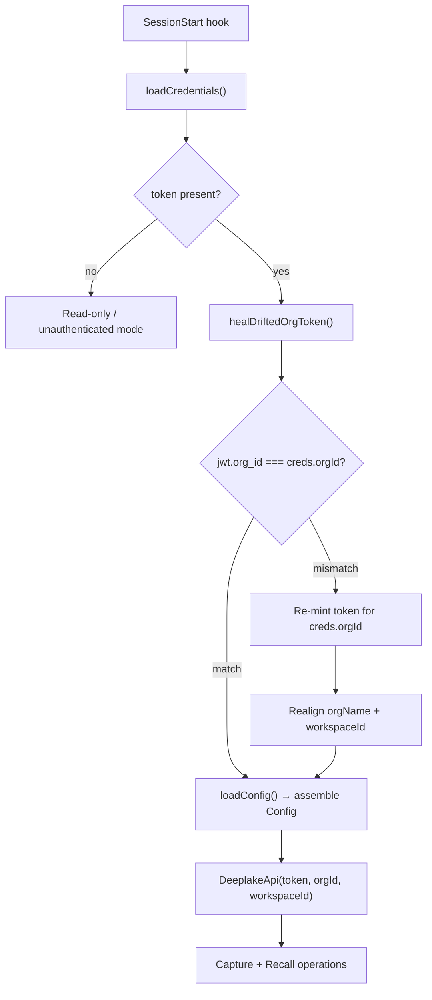

# Org and Workspace Model

> Category: Multi-tenant | Version: 1.0 | Date: June 2026 | Status: Active

How Hivemind maps Deeplake's org and workspace hierarchy onto per-agent credential files, how the API client enforces tenant isolation, and what happens during org switches and token drift.

**Related:**
- [`../auth/auth-architecture.md`](../auth/auth-architecture.md)
- [`../data/deeplake-tables-schema.md`](../data/deeplake-tables-schema.md)
- [`../architecture/system-overview.md`](../architecture/system-overview.md)
- [`../frontend/cursor-extension-architecture.md`](../frontend/cursor-extension-architecture.md)
- [`../collaboration/team-skills-sharing.md`](../collaboration/team-skills-sharing.md)
- [`../security/trust-boundaries.md`](../security/trust-boundaries.md)

---

## Two-level hierarchy

Hivemind's tenancy model follows Deeplake's native two-level structure: every user belongs to one or more **organizations**, and each organization contains one or more **workspaces**. Tables, rows, and vectors are scoped to a (org, workspace) pair. No query from one workspace ever sees a row that belongs to another.

At runtime, the active org and workspace are carried in the credential file, not in environment state. Every hook process reads `~/.deeplake/credentials.json` at startup, extracts `orgId` and `workspaceId`, and passes them to `DeeplakeApi`. The API client sends `orgId` on every request via the `X-Activeloop-Org-Id` header.

---

## Credential file layout

The credential file lives at `~/.deeplake/credentials.json`. Its directory is created with mode `0700` and the file itself with mode `0600`, keeping tokens off shared-directory reads. The `Credentials` shape carries:

```typescript
interface Credentials {
  token: string;        // long-lived org-bound API token
  orgId: string;        // Deeplake org UUID
  orgName?: string;     // display name for session banners
  userName?: string;    // local username stamped on every captured row
  workspaceId?: string; // "default" or a specific workspace id/name
  apiUrl?: string;      // defaults to https://api.deeplake.ai
  autoupdate?: boolean;
  savedAt: string;      // ISO timestamp of last write
}
```

`workspaceId` defaults to the string `"default"` when absent. Deeplake resolves the `"default"` sentinel server-side, so the client never needs to know the actual UUID of the default workspace.

Every environment variable override (`HIVEMIND_TOKEN`, `HIVEMIND_ORG_ID`, `HIVEMIND_WORKSPACE_ID`) wins over the file at `loadConfig()` time, letting CI pipelines and test suites inject alternate tenants without touching the user's credentials.

---

## Device-flow login

Login follows RFC 8628 (Device Authorization Flow). The sequence is:

1. `hivemind login` calls `requestDeviceCode` at `POST /auth/device/code`, which returns a `verification_uri_complete`, a short `user_code`, and a polling `device_code`.
2. The CLI opens the browser to `verification_uri_complete` (or prints the URL when the browser launch fails). The user approves on the Deeplake web app.
3. The CLI polls `POST /auth/device/token` at the server-mandated interval (minimum 5 seconds) until it receives an `access_token` or the device code expires.
4. `saveCredentialsFromToken` exchanges the short-lived Auth0 token for a long-lived API token bound to the selected org: it calls `POST /users/me/tokens` with `organization_id` and `duration=31536000` (one year), then persists the resulting token.

The long-lived token carries an `org_id` claim baked in at mint time. This claim is what the drift-healing logic checks.

Org selection during login follows a priority order:
1. `HIVEMIND_ORG_ID` env var (explicit override).
2. `org_id` claim in the JWT, when `skipTokenMint=true` (API-key path: the token was already minted against a specific org).
3. First org in the account's list (device-flow path: falls back to `orgs[0]`, then re-mints against it).

---

## Org switching

`hivemind org switch <name-or-id>` calls `switchOrg`. Because the API token carries an `org_id` claim baked in at mint time, switching orgs requires re-minting a new token, not just updating `orgId` in the credential file. A legacy bug (pre-fix, before the current code) only rewrote `orgId` without re-minting, leaving the token's JWT claim pointing at the old org. The current `switchOrg` always re-mints.

Re-minting uses a timestamp suffix on the token name (`deeplake-plugin-switch-<Date.now()>`) because Deeplake rejects duplicate `(user_id, name)` pairs with a `500`. A date-only suffix would collide if the user ran two switches on the same day.

---

## Workspace switching

`hivemind workspace <id>` calls `switchWorkspace`, which rewrites only `workspaceId` in the credential file. No token re-mint is required because the workspace is passed as a query scope parameter to the API, not baked into the JWT. Workspace IDs can be name strings or UUID strings; the API resolves both.

---

## Token drift healing

A historical deployment bug left some users with credential files where `orgId` had been updated by `org switch` but the token's `org_id` JWT claim still pointed at the old org. Every `SessionStart` hook calls `healDriftedOrgToken` to detect and repair this state transparently.

The heal logic:

1. Decodes the JWT payload from `creds.token` without verifying the signature (no public key needed: this is a read of public claims).
2. Compares `jwt.org_id` to `creds.orgId`. If they match, returns the credential unchanged.
3. On mismatch, re-mints a fresh org-bound token against `creds.orgId` using a `Date.now()` suffixed name.
4. With the new token, runs two independent best-effort realignments:
   - Fetches `GET /organizations` and updates `orgName` if the display name drifted.
   - Fetches `GET /workspaces` and resets `workspaceId` to `"default"` if the previously-set workspace no longer exists in the new org, or resolves a name to its canonical UUID if it was stored by name.
5. Persists the healed credentials and returns them.

The heal never throws: a failed re-mint logs a warning and returns the original (stale) credentials so the session can continue. The two realignment blocks are independent try/catch blocks so a transient API error on one cannot suppress the other.

---

## Config loading and table name resolution

`loadConfig()` in `src/config.ts` assembles the full runtime configuration from the credential file plus environment overrides:

| Config field | Default | Env override |
|---|---|---|
| `token` | `credentials.json:token` | `HIVEMIND_TOKEN` |
| `orgId` | `credentials.json:orgId` | `HIVEMIND_ORG_ID` |
| `workspaceId` | `"default"` | `HIVEMIND_WORKSPACE_ID` |
| `apiUrl` | `https://api.deeplake.ai` | `HIVEMIND_API_URL` |
| `tableName` (memory) | `"memory"` | `HIVEMIND_TABLE` |
| `sessionsTableName` | `"sessions"` | `HIVEMIND_SESSIONS_TABLE` |
| `skillsTableName` | `"skills"` | `HIVEMIND_SKILLS_TABLE` |
| `rulesTableName` | `"hivemind_rules"` | `HIVEMIND_RULES_TABLE` |
| `goalsTableName` | `"hivemind_goals"` | `HIVEMIND_GOALS_TABLE` |
| `kpisTableName` | `"hivemind_kpis"` | `HIVEMIND_KPIS_TABLE` |
| `codebaseTableName` | `"codebase"` | `HIVEMIND_CODEBASE_TABLE` |
| `memoryPath` | `~/.deeplake/memory` | `HIVEMIND_MEMORY_PATH` |

Table names are scoped to the `(orgId, workspaceId)` pair by the Deeplake API itself: two workspaces that each have a table named `"memory"` hold completely separate data. The client does not prefix table names.

---

## Member management

Org membership is managed through three API functions in `src/commands/auth.ts`:

- `inviteMember(username, accessMode, ...)` - invites a user with role `ADMIN`, `WRITE`, or `READ`.
- `listMembers(token, orgId, ...)` - returns `{ user_id, name, email, role }` for every current member.
- `removeMember(userId, ...)` - removes a member by their Deeplake user ID.

All three pass the `X-Activeloop-Org-Id` header so they operate against the correct org. The CLI surfaces these as `hivemind invite`, `hivemind members`, and `hivemind remove`.

---

## Tenant isolation at the storage layer

Deeplake enforces org and workspace boundaries at the storage layer: tables, rows, partitions, and vector indexes are never shared across workspace boundaries. Hivemind does not implement any application-level tenant filtering (no `WHERE org_id = ?` predicates on every query). Isolation is entirely the responsibility of the API client sending the correct `X-Activeloop-Org-Id` header and using the correct workspace-scoped API endpoint.

This means a mis-configured token (wrong `org_id` claim) does not cause data leakage to the wrong org - Deeplake returns a 403 or routes the request to the wrong org's tables. The drift-healing path described above exists precisely to prevent this routing failure from happening silently.

---

## Mermaid: org and workspace resolution at session start


