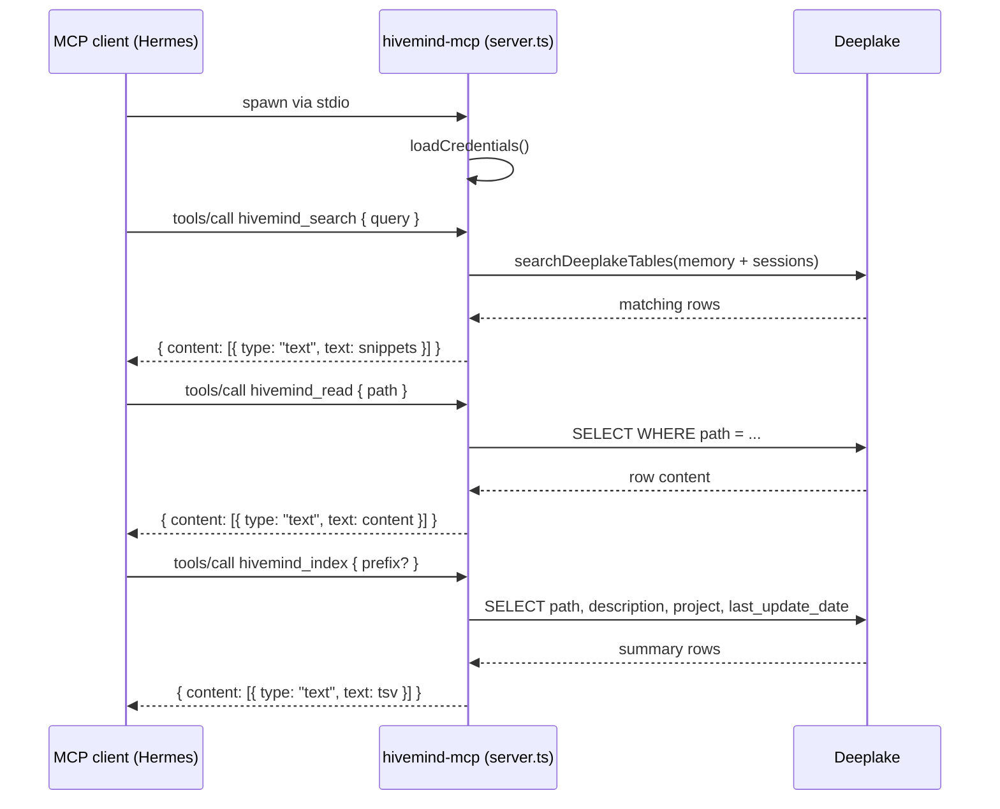
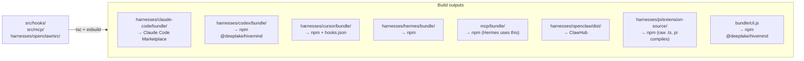

# MCP and Extension Surfaces

> Category: Plugins | Version: 1.0 | Date: June 2026 | Status: Active

The three non-hook integration surfaces in Hivemind: the MCP server that exposes memory as MCP tools, the OpenClaw native extension with its contracted tools and memory-corpus federation, and the distributable plugin bundles for Claude Code and Cursor.

**Related:**
- [`integration-model.md`](integration-model.md)
- [`hook-lifecycle.md`](hook-lifecycle.md)
- [`../ai/embeddings-retrieval.md`](../ai/embeddings-retrieval.md)
- [`../architecture/system-overview.md`](../architecture/system-overview.md)
- [`../architecture/session-lifecycle.md`](../architecture/session-lifecycle.md)
- [`../overview.md`](../overview.md)
- [`../../../../docs/ARCHITECTURE.md`](../../../../docs/ARCHITECTURE.md)

---

## Overview

Hook-based capture and VFS recall cover Claude Code, Codex, Cursor, Hermes, and pi through their respective `hooks.json` or extension entry points. Three additional surfaces exist for agents or runtimes that cannot or should not use hooks for recall:

1. The **MCP server** (`src/mcp/server.ts`) provides a standard Model Context Protocol interface to Hivemind memory, currently used by Hermes and available to any future MCP-capable client.
2. The **OpenClaw extension** (`harnesses/openclaw/src/index.ts`) is a native plugin that integrates through OpenClaw's gateway contract, registering tools, commands, and a memory-corpus supplement instead of hook events.
3. The **distributable bundles** (`harnesses/claude-code/`, `cursor/`) are the packaged artifacts that ship to their respective marketplaces and hook registries, built from the shared core sources.

---

## The MCP server

The MCP server lives at `src/mcp/server.ts` and exposes three tools over stdio transport. It is spawned as a subprocess by the consuming MCP client (Hermes today) and runs as a read-only process. It never writes to Deeplake and never creates tables; table provisioning happens in the per-agent SessionStart hooks.



### Tools

**`hivemind_search`** accepts a `query` string and an optional `limit` (1-50, default 10). It delegates to `searchDeeplakeTables` from `src/shell/grep-core.ts`, which runs a hybrid lexical-plus-semantic query across both the `memory` table (summaries) and the `sessions` table (raw turns). Results are returned as path-and-snippet pairs separated by horizontal rules. The tool description explicitly notes that different paths under `/summaries/<username>/` belong to different users and should not be merged.

**`hivemind_read`** accepts a single `path` string starting with `/`. It resolves the target table from the path prefix: `/sessions/` paths query the `sessions` table and fetch the `message` column; all other paths query the `memory` table and fetch the `summary` column. A LIMIT of 200 rows prevents runaway reads on large JSONL session files.

**`hivemind_index`** accepts an optional `prefix` (e.g. `/summaries/alice/`) and an optional `limit` (1-200, default 50). It queries the `memory` table for summary entries sorted by `last_update_date` descending and returns a TSV payload with `path`, `last_updated`, `project`, and `description` columns. This is the discovery entry point: call it to see what is in memory, then `hivemind_read` to fetch a specific session.

### Authentication and error handling

The server calls `loadCredentials` at the start of every tool invocation via `getContext()`. If credentials are missing, tools return a clear "not authenticated" message rather than crashing. On a fresh org where no session has ever run, the `memory` and `sessions` tables do not exist yet (they are created by the first SessionStart hook). A missing-table 400 error from Deeplake is caught and surfaced as a human-readable "memory is empty" hint rather than a raw API error (resolved in issue #252).

---

## The OpenClaw extension

OpenClaw loads plugins from `~/.openclaw/extensions/hivemind/dist/index.js`. The extension is built from `harnesses/openclaw/src/index.ts` and installed by `src/cli/install-openclaw.ts`. It follows OpenClaw's `definePluginEntry` contract: a synchronous `register(pluginApi)` function that must complete registration before returning, with all async work in a fire-and-forget IIFE.

### Plugin manifest

The OpenClaw plugin manifest at `harnesses/openclaw/openclaw.plugin.json` declares the extension's contract:

```json
{
  "id": "hivemind",
  "contracts": {
    "tools": [
      "hivemind_search", "hivemind_read", "hivemind_index",
      "hivemind_goal_add", "hivemind_kpi_add"
    ],
    "commands": [
      "hivemind_login", "hivemind_capture", "hivemind_whoami",
      "hivemind_orgs", "hivemind_switch_org",
      "hivemind_workspaces", "hivemind_switch_workspace",
      "hivemind_setup", "hivemind_version",
      "hivemind_update", "hivemind_autoupdate"
    ],
    "memoryCorpusSupplements": true
  }
}
```

The `memoryCorpusSupplements: true` declaration tells OpenClaw's runtime that this plugin implements the `MemoryCorpusSupplement` interface. Other plugins that expose a generic `memory_search` tool can fan out queries to registered supplements, so memory-core users get Hivemind hits automatically without any extra wiring.

### Registered agent tools

The three recall tools (`hivemind_search`, `hivemind_read`, `hivemind_index`) mirror the MCP server tools but use the OpenClaw `AgentTool` interface and accept richer parameters. `hivemind_search` additionally supports `path`, `regex`, and `ignoreCase` fields. All three call the same `searchDeeplakeTables` and `readVirtualPathContent` functions from the shared core.

Two write tools are also registered:

- **`hivemind_goal_add`** creates a new goal row in the `hivemind_goals` table with `agent: "openclaw"` provenance. It mirrors the `hivemind goal add --agent capture` CLI path.
- **`hivemind_kpi_add`** creates a KPI row in the `hivemind_kpis` table linked to an existing goal by `goal_id`.

### Commands

Eleven slash commands are available: `/hivemind_login`, `/hivemind_capture`, `/hivemind_whoami`, `/hivemind_orgs`, `/hivemind_switch_org`, `/hivemind_workspaces`, `/hivemind_switch_workspace`, `/hivemind_setup`, `/hivemind_version`, `/hivemind_update`, and `/hivemind_autoupdate`.

The `/hivemind_setup` command is OpenClaw-specific. It calls `ensureHivemindAllowlisted` from the dynamically-imported `setup-config.ts` chunk to add `"hivemind"` to both `plugins.allow` and `tools.alsoAllow` in `~/.openclaw/openclaw.json`. This step is required once per install to make the memory tools available to the active agent model.

### The env-harvesting workaround

OpenClaw's per-bundle static scanner flags any `process.env` access in a file that also calls `fetch()` as critical `env-harvesting`. To work around this, all `HIVEMIND_*` environment variable reads in the openclaw bundle are replaced by esbuild's `define` with `globalThis.__hivemind_tuning__?.HIVEMIND_X`. The `applyOpenclawTuning` function, called once at `register()` time, bridges the user's `openclaw.json` plugin config `tuning` object into that global:

```
pluginConfig.tuning.queryTimeoutMs  →  globalThis.__hivemind_tuning__.HIVEMIND_QUERY_TIMEOUT_MS
pluginConfig.tuning.semanticSearch  →  globalThis.__hivemind_tuning__.HIVEMIND_SEMANTIC_SEARCH
pluginConfig.tuning.debug           →  globalThis.__hivemind_tuning__.HIVEMIND_DEBUG
...
```

This preserves runtime tunability through the plugin config without any literal `process.env.X` strings in the bundle.

### Capture and skillify in agent_end

The `agent_end` hook fires after each agent turn with a full `messages` array. The extension slices off the messages captured since the previous turn using a per-session count (`capturedCounts`), inserts each new user/assistant message as a separate row into the `sessions` table with a session path matching the Claude Code convention (`/sessions/<user>/<user>_<org>_<ws>_<sessionId>.jsonl`), and then fires the skillify worker.

Because OpenClaw has no CLI of its own, the skillify worker needs a delegate gate agent to evaluate whether a session is worth mining. `detectOpenclawGateAgent` probes the PATH for `claude`, `codex`, `cursor-agent`, `hermes`, and `pi` in that order and returns the first found. If none is installed, the worker spawn is skipped for that turn.

### Memory-corpus supplement

The extension registers a `MemoryCorpusSupplement` object with `search` and `get` methods. Both call the same Deeplake query functions used by the agent-facing tools. The `search` method scores summary hits (`/summaries/` paths) at 0.8 and raw session hits at 0.6, spreading within-group by source order so results stay deterministic across runs.

---

## Distributable plugin bundles

### Claude Code marketplace plugin

The Claude Code integration ships as a marketplace plugin from the `harnesses/claude-code/` directory. The build step (`npm run build`) runs `tsc` then `esbuild` and emits the bundle to `harnesses/claude-code/bundle/`. The plugin is submitted to the Claude Code Marketplace and installed by users via `hivemind install` or by running the marketplace installer directly.

The plugin manifest specifies the hook entry points and declares the Claude Code-specific capabilities (tool permissions, capabilities flags). The actual hook logic lives in `src/hooks/` and is bundled into the plugin output.

### Cursor hooks.json

The Cursor integration does not ship a traditional plugin; it writes a `~/.cursor/hooks.json` file pointing at the bundled hook scripts. The build output lands in `harnesses/cursor/bundle/`. The `hivemind install` CLI (via `src/cli/install-cursor.ts`) writes the hooks.json entry, creates the bundle directory, and registers `sessionStart`, `beforeSubmitPrompt`, `postToolUse`, `afterAgentResponse`, `stop`, and `sessionEnd` hooks.

Cursor 1.7+ introduced a hooks mechanism that is semantically similar to Claude Code's but uses lowercase event names and a different JSON output schema (`additional_context` vs `additionalContext`). The Cursor shim in `src/hooks/cursor/` normalizes these differences.

### Build outputs and distribution channels



All npm-distributed artifacts ship as part of the `@deeplake/hivemind` package. The `hivemind install` CLI detects which assistants are installed on the machine and writes the appropriate config files and bundle symlinks for each one. The OpenClaw plugin is distributed separately through ClawHub, OpenClaw's native plugin registry, because its bundle must pass ClawHub's static security scanner and satisfy the native extension contract.
