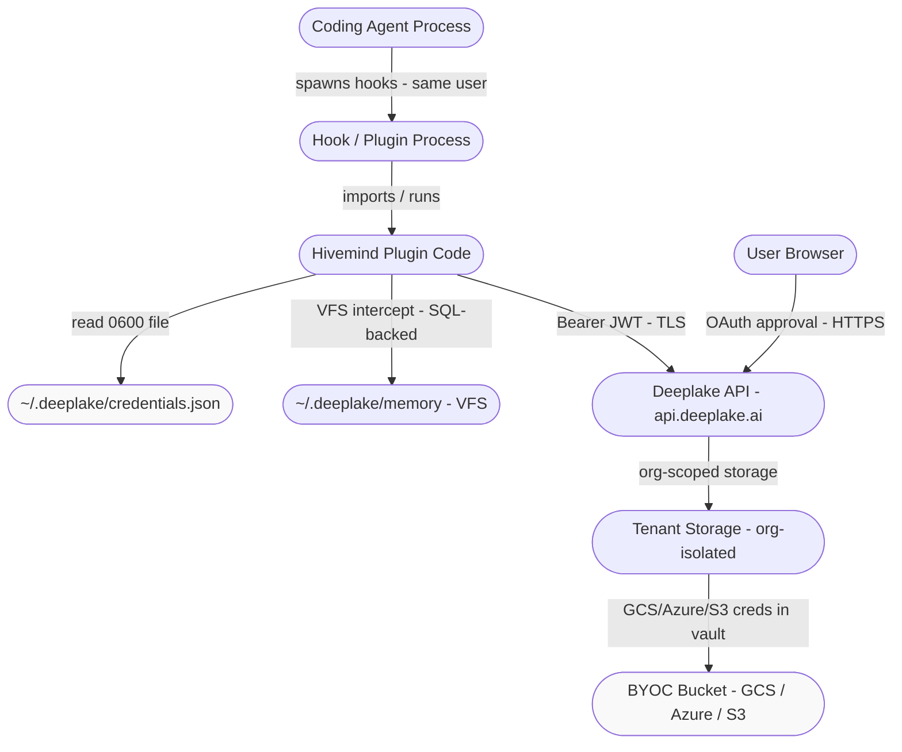
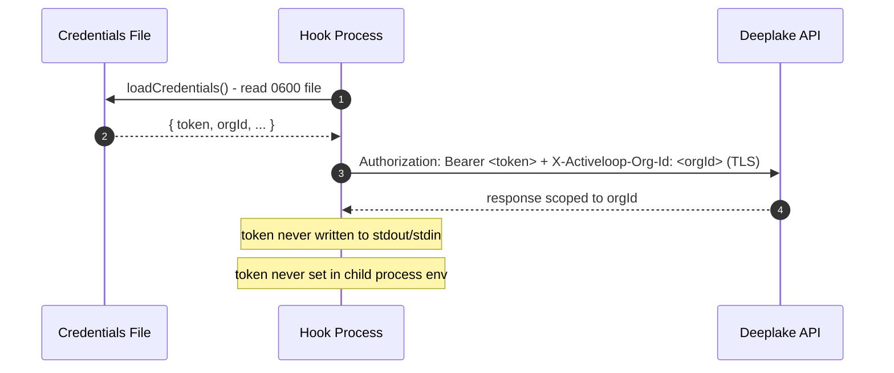

# Trust Boundaries

> Category: Security | Version: 1.0 | Date: June 2026 | Status: Active

Maps every trust boundary in the Hivemind system: where code runs, what it can access, who controls each boundary, and what defenses prevent privilege escalation or data leakage between zones.

**Related:**
- [`credential-storage.md`](credential-storage.md)
- [`../auth/auth-architecture.md`](../auth/auth-architecture.md)
- [`../data/memory-virtual-filesystem.md`](../data/memory-virtual-filesystem.md)
- [`../architecture/system-overview.md`](../architecture/system-overview.md)
- [`../overview.md`](../overview.md)

---

## Trust Boundary Map

Note: the diagram uses fill only on data-at-rest nodes to distinguish them from process nodes; no security meaning is implied by the fill color.

---

## Zone Definitions

| Zone | Owner | What runs there | Trust level |
|---|---|---|---|
| **User Browser** | User's OS | OAuth device-flow approval page | User-trusted (separate from agent) |
| **Agent Process** | Coding agent (Claude Code, Codex, Cursor, etc.) | Agent LLM loop, tool calls | Host OS user |
| **Hook / Plugin Process** | Agent runtime | Spawned Node bundles at lifecycle events | Same OS user as agent |
| **Hivemind Plugin Code** | `~/.cursor/hivemind/bundle/` or equivalent | Capture, recall, session hooks | Same OS user; no elevated privilege |
| **Credentials File** | File system | `~/.deeplake/credentials.json` | Mode 0600; OS user only |
| **VFS Layer** | `~/.deeplake/memory/` | SQL-backed virtual filesystem for memory | OS user; allowlisted commands only |
| **Deeplake API** | Activeloop / cloud | REST API, session storage, skill mining | Authenticated with org-bound JWT |
| **Tenant Storage** | Deeplake cloud | Row-level org/workspace isolation | Server-enforced; AES-256 at rest |
| **BYOC Bucket** | Customer's cloud (GCS/Azure/S3) | Raw object storage | Customer-controlled; creds in Deeplake vault |

---

## Token Handling at Boundaries

The access token is the primary security primitive. It moves across boundaries as follows:

Key invariants:
- The token is read from disk at hook startup. It is never passed as a command-line argument (visible in `ps aux`) or written to `process.env` (visible to child processes).
- All API calls use TLS. The token is in an HTTP header, not a URL query parameter.
- `authLog` writes to `process.stderr`, not `stdout`, so token-adjacent messages cannot be parsed by callers that read hook stdout as structured data.

---

## Hook Consent Model

Hivemind installs hooks into agent lifecycle events (`sessionStart`, `beforeSubmitPrompt`, `postToolUse`, `afterAgentResponse`, `stop`, `sessionEnd`). Each agent platform enforces its own consent model before running foreign hooks:

| Platform | Consent mechanism |
|---|---|
| **Codex** | "Hooks need review" terminal prompt on first run. User must choose "Trust all and continue"; otherwise hooks are inert. |
| **Cursor** | `hooks.json` is written to `~/.cursor/hooks.json`. Cursor 1.7+ reads this file; the user controls the Cursor installation. |
| **Claude Code** | Plugin marketplace install; Claude Code's own approval flow for marketplace plugins. |
| **OpenClaw** | `openclaw plugins install clawhub:hivemind`; ClawHub approval. |
| **Hermes** | `config.yaml` hooks section; operator-controlled config file. |
| **pi** | `AGENTS.md` marker block + TypeScript extension; user controls the `~/.pi/agent/` directory. |

In all cases, no hook runs silently without an explicit user action. The install command (`hivemind install`) displays a one-line consent notice before opening the browser for authentication.

---

## VFS Allowlist

The virtual filesystem intercepts reads and writes to `~/.deeplake/memory/`. Commands routed through this layer are matched against an allowlist of approximately 70 built-in operations. Any command not on the allowlist is denied with an error. This prevents an agent from using the VFS path to execute arbitrary shell commands under the guise of memory operations.

SQL values passed into VFS-backed queries are escaped through three utility functions:
- `sqlStr(value)` - safe string literal
- `sqlLike(value)` - safe LIKE pattern
- `sqlIdent(value)` - safe identifier (table/column name)

These prevent SQL injection from agent-provided values such as memory keys or search terms.

---

## Org and Workspace Isolation

Deeplake enforces multi-tenant isolation at the storage layer, not only at the API layer:

- Sessions never share a row, partition, or index with another workspace.
- The `X-Activeloop-Org-Id` header passed with every API call is validated server-side against the `org_id` claim in the JWT. A token minted for org A cannot be used to read org B data by spoofing the header.
- Hivemind's credential store mirrors this: `creds.orgId` and the `org_id` JWT claim are kept in sync by `healDriftedOrgToken`. A session that starts with a drifted token (claim and stored ID disagree) has its token reminted before any API call is made.

---

## Bring Your Own Cloud (BYOC)

BYOC moves object storage into the customer's own cloud account while leaving orchestration with Activeloop.

| Provider | Status | Boundary |
|---|---|---|
| Google Cloud Storage | Available | Customer GCS bucket; Activeloop reads/writes via GCS credentials stored in Deeplake vault |
| Azure Blob Storage | Available | Customer Azure container; same vault model |
| Amazon S3 | Available | Customer S3 bucket |
| S3-compatible on-prem | On request | Customer network; requires private network or VPN |

In all BYOC configurations, Hivemind (the client-side plugin) is unaware of the storage backend. The plugin calls `api.deeplake.ai` over TLS; the backend handles storage routing. The raw cloud provider credentials (GCS service account key, Azure SAS token, AWS credentials) are stored in Deeplake's vault and are never transmitted to the plugin process. Hivemind never sees the raw keys.

---

## Capture Opt-Out

The `HIVEMIND_CAPTURE=false` environment variable places Hivemind in read-only mode. In this mode:
- Session capture hooks execute but skip writing any trace data.
- The DDL ensure step (which writes placeholder rows) is also skipped.
- Recall and search still function.

This provides a per-session escape hatch for sensitive workflows where trace capture is inappropriate (e.g. working with credentials, PII-heavy files, or regulated data).

---

## Data Classification Summary

| Data type | Where stored | At rest | In transit | Access scope |
|---|---|---|---|---|
| Access token | `~/.deeplake/credentials.json` | Plaintext; mode 0600 | Bearer header over TLS | OS user only |
| Session traces (prompts, tool calls, responses) | Deeplake tenant storage | AES-256 | TLS | All members of the org workspace |
| Codified skills (`SKILL.md`) | Project directory + Deeplake | Plaintext files + AES-256 | TLS | Org workspace members |
| Memory summaries | Deeplake `memory` table | AES-256 | TLS | Org workspace members |
| BYOC cloud credentials | Deeplake vault | Encrypted | Never sent to plugin | Deeplake backend only |

The data collection notice in README.md states explicitly: "All users in your Deeplake workspace can read this data." Workspace-level isolation is the outer boundary; within a workspace, all members share the trace and skill surface by design.
