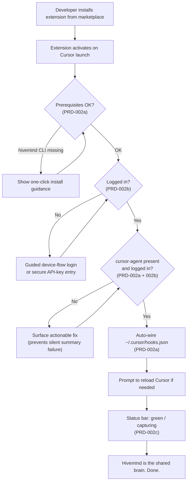

# PRD-002: Cursor Extension Core & Onboarding

> **Status:** Backlog
> **Priority:** P1
> **Effort:** XL (> 3d)
> **Schema changes:** None

---

## Overview

Today Hivemind reaches Cursor through a hooks-only integration: a developer runs `hivemind cursor install` in a terminal, the CLI merges seven lifecycle entries into `~/.cursor/hooks.json`, and a Node bundle is copied to `~/.cursor/hivemind/bundle/` (see `src/cli/install-cursor.ts:44-124`). There is **no first-party Cursor/VS Code extension** today: no status bar, no command palette, no in-editor surface that tells a developer whether Hivemind is actually working. When something goes wrong, it goes wrong invisibly. The clearest example: the session-end wiki worker shells out to `cursor-agent --print`, and when that binary is missing from `PATH` or not logged in, the error is caught, written only to a log file, and swallowed, so every session summary silently becomes an empty placeholder (`src/hooks/cursor/wiki-worker.ts:186-188`).

PRD-002 delivers the **Cursor Extension Core**: the first-party Cursor extension that becomes Hivemind's home inside the editor. Its job in this stage is not features-for-features'-sake. It is to make the developer's very first five minutes with Hivemind feel effortless and trustworthy, and to make the system's health continuously **visible** so failures can never again be silent. A developer installs the extension from the marketplace, and without opening a terminal or reading a README, the extension verifies prerequisites, gets them authenticated, wires the hooks for them, and shows a single honest status indicator that answers the only question that matters: "Is Hivemind capturing my work right now, yes or no?"

This index covers the module-level vision, goals, and the three sub-features that compose it. Implementation detail lives in the sub-PRDs.

---

## The problem, from the developer's chair

A new teammate wants the "one brain for all your agents" promise. Their journey today looks like this:

1. They read the README and learn they must run `npm i -g @deeplake/hivemind && hivemind install` in a terminal.
2. They must separately know to run `hivemind login` and complete a browser device flow.
3. They must restart Cursor for hooks to load, with no confirmation that anything is wired.
4. They have no in-editor signal that capture is on, that they are logged in, or that the background summary worker can reach `cursor-agent`.
5. If `cursor-agent` is not installed or not logged in, summaries quietly fail forever and the developer never finds out until they wonder why their "shared brain" is empty.

Every one of these steps is a place to lose a developer. The value of PRD-002 is converting that brittle, terminal-bound, silent path into a guided, in-editor, self-verifying one.

---

## Value & success themes

| Theme | What "good" feels like for the developer |
|---|---|
| **Zero-friction onboarding** | Install the extension, answer at most one consent prompt, and Hivemind is fully wired. No terminal, no manual `hooks.json` edits, no copy-pasting commands. |
| **Always-visible truth** | A glance at the status bar always answers "is Hivemind healthy and capturing?" No guessing, no log-spelunking. |
| **No silent failures** | Every prerequisite gap, auth lapse, or worker failure surfaces as an actionable in-editor message, never a swallowed log line. |
| **Trust through transparency** | The developer can see exactly what was wired, where credentials live, and how to undo it. Security posture is legible, not hidden. |
| **Respect for existing setups** | The extension cooperates with a CLI install that already happened; it never clobbers a working configuration or duplicates hooks. |

---

## Goals

- A developer can go from "extension not installed" to "Hivemind capturing, logged in, hooks wired, status green" without ever leaving Cursor or opening a terminal.
- The extension continuously verifies four things and reflects them in one status indicator: (1) `hivemind` CLI present, (2) `cursor-agent` CLI present and logged in, (3) Hivemind login valid, (4) Cursor hooks wired and current.
- Any failure in those four checks produces a specific, actionable remediation the developer can act on with one click.
- The session-end wiki-worker class of silent failure becomes impossible to miss: a missing or logged-out `cursor-agent` is surfaced proactively, before it corrupts summaries.
- Onboarding is idempotent and re-entrant: running it twice, or running it after a prior CLI install, converges to the same healthy state without duplication or damage.

## Non-Goals

- **Replacing the hooks mechanism.** The extension orchestrates and verifies the existing hooks integration (`~/.cursor/hooks.json`); it does not change how capture itself works at runtime.
- **Replacing the `hivemind` CLI.** The CLI remains the source of truth for install/login/status logic. The extension is a friendly front-end that calls into and reflects CLI capabilities, not a reimplementation.
- **Rich in-editor memory UX:** searching traces, browsing summaries, viewing the codebase graph, or skill management inside the editor. Those are later stages, not Stage 2.
- **Authoring or changing authentication protocols.** The extension consumes the existing device-flow and token paths; designing new auth flows is out of scope (and any deep auth-protocol concern hands off to `auth-guardian`).
- **A VS Code (non-Cursor) general release.** The target surface for this stage is Cursor 1.7+. Broader VS Code Marketplace distribution is a later consideration.
- **Multi-agent onboarding inside the editor** (Claude Code, Codex, Hermes, pi). This extension is Cursor-scoped; cross-agent install stays with `hivemind install`.

---

## Sub-features

| Sub-PRD | Scope | Status |
|---|---|---|
| [`prd-002a-health-check`](./prd-002a-health-check.md) | Prerequisite health check (detect `hivemind` + `cursor-agent` on PATH and their login state) and zero-friction auto-wiring of `~/.cursor/hooks.json`. | Backlog |
| [`prd-002b-auth-secrets`](./prd-002b-auth-secrets.md) | Unified authentication journey (login-status detection, guided browser device-flow, secure API-key entry) and secrets handling via the OS keychain / existing `~/.deeplake/credentials.json`. | Backlog |
| [`prd-002c-status-bar`](./prd-002c-status-bar.md) | Persistent status-bar indicator reflecting overall health, plus the basic command palette surface (re-run onboarding, login/logout, view status, open logs). | Backlog |

---

## The onboarding journey (module-level)

The three sub-features compose into one continuous first-run experience. The extension owns the orchestration; each sub-PRD owns its segment.

The defining property: **at every branch where the legacy path would fail silently, the extension instead stops, explains, and offers a fix.** The journey only reaches "done" when all four health dimensions are genuinely true.

---

## Personas

| Persona | Context | What PRD-002 gives them |
|---|---|---|
| **First-time developer (Dana)** | Joined a team that uses Hivemind; has never run the CLI. | A guided, terminal-free setup that ends in a green status bar. |
| **Existing CLI user (Marco)** | Already ran `hivemind install` last month. | The extension detects the existing healthy wiring and shows green immediately; it never duplicates or clobbers. |
| **The skeptic (Priya)** | Wants to know exactly what got installed and where her credentials live before trusting it. | Transparent status detail, a legible secrets story, and a one-click uninstall/undo. |
| **The unlucky one (Sam)** | Has `cursor-agent` installed but is logged out, so summaries were silently empty. | A proactive, specific warning that this will break summaries, with a one-click path to fix it. |

---

## Acceptance criteria (module-level)

| ID | Criterion |
|---|---|
| AC-1 | Given a developer with no prior Hivemind setup, when they install and activate the extension, then they are guided through prerequisites, authentication, and hook wiring to a "healthy / capturing" state without opening a terminal. |
| AC-2 | Given a machine where `hivemind` or `cursor-agent` is not on `PATH`, when the extension activates, then the status bar shows a non-green state and offers a specific, actionable remediation for the missing prerequisite. |
| AC-3 | Given a developer who is not logged in, when onboarding runs, then the extension initiates the browser device-flow (or secure API-key entry) and reflects success in the status bar without requiring a manual CLI command. |
| AC-4 | Given `cursor-agent` is present but logged out, when the extension checks health, then it surfaces a proactive warning that session summaries will fail, before any summary is attempted. |
| AC-5 | Given an existing healthy CLI install, when the extension activates, then it detects the existing wiring, shows green, and makes no duplicate or destructive changes to `~/.cursor/hooks.json`. |
| AC-6 | Given onboarding has completed once, when it is re-run, then the system converges to the same healthy state idempotently (no duplicated hooks, no re-prompt loop). |
| AC-7 | Given any of the four health dimensions degrades during a session, when the next health poll runs, then the status bar updates to reflect the new state within one poll interval. |

---

## Cross-cutting requirements

- **Idempotency.** All onboarding actions are safe to repeat. Hook wiring reuses the existing merge-and-dedupe behaviour (`isHivemindEntry` / `mergeHooks` in `src/cli/install-cursor.ts:62-114`) rather than blindly appending.
- **Honesty over optimism.** The status indicator must never show green unless all four checks pass. A degraded-but-running state is its own visible state, not green.
- **Actionability.** Every non-green state maps to at least one concrete next action the developer can take from inside the editor.
- **No secret leakage.** Tokens and API keys are never written to extension logs, settings JSON, or the output channel. Secrets handling defers to PRD-002b.
- **Graceful when offline.** Network-dependent checks (login validity) degrade to a clearly labelled "unknown / offline" state rather than a false red or false green.

---

## Open questions

- [ ] Should the extension bundle/trigger the `npm i -g @deeplake/hivemind` install of a missing `hivemind` CLI itself, or only detect-and-guide? (Security and permissions trade-off; PRD-002a leans detect-and-guide.)
- [ ] What is the canonical secret store on each OS, the editor's `SecretStorage` API, the OS keychain, or the existing `~/.deeplake/credentials.json` (mode `0600`)? PRD-002b proposes a precedence order; final selection is open.
- [ ] What health-poll interval balances freshness against overhead, and should polling pause when Cursor is unfocused?
- [ ] Does Cursor expose a programmatic "reload window" affordance the extension can offer post-wiring, or must the developer reload manually?

---

## Related

- [`prd-002a-health-check`](./prd-002a-health-check.md): prerequisite detection and hook auto-wiring.
- [`prd-002b-auth-secrets`](./prd-002b-auth-secrets.md): unified auth and secrets management.
- [`prd-002c-status-bar`](./prd-002c-status-bar.md): status bar and command palette.
- [`../prd-001-egress-control/prd-001-egress-control-index.md`](../prd-001-egress-control/prd-001-egress-control-index.md): sibling Stage 1 PRD; security posture context.
- [`../../../knowledge/private/standards/documentation-framework.md`](../../../knowledge/private/standards/documentation-framework.md): documentation standards this PRD conforms to.
- Source grounding: `src/cli/install-cursor.ts` (hook wiring), `src/cli/index.ts` (`runStatus`), `src/commands/auth.ts` + `src/commands/auth-creds.ts` (login + credential storage), `src/hooks/cursor/wiki-worker.ts:170-188` (silent `cursor-agent` failure), `src/utils/resolve-cli-bin.ts` (PATH resolution).
