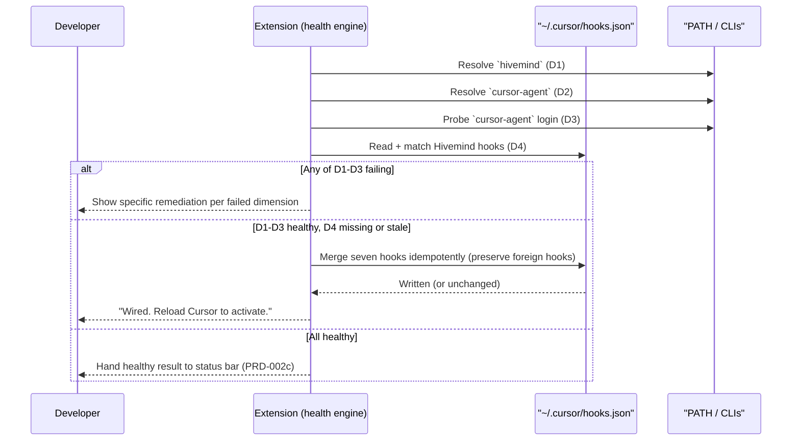

# PRD-002a: Prerequisite Health Check & Hook Auto-wiring

> **Status:** Backlog
> **Priority:** P1
> **Effort:** L (1-3d)
> **Schema changes:** None
> **Parent:** [`prd-002-cursor-extension-core-index`](./prd-002-cursor-extension-core-index.md)

---

## Overview

This sub-feature is the extension's "is everything in place?" engine. It answers, continuously and on demand, whether the local environment can actually run Hivemind in Cursor, and it removes the single biggest source of setup friction: hand-editing `~/.cursor/hooks.json`. Concretely it does two jobs. First, the **health check** detects whether the `hivemind` and `cursor-agent` CLIs are installed and resolvable on `PATH`, whether their versions are sane, and whether `cursor-agent` is logged in. Second, the **auto-wiring** step writes the seven Hivemind lifecycle hooks into `~/.cursor/hooks.json` for the developer so they never have to run a terminal command or paste JSON.

The value here is twofold. Friction goes to near-zero: the developer does not need to know that hooks exist, where the file lives, or what seven events to wire. And a whole class of silent failure becomes loud: the health check exists precisely so that the missing-`cursor-agent` and logged-out-`cursor-agent` conditions, the conditions that today corrupt session summaries invisibly (`src/hooks/cursor/wiki-worker.ts:186-188`), are caught and shown before they cause harm.

---

## Why this matters: the silent failure we are killing

The session-end wiki worker generates a summary by shelling out to `cursor-agent --print`. The binary is resolved by `resolveCliBin("cursor-agent", "cursor-agent")`, which falls back to the literal string `"cursor-agent"` when nothing is on `PATH` (`src/utils/resolve-cli-bin.ts:29-51`). When the spawn then fails, the error is caught and only written to a log file:

```52:52:src/hooks/cursor/wiki-worker.ts
    } catch (e: any) {
```

```186:188:src/hooks/cursor/wiki-worker.ts
    } catch (e: any) {
      wlog(`cursor-agent --print failed: ${e.status ?? e.message}`);
    }
```

The worker then finds no summary file and moves on (`src/hooks/cursor/wiki-worker.ts:228-230`). The developer sees nothing. Their "shared brain" quietly fills with empty placeholders. This sub-PRD's health check is the proactive counterpart: it inspects the same two preconditions (binary present, session logged in) up front and surfaces them, so the worker is never set up to fail in the dark.

---

## Goals

- Detect, without developer action, whether `hivemind` is installed and resolvable, and report a clear present/absent state.
- Detect whether `cursor-agent` is installed and resolvable, and whether it is logged in, and report each independently.
- Auto-wire all seven Hivemind lifecycle hooks into `~/.cursor/hooks.json` on the developer's behalf, idempotently, preserving any non-Hivemind hooks already present.
- Detect when wired hooks are stale (a newer extension/bundle exists) and offer a one-click refresh.
- Turn every failed check into a specific, actionable remediation, never a generic error.
- Re-run safely any number of times and always converge to the same healthy wiring.

## Non-Goals

- **Installing the `hivemind` CLI automatically.** This sub-feature detects and guides; whether the extension may run a global `npm i` is an open question owned by the index PRD. Default posture: detect-and-guide.
- **Authenticating Hivemind itself.** Hivemind login state and the login flow belong to [`prd-002b-auth-secrets`](./prd-002b-auth-secrets.md). This sub-feature only *reads* login state to compose overall health. (`cursor-agent` login is a prerequisite check here; *Hivemind* login is 002b.)
- **Rendering the status indicator.** Presentation belongs to [`prd-002c-status-bar`](./prd-002c-status-bar.md). This sub-feature produces a structured health result; 002c displays it.
- **Changing the runtime hook bundle behaviour.** The seven hooks and their handlers are defined by the existing integration (`src/cli/install-cursor.ts:44-60`); this sub-feature wires them, it does not redesign them.

---

## The four health dimensions

The health check produces a structured result over four independent dimensions. Independence matters: a developer can be logged into Hivemind but missing `cursor-agent`, and the status must say so precisely.

| Dimension | Question | How it is determined | If it fails, the developer is told |
|---|---|---|---|
| **D1: `hivemind` CLI** | Is the `hivemind` CLI installed and resolvable? | PATH resolution (the same `which`/`where` strategy as `src/utils/resolve-cli-bin.ts:29-51`), then a version probe. | "Hivemind CLI not found. Install it to enable shared memory," with a copyable command and docs link. |
| **D2: `cursor-agent` CLI** | Is `cursor-agent` installed and resolvable? | PATH resolution; if absent, check the known install locations (mirrors `src/skillify/gate-runner.ts` cursor paths). | "`cursor-agent` not found. Session summaries cannot be generated until it is installed." |
| **D3: `cursor-agent` login** | Is `cursor-agent` logged in? | A lightweight non-mutating status probe of `cursor-agent`. | "`cursor-agent` is installed but logged out. Summaries will silently fail. Log in to fix." |
| **D4: Hooks wired & current** | Are the seven Hivemind hooks present in `~/.cursor/hooks.json` and matching the current bundle version? | Read `~/.cursor/hooks.json`, match Hivemind entries via the existing `isHivemindEntry` shape (`src/cli/install-cursor.ts:62-71`), compare against the version stamp. | "Hooks not wired" or "Hooks out of date" with a one-click "Wire / Refresh" action. |

> D3 is the dimension that directly closes the silent-failure gap. It is checked proactively, not lazily at summary time.

---

## The onboarding segment owned here



---

## Auto-wiring requirements

The wiring step is the friction-killer. Its correctness requirements:

1. **Wire all seven events** exactly as the canonical integration defines them: `sessionStart`, `beforeSubmitPrompt`, `preToolUse` (with the `Shell` matcher), `postToolUse`, `afterAgentResponse`, `stop`, and `sessionEnd` (`src/cli/install-cursor.ts:44-60`). The extension must not invent its own event list; it reuses the canonical config so the editor path and CLI path can never drift.
2. **Preserve foreign hooks.** Any hook entry that is not a Hivemind entry must survive untouched. Reuse the merge semantics that filter on `isHivemindEntry` and re-append (`src/cli/install-cursor.ts:73-85`).
3. **Idempotent writes.** Re-wiring when nothing changed must not rewrite the file (preserves Cursor's hook-trust fingerprint, matching `writeJsonIfChanged` usage at `src/cli/install-cursor.ts:114`).
4. **Bundle presence is a precondition.** Wiring assumes the bundle exists at `~/.cursor/hivemind/bundle/`. If it is absent, wiring must report the missing bundle rather than writing dangling `node "...bundle/..."` commands.
5. **Reload awareness.** After a wiring change, the developer is told a Cursor reload is required for hooks to take effect (the README documents the restart requirement). If a programmatic reload affordance exists, offer it; otherwise instruct.
6. **Reversible.** The developer can undo wiring; removal must mirror the existing strip-and-clean behaviour (`src/cli/install-cursor.ts:87-99,127-147`), deleting the file only when nothing meaningful remains.

---

## Remediation catalogue

Every failed check resolves to a concrete action. This table is the contract: a non-green dimension without a remediation is a bug.

| Failed dimension | Developer-facing message (intent) | Primary action |
|---|---|---|
| D1 missing | Hivemind CLI not found on PATH. | Copy install command + open docs. |
| D2 missing | `cursor-agent` not found; summaries disabled. | Open `cursor-agent` install guidance. |
| D3 logged out | `cursor-agent` installed but logged out; summaries will fail silently. | Trigger `cursor-agent` login guidance. |
| D4 missing | Hooks not wired. | One-click "Wire hooks". |
| D4 stale | Hooks present but out of date. | One-click "Refresh hooks". |
| Bundle absent | Hook bundle missing at `~/.cursor/hivemind/bundle/`. | Re-run extension provisioning / CLI install guidance. |

---

## Acceptance criteria

| ID | Criterion |
|---|---|
| AC-1 | Given `hivemind` is not on `PATH`, when the health check runs, then D1 reports "missing" and a copyable install command plus docs link is offered. |
| AC-2 | Given `cursor-agent` is not on `PATH`, when the health check runs, then D2 reports "missing" and the result explicitly notes that session summaries are disabled. |
| AC-3 | Given `cursor-agent` is installed but logged out, when the health check runs, then D3 reports "logged out" and warns that summaries will fail before any summary is attempted. |
| AC-4 | Given a `hooks.json` with no Hivemind entries, when auto-wiring runs, then all seven lifecycle events are added (including the `Shell` matcher on `preToolUse`) and any pre-existing foreign hooks are preserved unchanged. |
| AC-5 | Given auto-wiring has already run, when it runs again with no version change, then `~/.cursor/hooks.json` is not rewritten (idempotent, fingerprint-preserving). |
| AC-6 | Given the wired bundle version is older than the current extension bundle, when the health check runs, then D4 reports "stale" and offers a one-click refresh. |
| AC-7 | Given the bundle is absent at `~/.cursor/hivemind/bundle/`, when auto-wiring is attempted, then it refuses to write dangling commands and reports the missing bundle. |
| AC-8 | Given a healthy environment, when the health check completes, then it emits a structured four-dimension result consumable by the status bar (PRD-002c) without performing any presentation itself. |

---

## Open questions

- [ ] What exact non-mutating probe reliably reports `cursor-agent` login state across versions without side effects?
- [ ] May the extension shell out to wire hooks via the `hivemind cursor install` code path, or should it own a parallel writer that imports the same canonical config to avoid drift? (Drift risk argues for sharing the config module.)
- [ ] Where is the bundle version stamp authoritative for the staleness comparison, and does the extension ship its own bundle or rely on the CLI-provisioned one?

---

## Related

- [`prd-002-cursor-extension-core-index`](./prd-002-cursor-extension-core-index.md): parent module.
- [`prd-002b-auth-secrets`](./prd-002b-auth-secrets.md): owns Hivemind login state that this check reads.
- [`prd-002c-status-bar`](./prd-002c-status-bar.md): consumes this check's structured result.
- Source grounding: `src/cli/install-cursor.ts:44-147` (canonical hook config, merge, strip), `src/utils/resolve-cli-bin.ts:29-51` (PATH resolution), `src/hooks/cursor/wiki-worker.ts:170-230` (the silent failure being prevented), `src/skillify/gate-runner.ts` (known `cursor-agent` install paths).
