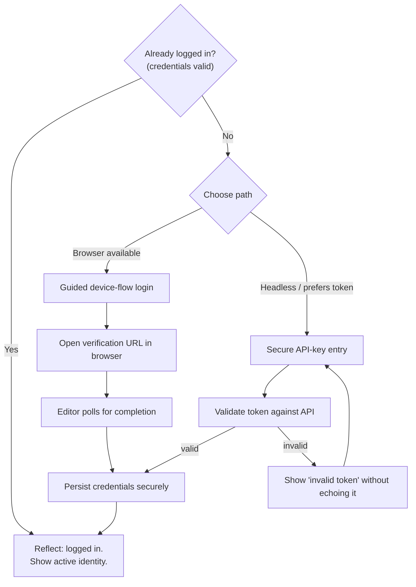

# PRD-002b: Unified Authentication & Secrets Management

> **Status:** Backlog
> **Priority:** P1
> **Effort:** L (1-3d)
> **Schema changes:** None
> **Parent:** [`prd-002-cursor-extension-core-index`](./prd-002-cursor-extension-core-index.md)

---

## Overview

Authentication is where good onboarding usually dies. Today a Cursor developer must know to drop into a terminal and run `hivemind login`, complete a browser device flow, and trust that a credentials file appeared somewhere. This sub-feature brings that whole journey inside the editor and makes it feel like a single, obvious step. The extension detects whether the developer is already logged in, and if not, guides them through either the browser device-flow or secure API-key entry, without a terminal. Throughout, it treats the developer's token as a secret to be protected, never echoed, logged, or written into plaintext settings.

The value is a developer who is authenticated within seconds of installing, who always knows their login state at a glance, and who can trust that their credentials are handled with the same care the rest of Hivemind already applies: credentials stored at `~/.deeplake/credentials.json` with directory mode `0700` and file mode `0600` (`src/commands/auth-creds.ts:62-63`), and device-flow login that keeps tokens out of the environment and out of code.

---

## Why this matters

Two failure shapes hurt developers today:

1. **The unauthenticated developer** who installed hooks but never logged in. The README notes that a non-interactive install "completes with hooks but skips sign-in" and the developer must "run `hivemind login` later to enable shared memory." Nothing in the editor reminds them. They get a shared brain that never shares.
2. **The headless / CI developer** who cannot complete a browser flow and needs an API token path (`HIVEMIND_TOKEN`), but has no in-editor way to provide one securely.

This sub-feature makes login state visible and both auth paths reachable from inside Cursor, while keeping the secret-handling guarantees intact.

---

## Goals

- Detect Hivemind login state reliably and reflect it as a single boolean health input ("logged in: yes/no"), mirroring the CLI's own `isLoggedIn()` semantics (`src/commands/auth.ts:14-16`).
- Offer a guided browser device-flow login that the developer can start with one click and complete in the browser, with the editor reflecting success automatically.
- Offer a secure API-key / token entry path for developers who cannot or prefer not to use the browser flow.
- Never expose the token: not in logs, not in the output channel, not in workspace or user settings JSON, not in error messages.
- Surface the related `cursor-agent` logged-out condition as an auth concern too, because it is the precondition for summaries to work (the silent failure from PRD-002a's D3).
- Make logout / credential removal reachable and honest about what it clears.

## Non-Goals

- **Designing new authentication protocols.** The device flow (RFC 8628 style) and token path already exist in `src/commands/auth.ts`. This sub-feature consumes them; it does not redesign auth. Any deep auth-protocol question hands off to `auth-guardian`.
- **Org / workspace switching UX.** `whoami`, `org switch`, and `workspaces` exist in the CLI (`src/cli/index.ts`). Rich in-editor org management is a later stage; this sub-feature shows the active identity and supports login/logout only.
- **Prerequisite detection.** Whether the `hivemind` and `cursor-agent` CLIs exist is [`prd-002a`](./prd-002a-health-check.md)'s job; this sub-feature assumes the CLI is present and focuses on identity.
- **Status presentation.** The login indicator's pixels belong to [`prd-002c`](./prd-002c-status-bar.md); this sub-feature provides the login-state input.
- **Multi-agent auth.** Authenticating Claude Code / Codex / Hermes / pi is out of scope; this is Cursor-scoped.

---

## The two authentication paths



### Path A: Guided browser device flow

The primary path for interactive developers. The extension initiates the device-flow login (the editor counterpart to `deviceFlowLogin()` in `src/commands/auth.ts`), opens the verification URL in the browser, and polls for completion so the developer never copies a code back and forth manually. On success, the editor reflects "logged in" without any further action.

### Path B: Secure API-key entry

For headless contexts or developers who prefer a token (the `HIVEMIND_TOKEN` path from the README). The extension presents a masked secret-input field, validates the token against the API, and on success persists it through the same secure storage path. The raw token is never shown back, never logged, and never placed in settings JSON.

---

## Secrets handling requirements

Secret safety is the non-negotiable spine of this sub-feature.

| Requirement | Detail |
|---|---|
| **No plaintext in settings** | Tokens are never written to user/workspace `settings.json` or any extension-readable config. |
| **No logging of secrets** | The token must never appear in the output channel, debug logs, telemetry, or error strings. Validation failures report "invalid token", not the value. |
| **Masked entry** | API-key input uses a masked/secret field; clipboard contents are not echoed. |
| **Reuse the proven store** | Persisted credentials honour the existing secure shape: `~/.deeplake/credentials.json`, directory mode `0700`, file mode `0600` (`src/commands/auth-creds.ts:28,62-63`). The editor's `SecretStorage` (OS keychain) is the proposed precedence for any extension-held copy. |
| **Single source of truth** | The extension should not maintain a competing credential store. It reads/writes the canonical credentials so the CLI and editor always agree on identity. |
| **Honest logout** | Logout clears the credential and states plainly what was removed and what remains (hooks stay; identity is cleared). |
| **Offline honesty** | When login validity cannot be confirmed (offline), the state is "unknown/offline", never a false "logged in" or false "logged out". |

---

## Login-state detection

The extension composes a login-state input for overall health. Detection must match the CLI's own definition so the two never disagree:

```14:16:src/commands/auth.ts
export function isLoggedIn(): boolean {
  return existsSync(CREDS_PATH) && loadCredentials() !== null;
}
```

Presence of a parseable credential is the baseline. Where feasible, a lightweight validity check (token not expired / accepted by the API) upgrades the state from "credential present" to "credential valid", with the offline-honesty rule above governing the uncertain case.

---

## Acceptance criteria

| ID | Criterion |
|---|---|
| AC-1 | Given a developer with valid stored credentials, when the extension activates, then login state resolves to "logged in" and the active identity is shown, with no prompt. |
| AC-2 | Given a developer with no credentials, when onboarding runs, then the extension offers both the guided browser device-flow and secure API-key entry, selectable without a terminal. |
| AC-3 | Given the developer starts the browser device-flow, when they complete sign-in in the browser, then the editor detects completion by polling and updates to "logged in" automatically. |
| AC-4 | Given the developer enters an API key, when the key is valid, then credentials are persisted through the canonical secure store and state becomes "logged in"; the raw key is never displayed back. |
| AC-5 | Given an invalid API key is entered, when validation fails, then the error message does not contain the token value anywhere. |
| AC-6 | Given any successful or failed auth attempt, when logs/output are inspected, then the token does not appear in any log line, output channel, settings file, or telemetry. |
| AC-7 | Given the developer logs out, when logout completes, then credentials are cleared and the developer is told plainly what was removed (identity) and what was not (hooks). |
| AC-8 | Given the machine is offline, when login validity cannot be confirmed, then the state is reported as "unknown/offline" rather than a false positive or negative. |
| AC-9 | Given `cursor-agent` is logged out (PRD-002a D3), when the auth surface is shown, then it presents the `cursor-agent` login remediation alongside Hivemind login, because both are required for the full capture+summary loop. |

---

## Open questions

- [ ] Precedence for the extension-held secret: editor `SecretStorage` (OS keychain) as the primary with `~/.deeplake/credentials.json` as the interop source of truth, or treat the credentials file as canonical and mirror nothing? (Index PRD flags this.)
- [ ] Can the extension reuse the CLI's device-flow implementation directly (shared module) versus reimplementing the poll loop, to guarantee identical endpoints and semantics?
- [ ] Should token validity be actively re-checked on a schedule, or only on activation and on demand, to balance freshness against API load?
- [ ] How should the editor present the rare "credentials present but org/workspace unresolved" state, given org switching is out of scope here?

---

## Related

- [`prd-002-cursor-extension-core-index`](./prd-002-cursor-extension-core-index.md): parent module.
- [`prd-002a-health-check`](./prd-002a-health-check.md): provides `cursor-agent` login (D3) detection that this surface presents.
- [`prd-002c-status-bar`](./prd-002c-status-bar.md): renders the login indicator from this state.
- Source grounding: `src/commands/auth.ts:14-16` (`isLoggedIn`), `src/commands/auth.ts` (device-flow login + token path), `src/commands/auth-creds.ts:28,62-63` (credential path and `0700`/`0600` modes), `README.md` (browser flow, `HIVEMIND_TOKEN` headless path, "skips sign-in" warning).
