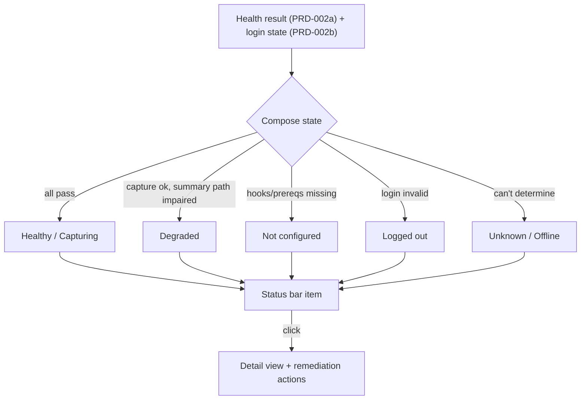

# PRD-002c: Status Bar & Basic Command Palette

> **Status:** Backlog
> **Priority:** P1
> **Effort:** M (3-8h)
> **Schema changes:** None
> **Parent:** [`prd-002-cursor-extension-core-index`](./prd-002-cursor-extension-core-index.md)

---

## Overview

This sub-feature is Hivemind's visible face inside Cursor. It is one persistent status-bar item that answers the only question a developer asks day to day, "is Hivemind healthy and capturing my work right now?", and a small command palette surface that lets them act on the answer. It owns no detection logic of its own; it renders the structured health result from [`prd-002a`](./prd-002a-health-check.md) and the login state from [`prd-002b`](./prd-002b-auth-secrets.md), and it routes the developer to the right remediation when something is off.

The value is constant, honest presence. The single biggest cause of distrust in the current integration is invisibility: capture and summarization happen (or fail) entirely off-screen. A developer cannot tell a working install from a broken one. This sub-feature replaces "no signal" with "one glance," and replaces "open a terminal and read a log" with "click the status bar."

---

## Why this matters

A status indicator is not decoration; it is the mechanism that makes silent failure structurally impossible. If `cursor-agent` is logged out and summaries are dying quietly (the failure proven in `src/hooks/cursor/wiki-worker.ts:186-188`), the status bar is the surface that turns that into a visible, clickable warning. The command palette is the matching affordance: the developer who notices a problem, or who simply wants to re-run setup or log out, can do so from inside the editor instead of recalling CLI syntax. Together they make the system legible.

---

## Goals

- Present one persistent status-bar item whose appearance reflects overall Hivemind health at a glance.
- Map the four health dimensions (D1-D4 from PRD-002a) plus login state (PRD-002b) into a small, unambiguous set of visible states.
- Make the item interactive: clicking it reveals detail and the relevant remediation actions.
- Provide a basic command palette surface for the core actions: re-run onboarding, log in, log out, show status detail, open logs.
- Update promptly when health changes, so the indicator never lies for long.
- Never show "green" unless every dimension genuinely passes; degraded is its own visible state.

## Non-Goals

- **Detecting health.** All detection is PRD-002a (prerequisites/hooks) and PRD-002b (login). This sub-feature only renders and routes.
- **Rich memory UX.** Searching traces, browsing summaries, viewing the codebase graph, and skill management are later stages, not part of this status surface.
- **Org/workspace switching commands.** Beyond showing the active identity, identity management commands are out of scope (see PRD-002b non-goals).
- **Notifications spam.** This sub-feature avoids repeated toast nagging; the persistent status item is the primary channel, with at most a single actionable nudge per newly-detected problem.

---

## The visible states

The status item collapses the health dimensions into a small set of honest states. Precision matters more than cheerfulness: a developer must be able to trust green absolutely.

| State | Meaning | Composed from | Click reveals |
|---|---|---|---|
| **Healthy / Capturing** | All prerequisites present, logged in, hooks wired & current. | D1-D4 pass + login valid | Identity, what's wired, "everything's working" detail. |
| **Degraded** | Capture works but something is impaired (e.g. `cursor-agent` logged out so summaries will fail). | D1, D4 pass; D2/D3 or summary path impaired | The specific impairment + its one-click fix. |
| **Not configured** | Hooks not wired or prerequisites missing; setup incomplete. | D1/D2/D4 failing | "Run onboarding" entry point. |
| **Logged out** | Hivemind login missing/invalid; shared memory inactive. | login state false | "Log in" action (browser flow or API key). |
| **Unknown / Offline** | Health could not be determined (e.g. offline validity check). | inconclusive checks | Honest "couldn't verify" detail + retry. |

> The **Degraded** state is the direct antidote to silent failure: a logged-out `cursor-agent` shows here as a visible, actionable problem rather than an empty summary nobody notices.

---

## Command palette surface (basic)

A small, dependable set of commands. Each maps to logic owned by 002a/002b; this sub-feature contributes the palette entries and wires them.

| Command (intent) | What it does | Delegates to |
|---|---|---|
| **Hivemind: Run Onboarding** | Re-runs the full guided setup (prereqs → auth → wiring). | PRD-002a + PRD-002b |
| **Hivemind: Log In** | Starts the browser device-flow or API-key entry. | PRD-002b |
| **Hivemind: Log Out** | Clears credentials with an honest summary of what's removed. | PRD-002b |
| **Hivemind: Show Status** | Opens the detail view with all dimensions and identity. | PRD-002a (result) |
| **Hivemind: Wire / Refresh Hooks** | Triggers idempotent (re)wiring. | PRD-002a |
| **Hivemind: Open Logs** | Opens the extension output channel / wiki-worker log location. | this sub-feature |

The detail view mirrors what `hivemind status` reports on the CLI (`src/cli/index.ts` `runStatus`: version, "logged in: yes/no", detected assistants), so the editor and terminal tell the same story.

---

## Presentation requirements

- **One item, not many.** A single status-bar item; no clutter of separate icons per dimension.
- **Honest color/affordance.** Green is reserved for fully healthy. Degraded and not-configured are visually distinct from green and from each other. (No reliance on color alone; include a label/icon for accessibility.)
- **Tooltip first.** Hover surfaces a concise summary of all dimensions before the developer even clicks.
- **Prompt updates.** The item reflects a health change within one poll interval (interval owned by PRD-002a); a manual "refresh" is available.
- **No secret leakage.** The detail view and logs never render tokens or API keys (defers to PRD-002b's secrets rules).
- **Quiet by default.** At most one actionable nudge per newly-detected problem; the persistent item carries ongoing state without nagging.

---

## Acceptance criteria

| ID | Criterion |
|---|---|
| AC-1 | Given all health dimensions pass and login is valid, when the status item renders, then it shows the "Healthy / Capturing" state and the tooltip confirms all dimensions pass. |
| AC-2 | Given `cursor-agent` is logged out, when the status item renders, then it shows "Degraded" (not green) and clicking it surfaces the `cursor-agent` login remediation. |
| AC-3 | Given hooks are not wired, when the status item renders, then it shows "Not configured" and offers a "Run Onboarding" entry point. |
| AC-4 | Given the developer is not logged in to Hivemind, when the status item renders, then it shows "Logged out" and offers a "Log In" action. |
| AC-5 | Given health cannot be determined (offline), when the status item renders, then it shows "Unknown / Offline" rather than a false green or red. |
| AC-6 | Given any health dimension changes during a session, when the next poll completes, then the status item updates to the new state without requiring a window reload. |
| AC-7 | Given the command palette, when the developer opens it, then the six core Hivemind commands are present and each routes to its owning logic (002a/002b) or opens logs. |
| AC-8 | Given the detail view or logs are opened, when their contents are inspected, then no token or API key value appears anywhere. |

---

## Open questions

- [ ] Should the status item also reflect a transient "capturing now" pulse on hook activity, or only steady-state health? (Steady-state proposed for this stage.)
- [ ] What is the right click default: open the detail view, or jump straight to the top remediation when degraded?
- [ ] Where should "Open Logs" point given the wiki-worker writes to its own log file: a unified output channel, the raw log path, or both?

---

## Related

- [`prd-002-cursor-extension-core-index`](./prd-002-cursor-extension-core-index.md): parent module.
- [`prd-002a-health-check`](./prd-002a-health-check.md): produces the four-dimension health result this renders.
- [`prd-002b-auth-secrets`](./prd-002b-auth-secrets.md): produces the login state this renders and the auth actions the palette triggers.
- Source grounding: `src/cli/index.ts` (`runStatus`, the CLI status story the detail view mirrors), `src/hooks/cursor/wiki-worker.ts:186-188` (the silent failure this surface makes visible).
