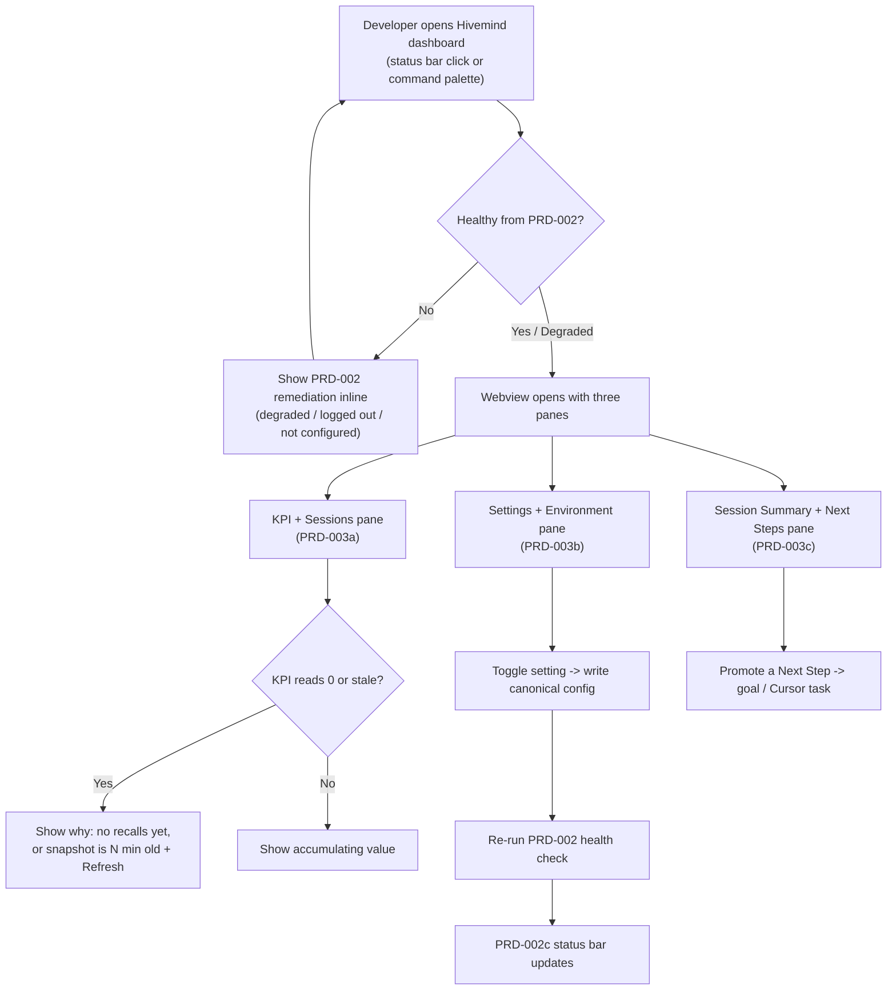

# PRD-003: Cursor Extension Dashboard & Settings

> **Status:** Backlog
> **Priority:** P1
> **Effort:** XL (> 3d)
> **Schema changes:** None

---

## Overview

PRD-002 made Hivemind **honest** inside Cursor: a status bar that never lies, zero-friction onboarding, and a proactive end to the silent `cursor-agent` failure that quietly emptied session summaries (`src/hooks/cursor/wiki-worker.ts:186-188`). It answered the binary question "is Hivemind capturing my work right now, yes or no?" PRD-003 answers the next set of questions a developer asks once capture is trustworthy: **"What is it doing for me? What is it remembering? And how do I change how it behaves, without editing a JSON file?"**

PRD-003 delivers the **Cursor Extension Dashboard & Settings**: a beautiful, first-party Webview that opens directly inside Cursor and becomes Hivemind's home surface beyond the status bar. It does three things. It **shows value**: live KPI cards (tokens saved, sessions captured, active memory recalls) plus a scannable list of recent sessions, so the work Hivemind does in the background finally becomes visible. It **gives control**: a graphical settings panel that manages embeddings, the codebase graph, and the active organization and workspace, replacing hand-edited config files and environment variables. And it **closes the loop**: a session summary viewer that surfaces each session's "Next Steps" and lets the developer promote them into active goals or Cursor tasks.

Today the only graphical surface is a CLI-generated HTML file written to disk and opened in an external browser (`hivemind dashboard`, see `src/commands/dashboard.ts:36-68`). It is read-only, it lives outside the editor, and it cannot change a single setting. PRD-003 brings that surface inside Cursor, makes it interactive, and reuses the exact data layer the CLI dashboard already proved (`src/dashboard/data.ts:211-262`) so the editor and terminal always tell the same story.

This index covers the module-level vision, goals, non-goals, and the three sub-features that compose it. Implementation detail lives in the sub-PRDs.

---

## The problem, from the developer's chair

A developer finished onboarding in PRD-002. The status bar is green. Hivemind is capturing. Now their experience flattens out:

1. They have **no idea what they are getting**. Tokens saved, sessions captured, memory recalled, all of it happens off-screen. The promise of a "shared brain" is invisible, so it feels like nothing is happening.
2. When they do look, the numbers can read as **zero even when work happened**. The org stats endpoint is fed by a daily server rollup and cached for an hour (`src/notifications/sources/org-stats.ts:14-19,35`); a developer who looks right after a burst of work sees a stale snapshot. Worse, "tokens saved" and "memory recalls" are only ever incremented when a session actually grep'd `~/.deeplake/memory/` during an active query (`src/notifications/usage-tracker.ts:21-33`), so a quiet day genuinely reads as 0, and the developer has no way to know whether that 0 means "broken" or "nothing to recall yet."
3. To change anything, they must **leave the editor and learn CLI incantations**: `hivemind embeddings enable`, `hivemind graph build`, `hivemind org switch <name>`, or worse, set `HIVEMIND_EMBEDDINGS=false` and edit `~/.deeplake/config.json` by hand (`src/user-config.ts:1-20`).
4. Their session summaries, the actual output of the "shared brain", are written to a remote memory table they **never see in the editor**. Each summary even ends with a curated `## Next Steps` block (locked by contract in `tests/claude-code/wiki-next-steps-contract.test.ts:11-19`), but those next steps die in storage instead of becoming the developer's next task.

Every one of these is a place where Hivemind's value stays hidden or its controls stay hostile. PRD-003 converts that flat, opaque, CLI-bound aftermath into a visible, explainable, in-editor surface.

---

## Value & success themes

| Theme | What "good" feels like for the developer |
|---|---|
| **Visible value** | One glance at the dashboard shows what Hivemind has saved and remembered. The "shared brain" stops being a slogan and becomes a number that grows. |
| **No mystery zeros** | When a KPI reads 0 or looks stale, the dashboard explains why (no recalls yet, or a cached snapshot from N minutes ago) and offers a refresh, so a 0 never reads as "broken." |
| **Settings without JSON** | Embeddings, the codebase graph, and the active org / workspace are all togglable from a panel. No `~/.deeplake/config.json` edits, no environment variables, no remembering subcommands. |
| **Closed loop** | Session summaries and their "Next Steps" are visible in the editor and convertible into goals or Cursor tasks with one click, so the brain's output drives the developer's next action. |
| **One source of truth** | The dashboard reads and writes the same canonical artifacts the CLI uses, so the editor and terminal never disagree about stats, settings, or identity. |

---

## Goals

- A developer can open a single in-editor Webview and immediately see live KPI cards (tokens saved, sessions, active memory recalls) and a list of recent sessions, without running a CLI command or opening an external browser.
- Every KPI is **legible**: its source (org rollup vs local fallback vs empty), its freshness (how stale the cached snapshot is), and how it accumulates (only on active recalls) are visible, so a 0 or a stale value is explained rather than mysterious.
- A developer can change every common setting, embeddings on/off, codebase graph build/refresh, and active organization and workspace, from a graphical panel that writes the same canonical config the CLI writes (`src/user-config.ts:50-61`), with no manual file or environment-variable editing.
- A developer can read past session summaries inside the editor and convert any summary's "Next Steps" into active goals or Cursor tasks.
- Every settings action that requires a health change (for example enabling embeddings, wiring/rebuilding the graph, switching org) re-runs the relevant PRD-002 health check and reflects the new state in the PRD-002c status bar.
- The dashboard degrades gracefully: a fresh install with no creds, no sessions, and no graph still renders a coherent empty state with next steps, never a crash or a blank page (matching the data layer's never-throw contract, `src/dashboard/data.ts:264-288`).

## Non-Goals

- **Replacing the capture or summarization runtime.** PRD-003 visualizes and configures; it does not change how hooks capture sessions or how the wiki worker generates summaries (`src/hooks/cursor/wiki-worker.ts`).
- **Replacing the `hivemind` CLI as the engine.** The CLI remains the source of truth for stats computation, config persistence, graph building, and org switching. The dashboard is a graphical front-end that calls into and reflects those capabilities.
- **Re-authoring authentication or onboarding flows.** Login, secrets, prerequisite detection, and hook wiring are owned by PRD-002 (`prd-002a`, `prd-002b`, `prd-002c`). PRD-003 triggers and reflects them; it does not redesign them.
- **A full memory browser or semantic search UI.** Browsing the entire memory table, free-text searching traces, or editing summaries is a later stage. PRD-003 shows recent sessions and their summaries, not the whole corpus.
- **A rich interactive codebase-graph explorer in Settings.** PRD-003 surfaces graph build status and basic counts in Settings and can trigger a build; the interactive force-directed visualization is owned by PRD-004 (`prd-004-cursor-graph-visualizer`) in the dashboard Graph tab.
- **Changing the server-side stats rollup.** The daily org rollup and the 1-hour cache (`src/notifications/sources/org-stats.ts:14-19`) are upstream; PRD-003 explains their freshness, it does not re-architect them.
- **A VS Code (non-Cursor) release.** The target surface is Cursor 1.7+, matching PRD-002.

---

## Sub-features

| Sub-PRD | Scope | Status |
|---|---|---|
| [`prd-003a-kpi-webview`](./prd-003a-kpi-webview.md) | The Live KPI and Session History Webview: KPI cards (tokens saved, sessions, active memory recalls, skills created), a recent-sessions list, and the freshness/empty-state explanations that prevent "mystery zeros." | Backlog |
| [`prd-003b-settings-manager`](./prd-003b-settings-manager.md) | The Graphical Settings and Environment Manager: toggle embeddings, build/refresh the codebase graph, switch active organization and workspace, all writing the canonical config and re-triggering PRD-002 health checks. | Backlog |
| [`prd-003c-session-viewer`](./prd-003c-session-viewer.md) | The Session Summary and Next Steps Viewer: read a past session's summary in-editor and convert its "Next Steps" into Hivemind goals or Cursor tasks. | Backlog |

---

## The dashboard journey (module-level)

The three sub-features compose into one continuous in-editor surface. The extension owns the Webview shell and routing; each sub-PRD owns a pane.

The defining property carried over from PRD-002: **the surface never leaves the developer guessing.** Where the legacy path would show an unexplained 0 or force a CLI command, the dashboard shows the reason and the in-editor action.

---

## Personas

| Persona | Context | What PRD-003 gives them |
|---|---|---|
| **The value-seeker (Dana)** | Onboarded last week; wants to know Hivemind is worth keeping. | KPI cards that visibly accumulate tokens saved and sessions captured, with an honest explanation of how they grow. |
| **The confused-by-zero developer (Sam)** | Looks at stats after a quiet morning and sees 0 saved. | A clear "no memory recalls yet today, here is how this number grows" message and a refresh, instead of a scary 0. |
| **The tweaker (Marco)** | Wants embeddings off on his laptop and the graph rebuilt, hates editing JSON. | A settings panel with real toggles that write the same config the CLI does and reflect health immediately. |
| **The multi-org consultant (Priya)** | Works across two client organizations and several workspaces. | A graphical org/workspace switcher that updates identity, invalidates the stale stats cache, and refreshes the dashboard. |
| **The finisher (Lee)** | Ends sessions with good intentions that evaporate. | Session summaries with "Next Steps" that become real goals or Cursor tasks in one click. |

---

## Acceptance criteria (module-level)

| ID | Criterion |
|---|---|
| AC-1 | Given a logged-in developer with captured sessions, when they open the dashboard from the status bar or command palette, then a Webview opens inside Cursor showing live KPI cards and a recent-sessions list without an external browser. |
| AC-2 | Given a KPI that reads 0 or is served from a stale cache, when the dashboard renders that KPI, then it shows the reason (no recalls yet, or a snapshot of age N) and offers a refresh, so the value is explained rather than ambiguous. |
| AC-3 | Given the settings pane, when the developer toggles embeddings, builds/refreshes the graph, or switches org/workspace, then the change is persisted to the same canonical config the CLI uses and no manual JSON or environment-variable edit is required. |
| AC-4 | Given a settings change that affects health (embeddings, graph wiring, org switch), when it is applied, then the PRD-002 health check re-runs and the PRD-002c status bar reflects the new state within one poll interval. |
| AC-5 | Given a past session with a summary, when the developer opens it in the session viewer, then the summary and its "Next Steps" render in-editor. |
| AC-6 | Given a summary's "Next Steps," when the developer promotes one, then it is created as a Hivemind goal or a Cursor task, and the dashboard reflects the new open goal. |
| AC-7 | Given an org/workspace switch, when it completes, then the org stats cache scoped to the prior identity is invalidated so the dashboard does not show the previous org's numbers (mirroring the scope-key rule in `src/notifications/sources/org-stats.ts:80-100`). |
| AC-8 | Given a fresh install with no creds, no sessions, and no graph, when the dashboard opens, then it renders a coherent empty state with guidance instead of crashing or showing a blank page. |
| AC-9 | Given the dashboard is open when health or stats change, when the next refresh occurs, then the panes update to the new values without the developer reopening the Webview. |

---

## How the "mystery zeros" get killed (cross-cutting)

This is the through-line of PRD-003 and deserves a module-level statement because all three sub-features touch it. Two distinct mechanisms produce a confusing 0 today, and the dashboard must make each one legible.

| Mechanism | Why the developer sees a confusing value | Where it lives | How PRD-003 makes it honest |
|---|---|---|---|
| **Stale cached snapshot** | Org stats come from a daily server rollup cached for 1 hour; a look right after work shows the pre-work snapshot. | `src/notifications/sources/org-stats.ts:14-19,35,114-133` | The KPI card stamps the snapshot age ("as of N minutes ago") and offers an explicit refresh that bypasses the fresh-cache short-circuit. |
| **Accumulate-only-on-recall** | Tokens saved and memory recalls increment only when a session actually grep'd `~/.deeplake/memory/`; a quiet session contributes 0. | `src/notifications/usage-tracker.ts:21-33`, `src/dashboard/data.ts:211-262` | The card distinguishes "0 because nothing recalled yet" (empty state with a one-line explanation of how it grows) from "no data source at all" (`tokensSource: "none"`, fresh-install empty state). |

The data layer already encodes the three-way distinction the UI needs, `tokensSource` is `"org"`, `"local"`, or `"none"` (`src/dashboard/data.ts:61-81`), and PRD-003a turns that distinction into the visible explanation.

---

## Cross-cutting requirements

- **One source of truth.** The dashboard reuses `loadDashboardData` and the canonical config readers/writers (`src/dashboard/data.ts:270-288`, `src/user-config.ts:31-61`); it never maintains a competing stats cache or settings store.
- **Never-throw rendering.** Every pane has a defined empty/error state. A missing snapshot, absent creds, or unreachable org endpoint degrades to an explained empty state, matching the data layer's never-throw contract.
- **Honesty over optimism.** A KPI is never shown as a confident number when its source is stale or absent; freshness and source are always disclosed.
- **No secret leakage.** The Webview, its serialized state payload, and any logs never render tokens or API keys (defers to PRD-002b's secrets rules). Identity is shown by name/org, never by token.
- **Idempotent settings writes.** Settings changes reuse the canonical atomic writer (`writeUserConfig`, `src/user-config.ts:50-61`) and are safe to repeat; a no-op toggle does not corrupt config.
- **Health coherence.** Any setting that changes a health dimension re-runs the PRD-002a check and updates the PRD-002c status bar; the dashboard and status bar never disagree.

---

## Open questions

- [ ] Should the in-editor dashboard render as a native Cursor Webview panel, or reuse the existing self-contained HTML (`src/dashboard/render.ts`) inside a Webview host? (Webview-native gives interactivity for settings; HTML reuse is cheaper but read-only.)
- [ ] What is the right refresh model for KPIs: a manual refresh button only, a poll on the PRD-002a interval, or a refresh on Webview focus? (Balances freshness against the 1.5s org-stats fetch and the 1-hour cache.)
- [ ] When the developer refreshes KPIs explicitly, should the dashboard force-bypass the 1-hour org-stats cache, and if so, how do we avoid hammering `/me/hivemind-stats` on rapid clicks?
- [ ] Does Cursor expose a first-party "create task" API the session viewer can target for Next Steps, or should promotion default to Hivemind goals (`hivemind goal`) with Cursor tasks as a best-effort?
- [ ] Should recent-session metadata come from the local sessions artifacts or a query against the remote sessions table, given the wiki worker reads sessions remotely (`src/hooks/cursor/wiki-worker.ts:116-142`)? Latency vs completeness trade-off.
- [ ] How should the settings pane represent a graph build, which is a potentially long-running background job (`hivemind graph build`), inside a Webview, progress, completion, and failure?

---

## Related

- [`prd-003a-kpi-webview`](./prd-003a-kpi-webview.md): live KPI cards and session history.
- [`prd-003b-settings-manager`](./prd-003b-settings-manager.md): graphical settings and environment manager.
- [`prd-003c-session-viewer`](./prd-003c-session-viewer.md): session summary and Next Steps viewer.
- [`../prd-002-cursor-extension-core/prd-002-cursor-extension-core-index.md`](../prd-002-cursor-extension-core/prd-002-cursor-extension-core-index.md): the Stage 2 core this dashboard builds on (health, auth, status bar).
- [`../prd-002-cursor-extension-core/prd-002a-health-check.md`](../prd-002-cursor-extension-core/prd-002a-health-check.md): the four-dimension health result the dashboard re-triggers and reflects.
- [`../prd-002-cursor-extension-core/prd-002c-status-bar.md`](../prd-002-cursor-extension-core/prd-002c-status-bar.md): the status bar this dashboard opens from and keeps in sync.
- [`../../../knowledge/private/standards/documentation-framework.md`](../../../knowledge/private/standards/documentation-framework.md): documentation standards this PRD conforms to.
- Source grounding: `src/commands/dashboard.ts:36-68` (existing CLI dashboard surface), `src/dashboard/data.ts:61-288` (KPI + graph data layer, `tokensSource` distinction, never-throw contract), `src/notifications/sources/org-stats.ts:14-133` (1-hour cache, daily rollup, scope-key invalidation), `src/notifications/usage-tracker.ts:21-116` (accumulate-only-on-recall local stats), `src/user-config.ts:31-106` (canonical config read/write, embeddings flag), `src/cli/index.ts:399-490` (status, embeddings, graph, org/workspace dispatch), `src/notifications/sources/open-goals.ts` (goals the viewer promotes into).
