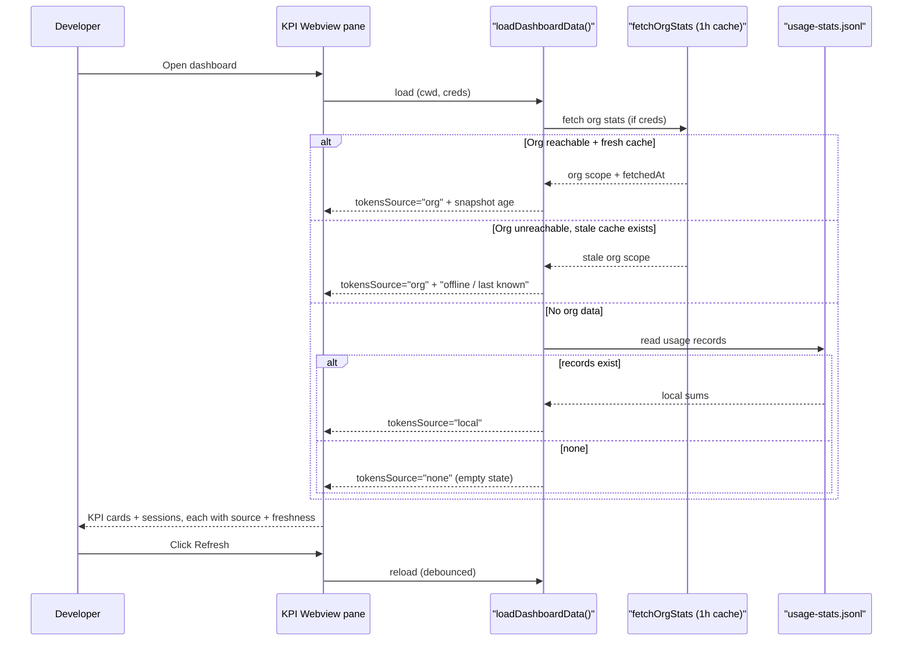

# PRD-003a: Live KPI & Session History Webview

> **Status:** Backlog
> **Priority:** P1
> **Effort:** L (1-3d)
> **Schema changes:** None
> **Parent:** [`prd-003-cursor-extension-dashboard-index`](./prd-003-cursor-extension-dashboard-index.md)

---

## Overview

This sub-feature is the dashboard's front door: the pane a developer sees first when they open Hivemind inside Cursor. It does one job extremely well, **make the value of the shared brain visible and believable**. It renders a small set of KPI cards (tokens saved, sessions captured, active memory recalls, skills created) and a scannable list of recent sessions, drawn from the same read-only data layer the CLI dashboard already uses (`src/dashboard/data.ts:270-288`). It lives in a Cursor Webview, so the developer never opens an external browser or runs a command to see what Hivemind has done for them.

The value is trust through visibility. After PRD-002, a developer knows Hivemind is *on*. This pane shows them it is *working*, and, crucially, it never lets a number lie by omission. The single hardest design problem here is not drawing a card; it is making a `0` or a stale value honest. The two ways Hivemind produces a confusing number, a stale cached snapshot and the accumulate-only-on-recall stats model, are both surfaced and explained here rather than left to scare the developer into thinking the product is broken.

---

## Why this matters: the mystery zeros we are killing

A developer who sees "0 tokens saved" after a morning of work concludes Hivemind is broken and stops trusting it. But the 0 is usually correct and benign, and the code already knows why. Two mechanisms produce it:

**1. The stale cached snapshot.** Org-wide stats come from a daily server rollup and are cached locally for one hour. The cache deliberately returns a fresh value without re-fetching, and even returns a *stale* value when the network fails:

```114:133:src/notifications/sources/org-stats.ts
function readCache(scopeKey: string): { fresh?: OrgStats; stale?: OrgStats } {
  if (!existsSync(cacheFilePath())) return {};
  try {
    const parsed = JSON.parse(readFileSync(cacheFilePath(), "utf-8")) as CacheFileShape;
    if (!parsed || typeof parsed !== "object") return {};
    if (parsed.scopeKey !== scopeKey) return {};
    if (typeof parsed.fetchedAt !== "number") return {};
    const age = Date.now() - parsed.fetchedAt;
    const data = parsed.data;
    if (!data || typeof data !== "object" || !data.org || !data.user) return {};
    if (age >= 0 && age < CACHE_TTL_MS) return { fresh: data };
    return { stale: data };
  } catch (e: any) {
    log(`cache read failed: ${e?.message ?? String(e)}`);
    return {};
  }
}
```

So a developer can be looking at a snapshot up to an hour old (or older, if offline). That is fine for a daily rollup, but only if the UI says so.

**2. Accumulate-only-on-recall.** Local stats are written per session, and the load-bearing metric is *bytes of memory grep'd during that session*. A session that did not search memory contributes nothing:

```21:33:src/notifications/usage-tracker.ts
export interface UsageRecord {
  /** ISO 8601 timestamp the session ended. */
  endedAt: string;
  /** Agent session_id (Claude Code session UUID). */
  sessionId: string;
  /** Bytes of `tool_result.content` returned from Bash tool calls grep'ing
   *  `~/.deeplake/memory/` during this session ... */
  memorySearchBytes: number;
  /** Count of Bash tool calls that referenced `.deeplake/memory` ... */
  memorySearchCount: number;
}
```

So "tokens saved" genuinely grows only when memory is recalled, not merely when a session happens. A quiet day is a real 0, not a bug. This pane's job is to make that legible: a `0` accompanied by "no memory recalls captured yet, this grows each time an agent pulls from your shared memory" is reassuring; a bare `0` is alarming.

The data layer already hands us the distinction we need to tell these stories apart.

---

## Goals

- Render KPI cards for tokens saved, sessions captured, active memory recalls, and skills created, inside a Cursor Webview, with no external browser or CLI invocation.
- Disclose, for every KPI, its **source** (org rollup, local fallback, or none) and its **freshness** (the snapshot age), so a number is never presented as more authoritative than it is.
- Distinguish, visibly, between "0 because nothing has accumulated yet" and "no data source at all (fresh install)," and explain how each KPI grows.
- Offer an explicit refresh that re-loads the data and (per the index's open question) can request fresher org stats than the 1-hour cache would otherwise serve.
- Render a recent-sessions list (most recent first) with enough metadata to recognize a session and open it in the session viewer (PRD-003c).
- Never throw: a fresh install with no creds, no sessions, and no org data renders a coherent empty state, matching the data layer's never-throw contract (`src/dashboard/data.ts:264-288`).

## Non-Goals

- **Computing or rolling up stats.** The numbers come from the existing data layer and server rollup. This pane reads and explains; it does not aggregate (`src/dashboard/data.ts:211-262`).
- **Changing the stats cache or its TTL.** The 1-hour cache and daily rollup are upstream (`src/notifications/sources/org-stats.ts:14-35`). This pane discloses freshness; it does not re-architect caching.
- **Rendering the codebase graph visualization.** Graph build status and counts belong to the settings pane (PRD-003b) and the CLI dashboard's force-directed view (`src/dashboard/render.ts`); this pane is KPIs and sessions.
- **Opening or rendering full summaries.** Reading a summary and its Next Steps is PRD-003c. This pane lists sessions and hands off.
- **Settings.** Toggling embeddings, graph, or org is PRD-003b. This pane may deep-link to settings when a KPI is empty because a feature is off, but it owns no toggles.

---

## The KPI cards

Each card reuses a field the data layer already produces. The table is the contract between the data envelope and the rendered card.

| Card | Value field | Source disclosure | Empty / zero story |
|---|---|---|---|
| **Tokens saved** | `kpis.tokensSaved` (org or local), with `kpis.userTokensSaved` as the "your contribution" sub-line | `kpis.tokensSource`: `"org"` => "team-wide, as of <age>"; `"local"` => "this machine"; `"none"` => empty | `null` + `"none"` => fresh-install empty state. `0` with a real source => "no memory recalls captured yet; this grows when agents pull from shared memory." |
| **Sessions captured** | `kpis.sessionsCount` | Same source as tokens (org rollup vs local record count) | `null` => "no sessions captured yet"; a positive number is always truthful. |
| **Active memory recalls** | `kpis.memorySearches` | Org `memoryRecallCount` or local `memorySearchCount` | `0` => "no recalls yet today; recalls happen when an agent greps your shared memory during a session." |
| **Skills created** | `kpis.skillsCreated` | Always local (directories under `~/.claude/skills/<name>--<author>/`) | `0` => "no skills authored yet"; note it counts only skills pulled to this machine (`src/notifications/usage-tracker.ts:118-169`). |

> The `tokensSource` three-way distinction (`"org" | "local" | "none"`, `src/dashboard/data.ts:61`) is the spine of honest rendering. `"none"` means `tokensSaved` is `null`, which the renderer must treat as "empty install," never as "0 saved" (`src/dashboard/data.ts:254-262`).

---

## Freshness and the refresh affordance

Freshness is a first-class part of every org-sourced card, not a footnote.

1. **Stamp the age.** When `tokensSource` is `"org"`, the card shows when the snapshot was taken, derived from the cache's `fetchedAt` (`src/notifications/sources/org-stats.ts:80-91,143`). "As of 12 minutes ago" turns a confusing stale number into an understood one.
2. **Explain the rollup cadence.** A tooltip or sub-line notes that org stats refresh from a daily server rollup, so same-minute precision is not expected. This matches the cache's own rationale ("the server rollup runs daily, so per-session freshness isn't meaningful," `src/notifications/sources/org-stats.ts:14-19`).
3. **Offer refresh.** A refresh control re-runs `loadDashboardData`. Per the index's open question, an explicit refresh may request fresher org stats than the 1-hour cache serves; the implementation must avoid hammering `/me/hivemind-stats` on rapid clicks (debounce or disable while in-flight).
4. **Be honest when offline.** If the org fetch fails and only a stale cache exists, the data layer returns the stale value (`src/notifications/sources/org-stats.ts:187,202-204`); the card must label it "offline, showing last known" rather than implying it is current.

---

## The recent-sessions list

The list turns the abstract "sessions captured" count into recognizable rows the developer can act on.

- **Ordering.** Most recent first, matching the durable per-session record stream (`src/notifications/usage-tracker.ts:5-8`).
- **Per-row metadata.** Enough to recognize a session: ended-at timestamp, project, and a memory-recall indicator (whether this session actually pulled from memory, derived from `memorySearchCount > 0`). This directly visualizes the accumulate-only-on-recall model, a row that recalled memory contributed to "tokens saved"; a row that did not, did not.
- **Open action.** Each row links to PRD-003c's session viewer for that `sessionId`.
- **Empty state.** No sessions yet renders the same coherent empty state as the cards, with a one-line "your sessions will appear here as you work" hint, not a blank list.

---

## The pane's data flow



---

## Presentation requirements

- **Beautiful and native-feeling.** The pane respects Cursor's theme (light/dark), uses the editor's font and color tokens, and reads as a first-party surface, not an embedded webpage.
- **Source and freshness always visible.** No card shows a number without its source label; org-sourced cards always show snapshot age.
- **Zero is never bare.** Any `0` or `null` carries its one-line explanation of how the metric grows or why it is empty.
- **No secret leakage.** The serialized state payload handed to the Webview and any logs never include tokens or API keys; identity appears as user/org name only (defers to PRD-002b).
- **Responsive to refresh.** Refresh shows an in-flight state and updates in place; it never blanks the pane while loading.
- **Accessible.** KPI status is conveyed by label and number, not color alone; the recent-sessions list is keyboard-navigable.

---

## Acceptance criteria

| ID | Criterion |
|---|---|
| AC-1 | Given a logged-in developer with org stats available, when the KPI pane renders, then each org-sourced card shows its value, a "team-wide" source label, and the snapshot age. |
| AC-2 | Given `tokensSource` is `"none"` (fresh install, no creds or sessions), when the pane renders, then the tokens card shows a fresh-install empty state and never the literal "0 saved." |
| AC-3 | Given a real data source but zero recalls, when the tokens or recalls card renders `0`, then it shows the explanation of how the metric accumulates (only on memory recalls) rather than a bare `0`. |
| AC-4 | Given the org stats are served from cache, when the card renders, then it stamps the snapshot age derived from the cache `fetchedAt`. |
| AC-5 | Given the org fetch fails but a stale cache exists, when the pane renders, then the card is labeled "offline / last known" rather than presented as current. |
| AC-6 | Given the developer clicks Refresh, when the reload is in flight, then the control is debounced/disabled so rapid clicks do not issue multiple concurrent org fetches, and the pane updates in place on completion. |
| AC-7 | Given captured sessions exist, when the recent-sessions list renders, then sessions appear most-recent-first with ended-at, project, and a memory-recall indicator, and each row can open the session viewer (PRD-003c). |
| AC-8 | Given no sessions exist, when the list renders, then it shows a coherent empty state, not a blank or broken list. |
| AC-9 | Given the Webview state payload or logs are inspected, when their contents are examined, then no token or API key value appears anywhere. |

---

## Open questions

- [ ] Should "active memory recalls" headline the org-wide recall count or the per-user recall count by default, given org stats expose both (`OrgStatsScope`, `src/notifications/sources/org-stats.ts:43-47`)?
- [ ] What exact freshness phrasing avoids false precision for a daily rollup ("as of 12 minutes ago" could imply live data)? Possibly "rolled up daily, last synced 12 minutes ago."
- [ ] For the recent-sessions list, is the local `usage-stats.jsonl` stream sufficient (zero-latency but local-only), or do we need a remote sessions-table query for cross-machine completeness (slower, matches `src/hooks/cursor/wiki-worker.ts:116-142`)?
- [ ] Should an explicit refresh hard-bypass the 1-hour org-stats cache, and if so, do we need a minimum interval between forced refreshes to protect the endpoint?

---

## Related

- [`prd-003-cursor-extension-dashboard-index`](./prd-003-cursor-extension-dashboard-index.md): parent module.
- [`prd-003b-settings-manager`](./prd-003b-settings-manager.md): owns the toggles this pane deep-links to when a KPI is empty because a feature is off.
- [`prd-003c-session-viewer`](./prd-003c-session-viewer.md): opens a session row from the recent-sessions list.
- [`../prd-002-cursor-extension-core/prd-002c-status-bar.md`](../prd-002-cursor-extension-core/prd-002c-status-bar.md): the status bar this pane opens from.
- Source grounding: `src/dashboard/data.ts:61-262` (`DashboardKpis`, `tokensSource`, `loadKpis` three-way fallback), `src/dashboard/data.ts:264-288` (never-throw load), `src/notifications/sources/org-stats.ts:14-19,80-133,162-208` (1-hour cache, `fetchedAt`, stale-on-failure), `src/notifications/usage-tracker.ts:21-116` (per-session local stats, accumulate-only-on-recall), `src/commands/dashboard.ts:36-68` (the read-only CLI surface this pane supersedes in-editor).
