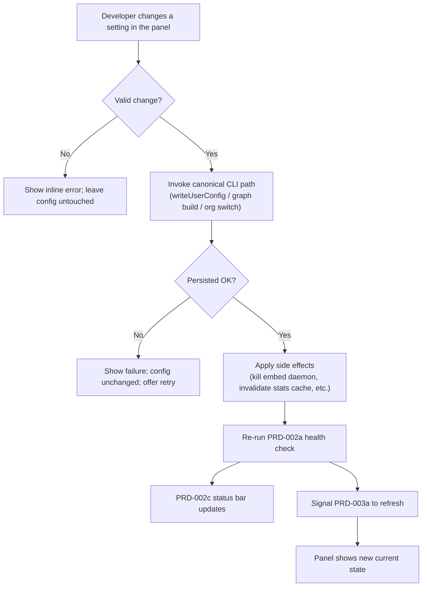

# PRD-003b: Graphical Settings & Environment Manager

> **Status:** Backlog
> **Priority:** P1
> **Effort:** L (1-3d)
> **Schema changes:** None
> **Parent:** [`prd-003-cursor-extension-dashboard-index`](./prd-003-cursor-extension-dashboard-index.md)

---

## Overview

This sub-feature replaces the most hostile part of running Hivemind: configuration. Today, changing how Hivemind behaves means leaving the editor and either remembering CLI subcommands (`hivemind embeddings enable`, `hivemind graph build`, `hivemind org switch <name>`) or, worse, hand-editing `~/.deeplake/config.json` and juggling environment variables like `HIVEMIND_EMBEDDINGS` (`src/user-config.ts:1-20,63-102`). This pane brings every common setting into a graphical panel inside Cursor. The developer flips a toggle; the extension writes the exact same canonical config the CLI writes, then re-runs the PRD-002 health check so the change is reflected honestly in the status bar.

The value is control without ceremony. A developer should be able to turn embeddings off on a laptop, rebuild the codebase graph after a big refactor, or switch from one client organization to another, all from a panel, all persisted to the one config the rest of Hivemind already trusts. No JSON, no environment variables, no memorized subcommands, and no risk that the editor and CLI disagree about the current configuration.

> **Graph visualization scope:** PRD-003 surfaces graph build status, counts, and refresh controls in Settings. The interactive force-directed graph explorer lives in the dashboard Graph tab and is specified by [`prd-004-cursor-graph-visualizer`](../prd-004-cursor-graph-visualizer/prd-004-cursor-graph-visualizer-index.md).

---

## Why this matters

Configuration is where trust quietly erodes. Three friction points hurt developers today:

1. **Embeddings are gated by a config flag with a legacy env-var migration.** The only persisted setting today is `embeddings.enabled`, seeded once from `HIVEMIND_EMBEDDINGS` and thereafter read from `~/.deeplake/config.json` (`src/user-config.ts:73-102`). A developer who wants embeddings off must either set an env var (read exactly once, then ignored) or edit JSON, and has no in-editor signal of the current state.
2. **The codebase graph is invisible and CLI-bound.** The graph powers the dashboard's visualization and richer context, but it only exists if the developer knew to run `hivemind graph build` (`src/cli/index.ts:462-465`, surfaced as a hint in `src/commands/dashboard.ts:238-240`). There is no in-editor way to see whether a graph exists, how old it is, or to rebuild it.
3. **Org / workspace switching is a CLI passthrough with a sharp cache edge.** `org switch` and `workspaces` exist only in the terminal (`src/cli/index.ts:486-490`), and switching org without invalidating the stats cache previously showed the *previous* org's numbers, the exact bug the cache scope-key was added to fix (`src/notifications/sources/org-stats.ts:80-100`). PRD-002b explicitly deferred org/workspace UX to a later stage; this is that stage.

This pane makes each of these a visible, safe, one-click operation.

---

## Goals

- Present a graphical settings panel inside the dashboard Webview covering embeddings, the codebase graph, and the active organization and workspace.
- Persist every change through the canonical config writer (`writeUserConfig`, `src/user-config.ts:50-61`) and canonical CLI code paths, so the editor and CLI never diverge and no manual file or environment-variable edit is required.
- Show the current state of each setting accurately on open (embeddings enabled/disabled, graph present/age, active org/workspace), reading the same sources the CLI reads.
- Re-run the PRD-002a health check after any change that affects a health dimension, and reflect the new state in the PRD-002c status bar within one poll interval.
- Invalidate the org stats cache scoped to the prior identity on an org/workspace switch, so the KPI pane (PRD-003a) never shows the old org's numbers.
- Represent long-running operations (graph build) with clear in-progress, success, and failure states inside the Webview.

## Non-Goals

- **Re-implementing the underlying operations.** Embeddings install/enable/disable, graph build, and org switch already exist in the CLI (`src/cli/index.ts:472-490`). This pane invokes them; it does not reimplement their logic.
- **Authentication and login.** Logging in, secrets, and credential storage are PRD-002b. This pane assumes an authenticated identity and switches *between* orgs/workspaces; it does not create credentials.
- **Prerequisite detection and hook wiring.** Whether CLIs exist and whether hooks are wired is PRD-002a. This pane triggers a re-check after changes but does not own detection.
- **Editing arbitrary config keys.** Only the supported settings (embeddings, graph, org/workspace) are exposed. A raw JSON editor for `~/.deeplake/config.json` is out of scope.
- **Designing new config schema.** `UserConfig` currently holds only `embeddings.enabled` (`src/user-config.ts:16-20`); any new persisted setting is added through the existing reader/writer, not a new store.

---

## The settings surface

Each control maps to an existing canonical operation and a known source of truth. This table is the contract.

| Setting | Control | Reads current state from | Writes / invokes | Health impact |
|---|---|---|---|---|
| **Embeddings** | On/off toggle | `getEmbeddingsEnabled()` (`src/user-config.ts:73-94`) | `enableEmbeddings()` / `disableEmbeddings()` (light: flip flag, kill daemon) or `installEmbeddings()` (heavy: deps + symlinks) per current install state (`src/cli/index.ts:472-481`) | Capture/wiki/grep embed paths toggle; re-check D-dimensions that depend on the daemon. |
| **Codebase graph** | Status line + "Build / Refresh" button | Snapshot resolver: `~/.hivemind/graphs/<repo-key>/latest-commit.txt` + snapshots (`src/dashboard/data.ts:141-209`) | `hivemind graph build` (`src/cli/index.ts:462-465`) | None on PRD-002 health directly; updates the dashboard graph empty-state and KPI context. |
| **Active organization** | Dropdown / switcher | Current `creds.orgId` / `whoami` (`src/cli/index.ts:486-490`) | `hivemind org switch <name-or-id>` (auth passthrough) | Identity change; invalidate stats cache; re-run health to confirm workspace resolves. |
| **Active workspace** | Dropdown | `creds.workspaceId`, `workspaces` list (`src/cli/index.ts:486-490`) | `hivemind workspace` selection (auth passthrough) | Same as org: identity change + cache invalidation. |

---

## Settings write flow (the safety spine)

Every change follows the same disciplined path so the editor, the CLI, and the status bar can never drift.

Three properties make this safe:

1. **Canonical writes only.** Persisted config goes through `writeUserConfig`, which writes atomically via a temp file and rename (`src/user-config.ts:50-61`) and deep-merges so unrelated keys survive. The pane never writes `config.json` directly.
2. **Idempotent and re-entrant.** Re-applying the same setting is a no-op-safe operation; the canonical readers/writers already tolerate repeat calls and cache in memory (`src/user-config.ts:31-48`).
3. **Cache coherence on identity change.** Switching org or workspace changes the stats cache scope key (`{apiUrl, orgId, userName}`, `src/notifications/sources/org-stats.ts:93-100`); the pane must ensure the prior-scope cache is not served afterward, so PRD-003a does not render the old org's numbers.

---

## The org / workspace switch (closing PRD-002b's deferral)

PRD-002b deliberately scoped org/workspace switching out and left an open question about presenting the "credentials present but org/workspace unresolved" state (`prd-002b-auth-secrets.md` non-goals and open questions). This pane resolves that:

- **Show the active identity** (org and workspace) read from credentials, matching what `whoami` reports.
- **List available orgs/workspaces** via the existing auth passthrough commands (`src/cli/index.ts:486-490`).
- **Switch on selection**, invoking the canonical `org switch` / workspace selection so the credentials file (the shared source of truth for CLI and editor) is updated once.
- **Invalidate the prior-scope stats cache** so the KPI pane refetches for the new identity rather than serving the previous org's fresh-cached numbers.
- **Re-run health** so any "workspace unresolved" condition surfaces as an actionable state rather than a silent mismatch.

---

## Presentation requirements

- **Real toggles, real state.** Each control reflects the actual persisted/derived state on open; no optimistic UI that claims a change before it is persisted.
- **In-progress honesty for long operations.** A graph build shows a running state and a terminal success/failure; the panel never appears frozen or silently completes.
- **Inline errors, not silent failures.** A failed write (read-only fs, permissions) shows an inline error and leaves config untouched, mirroring the writer's own fail-soft fallback (`src/user-config.ts:86-92`); it never claims success.
- **No secret leakage.** Org/workspace switching shows names and IDs, never tokens; the panel and logs defer to PRD-002b's secrets rules.
- **Health coherence.** After any change, the status bar (PRD-002c) and KPI pane (PRD-003a) reflect the new reality; the panel coordinates the re-check rather than leaving them stale.
- **Theme-native.** Controls use Cursor's native form controls and theme tokens for a first-party feel.

---

## Acceptance criteria

| ID | Criterion |
|---|---|
| AC-1 | Given the settings panel opens, when it renders, then each setting shows its true current state read from the canonical source (embeddings flag, graph snapshot presence/age, active org/workspace). |
| AC-2 | Given the developer toggles embeddings, when the change is applied, then it is persisted via the canonical config writer (atomic temp-file rename) and no manual JSON or env-var edit is required. |
| AC-3 | Given embeddings are toggled off, when the change applies, then the light disable path runs (flag flipped, daemon killed) consistent with `hivemind embeddings disable`, and the panel reflects the disabled state. |
| AC-4 | Given no codebase graph exists for the repo, when the panel renders, then the graph status shows "not built" with a Build action; given a graph exists, it shows the snapshot age and a Refresh action. |
| AC-5 | Given the developer triggers a graph build, when it runs, then the panel shows an in-progress state and a terminal success or failure result, never a frozen or silently-completed control. |
| AC-6 | Given the developer switches organization, when the switch completes, then the credentials identity updates via the canonical path and the org-scoped stats cache for the prior identity is invalidated so the KPI pane does not show the old org's numbers. |
| AC-7 | Given any setting change that affects a health dimension, when it applies, then the PRD-002a health check re-runs and the PRD-002c status bar updates within one poll interval. |
| AC-8 | Given a config write fails (permissions, read-only fs), when the developer applies a change, then an inline error is shown, the prior config is left intact, and a retry is offered. |
| AC-9 | Given the panel or logs are inspected after an org switch, when their contents are examined, then no token or API key value appears; only org/workspace names and IDs are shown. |

---

## Open questions

- [ ] Should toggling embeddings from "never installed" auto-run the heavy `installEmbeddings()` (deps + symlinks) or only offer the light enable when already installed, and how do we represent the heavy install's duration in the Webview (`src/cli/index.ts:472-481`)?
- [ ] Does the org/workspace switcher invoke the CLI as a child process (guaranteeing identical behavior) or call a shared module directly, given PRD-002b raised the same shared-module-vs-subprocess question for auth?
- [ ] Where is graph "staleness" best defined for the Refresh prompt: snapshot commit vs current HEAD (`src/dashboard/data.ts:202-208` exposes `commitSha`), or snapshot mtime?
- [ ] Should the panel expose a read-only "view raw config" affordance for the skeptic persona, or keep `~/.deeplake/config.json` entirely behind the graphical controls?
- [ ] When a graph build is triggered from the panel and the developer closes the Webview, should the build continue in the background and report on reopen?

---

## Related

- [`prd-003-cursor-extension-dashboard-index`](./prd-003-cursor-extension-dashboard-index.md): parent module.
- [`prd-003a-kpi-webview`](./prd-003a-kpi-webview.md): consumes the cache invalidation this pane performs on org switch, and the graph state this pane manages.
- [`prd-003c-session-viewer`](./prd-003c-session-viewer.md): unaffected by settings directly, but shares the Webview shell.
- [`../prd-002-cursor-extension-core/prd-002a-health-check.md`](../prd-002-cursor-extension-core/prd-002a-health-check.md): the health check this pane re-runs after changes.
- [`../prd-002-cursor-extension-core/prd-002b-auth-secrets.md`](../prd-002-cursor-extension-core/prd-002b-auth-secrets.md): owns identity/credentials; this pane closes its deferred org/workspace switching.
- [`../prd-002-cursor-extension-core/prd-002c-status-bar.md`](../prd-002-cursor-extension-core/prd-002c-status-bar.md): the status bar this pane keeps coherent after changes.
- Source grounding: `src/user-config.ts:16-106` (canonical config schema, atomic `writeUserConfig`, `getEmbeddingsEnabled` migration), `src/cli/index.ts:462-490` (graph, embeddings, org/workspace dispatch), `src/notifications/sources/org-stats.ts:80-100` (cache scope key and the org-switch invalidation rule), `src/dashboard/data.ts:122-209` (graph snapshot resolution and `graphsRoot`), `src/commands/dashboard.ts:238-240` (the "run graph build" hint this pane replaces with a button).
