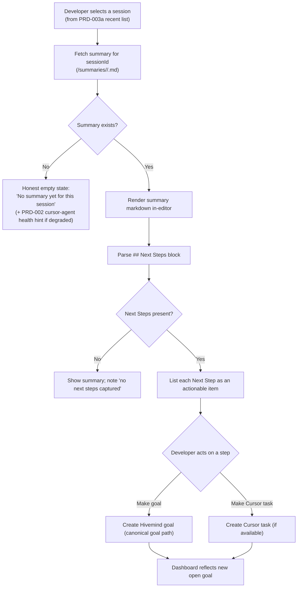

# PRD-003c: Session Summary & Next Steps Viewer

> **Status:** Backlog
> **Priority:** P2
> **Effort:** L (1-3d)
> **Schema changes:** None
> **Parent:** [`prd-003-cursor-extension-dashboard-index`](./prd-003-cursor-extension-dashboard-index.md)

---

## Overview

This sub-feature closes the loop. Hivemind's whole purpose is to turn the work of one session into reusable memory for the next, and the most concrete artifact of that is the **session summary**: a markdown document the wiki worker generates at session end and uploads to the shared memory table (`src/hooks/cursor/wiki-worker.ts:190-219`). Every summary ends with a curated `## Next Steps` block, a contract so important it is byte-locked across all agent variants in test (`tests/claude-code/wiki-next-steps-contract.test.ts:11-19`). Today those summaries live in remote storage and the developer never sees them in the editor, and those Next Steps, the most actionable thing the brain produces, evaporate instead of becoming the developer's next task.

This pane brings summaries into Cursor. The developer picks a session (from the recent-sessions list in PRD-003a), reads its summary rendered in-editor, and converts any "Next Step" into a real Hivemind goal or a Cursor task with one click. The value is a brain that does not just remember, but actively hands the developer their next move.

---

## Why this matters

The summary is the payoff of the entire capture pipeline, and right now it is invisible and inert.

1. **Invisible.** Summaries are uploaded to `/summaries/<userName>/<sessionId>.md` in the memory table (`src/hooks/cursor/wiki-worker.ts:194-219`) and surfaced only indirectly, in the SessionStart brief or the resume brief. A developer who wants to read what their last session accomplished has no in-editor reader.
2. **Inert Next Steps.** Each summary ends with a deliberately-formatted `## Next Steps` section. The contract test exists precisely because these next steps feed downstream surfaces and must stay byte-stable (`tests/claude-code/wiki-next-steps-contract.test.ts:11-19,96`). Yet there is no path for a developer to act on a Next Step beyond reading it; it does not become a goal or a task.
3. **A disconnected goals system.** Hivemind already has a goals concept, open goals are read and surfaced in the SessionStart banner (`src/notifications/sources/open-goals.ts:42-85`) and managed via `hivemind goal` (`src/cli/index.ts:447-450`). The Next Steps in a summary are exactly the raw material for goals, but nothing connects the two.

This pane connects reading to acting: summary in, goal or task out.

---

## Goals

- Render a selected session's summary markdown inside the Cursor dashboard Webview, including its `## Next Steps` block, with no external browser.
- Parse the `## Next Steps` section reliably (honoring its locked contract format) and present each next step as an actionable item.
- Let the developer convert a Next Step into a Hivemind goal (via the canonical goals path) or a Cursor task, with one click per item.
- Reflect a newly created goal back in the dashboard (the KPI/goals surfaces) so the loop is visibly closed.
- Handle the realities of summaries gracefully: a session with no summary yet (the silent-failure case PRD-002 guards against), a summary with an empty Next Steps section, and an unreachable memory table all render honest states.

## Non-Goals

- **Generating or editing summaries.** Summary generation is the wiki worker's job (`src/hooks/cursor/wiki-worker.ts`); this pane reads, it does not author or mutate stored summaries.
- **A full memory browser or search.** Browsing the entire memory corpus or free-text search across summaries is a later stage. This pane opens a specific session's summary handed to it by PRD-003a.
- **Goal management UI.** Editing, closing, or reprioritizing goals is the goals system's concern (`hivemind goal`). This pane only *creates* goals/tasks from Next Steps and links out.
- **Re-running summarization for a session.** Triggering a re-summary or backfill is out of scope; this pane reflects what the worker has already produced.
- **Cross-agent summary aggregation.** This pane is Cursor-scoped and reads Cursor session summaries; multi-agent summary unification is not part of this stage.

---

## What the pane shows

The pane has three regions: a header identifying the session (project, ended-at, source path), the rendered summary body, and an actionable Next Steps list.

---

## Reading the summary

- **Source.** Summaries are stored at `/summaries/<userName>/<sessionId>.md` in the memory table; the pane fetches by the `sessionId` handed in from PRD-003a's recent-sessions list. The wiki worker is the authoritative writer of this path (`src/hooks/cursor/wiki-worker.ts:194-195`).
- **Render markdown natively.** The summary is markdown and must render with headings, lists, and code blocks intact in the Webview, theme-aware.
- **Show provenance.** The header shows where the summary came from (session id, project, ended-at) so the developer trusts what they are reading.
- **The no-summary state is meaningful.** A missing summary is exactly the silent-failure symptom PRD-002 attacks: when `cursor-agent` was logged out, summaries became empty placeholders (`src/hooks/cursor/wiki-worker.ts:186-188,228-230`). If a selected session has no summary and PRD-002 health is degraded for that reason, this pane shows the connection ("this session has no summary; `cursor-agent` was logged out, see status bar") rather than a blank.

---

## The Next Steps contract

The `## Next Steps` block is not free-form text; it is a locked contract, and this pane must honor it.

- **Stable marker.** The section begins with the literal `## Next Steps` heading; the contract test extracts the body from that marker to the next section (`tests/claude-code/wiki-next-steps-contract.test.ts:41-54`).
- **Byte-identical across agents.** The block is required to be byte-identical across all five agent copies (`tests/claude-code/wiki-next-steps-contract.test.ts:96`), so a single parser works for Cursor and every other agent's summaries.
- **Parse defensively.** Each line item becomes an actionable entry. The parser must tolerate an empty or absent section (the contract allows a "no next steps" consequence) and never crash on a malformed summary, matching Hivemind's fail-soft posture everywhere else.

> Because the format is contract-locked and tested, the parser can be strict about the marker and lenient about the contents, the safest combination.

---

## Converting a Next Step into action

Two promotion targets, one click each.

| Action | What it creates | Delegates to | Result reflected in |
|---|---|---|---|
| **Make a goal** | A Hivemind goal whose label is the Next Step text | The canonical goal path (`hivemind goal`, `src/cli/index.ts:447-450`); goals are read back by `listOpenGoals` (`src/notifications/sources/open-goals.ts:60-65`) | The dashboard's open-goals surface and the SessionStart banner. |
| **Make a Cursor task** | A task in Cursor's task system, if a first-party API is available | Cursor task API (open question); falls back to "Make a goal" when unavailable | Cursor's task surface. |

Requirements:

1. **Canonical goal creation.** A promoted goal is created through the same path the CLI uses, so it appears in the same owner-scoped, version-deduped reader that powers the banner (`src/notifications/sources/open-goals.ts:55-65`). The pane does not invent a parallel goals store.
2. **Visible confirmation.** After promotion, the item shows a "created" state and the dashboard's open-goals count reflects the new goal, so the developer sees the loop close (matches PRD-003 module AC-6).
3. **Idempotency guardrail.** Promoting the same Next Step twice should not silently create duplicate goals without acknowledgment; the pane warns or marks already-promoted steps.
4. **Graceful fallback.** If Cursor task creation is unavailable, the pane offers "Make a goal" instead of failing, so the developer always has a working action.

---

## Presentation requirements

- **Readable summary.** Markdown renders cleanly and theme-aware; long summaries scroll within the pane without breaking the dashboard layout.
- **Actionable, not just readable.** Next Steps are visually distinct from the summary body and carry their promotion buttons inline.
- **Honest empty and error states.** No summary, empty Next Steps, and an unreachable memory table each render a specific, calm message, never a blank pane or a stack trace.
- **No secret leakage.** Summary content, the session header, and any logs never render tokens or API keys; the fetch authorizes via the existing credential path without exposing the token (defers to PRD-002b).
- **Loop visibility.** A promoted Next Step produces immediate, visible feedback and updates the dashboard's goals surface.

---

## Acceptance criteria

| ID | Criterion |
|---|---|
| AC-1 | Given a session with an uploaded summary, when the developer opens it in the viewer, then the summary markdown renders in-editor with headings, lists, and code blocks intact. |
| AC-2 | Given a summary with a populated `## Next Steps` section, when the viewer renders, then each next step appears as a distinct, actionable item parsed from the contract-locked block. |
| AC-3 | Given a Next Step, when the developer chooses "Make a goal," then a Hivemind goal is created via the canonical goal path and appears in the dashboard's open-goals surface. |
| AC-4 | Given a Next Step and an available Cursor task API, when the developer chooses "Make a Cursor task," then a Cursor task is created; given no such API, the viewer offers "Make a goal" instead and does not fail. |
| AC-5 | Given a session that has no summary, when the viewer opens it, then it shows an honest "no summary yet" state, and if PRD-002 health is degraded due to a logged-out `cursor-agent`, it links that cause. |
| AC-6 | Given a summary whose Next Steps section is empty or absent, when the viewer renders, then the summary still shows and the pane notes "no next steps captured" without error. |
| AC-7 | Given the developer promotes the same Next Step twice, when the second promotion is attempted, then the pane marks it already-promoted or warns rather than silently creating a duplicate. |
| AC-8 | Given the memory table is unreachable, when the viewer tries to fetch a summary, then it shows a calm error state and does not crash the dashboard. |
| AC-9 | Given the rendered summary, the session header, or logs are inspected, when their contents are examined, then no token or API key value appears anywhere. |

---

## Open questions

- [ ] Does Cursor expose a first-party API to create a task/todo the viewer can target, or should promotion default to Hivemind goals with Cursor tasks as best-effort (the index PRD raises this)?
- [ ] Should summaries be fetched from the remote memory table directly (authoritative, matches the worker's storage at `src/hooks/cursor/wiki-worker.ts:194-195`) or from a local cache for latency, and how fresh must they be?
- [ ] How should a resumed-session summary (which carries a `**JSONL offset**` marker, `src/hooks/cursor/wiki-worker.ts:152-154`) be presented, as one evolving document or with revision awareness?
- [ ] What dedupe key prevents duplicate goals from repeated promotion, the Next Step text, a hash, or a `(sessionId, stepIndex)` tuple?
- [ ] Should the viewer allow lightly editing a Next Step before promoting it to a goal, or promote verbatim to preserve the brain's wording?

---

## Related

- [`prd-003-cursor-extension-dashboard-index`](./prd-003-cursor-extension-dashboard-index.md): parent module.
- [`prd-003a-kpi-webview`](./prd-003a-kpi-webview.md): the recent-sessions list that selects which session this viewer opens, and the goals surface a promoted Next Step updates.
- [`prd-003b-settings-manager`](./prd-003b-settings-manager.md): shares the Webview shell.
- [`../prd-002-cursor-extension-core/prd-002a-health-check.md`](../prd-002-cursor-extension-core/prd-002a-health-check.md): the `cursor-agent` login (D3) check this viewer references when a summary is missing.
- [`../prd-002-cursor-extension-core/prd-002c-status-bar.md`](../prd-002-cursor-extension-core/prd-002c-status-bar.md): the status bar this viewer points to when a missing summary traces to degraded health.
- Source grounding: `src/hooks/cursor/wiki-worker.ts:186-230` (summary generation, upload path `/summaries/<user>/<sessionId>.md`, the missing-summary silent failure), `tests/claude-code/wiki-next-steps-contract.test.ts:11-96` (the locked `## Next Steps` contract this pane parses), `src/notifications/sources/open-goals.ts:42-85` (canonical goals reader a promoted step feeds), `src/cli/index.ts:447-450` (`hivemind goal` command the promotion delegates to).
