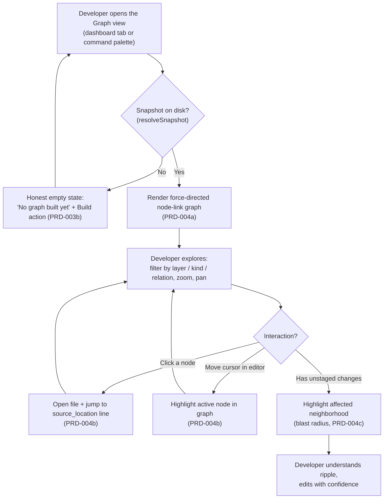

# PRD-004: Interactive Codebase Graph Visualizer

> **Status:** Backlog
> **Priority:** P2
> **Effort:** XL (> 3d)
> **Schema changes:** None

---

## Overview

PRD-002 made Hivemind honest inside Cursor (a status bar that never lies, zero-friction onboarding). PRD-003 made it visible and controllable (live KPI cards, a graphical settings panel, an in-editor session viewer). Both stages deliberately drew the same boundary line: the codebase graph stays a background, text-only asset. PRD-003 surfaces graph build status and counts and can trigger a build, but it explicitly defers "a rich interactive codebase-graph explorer" to a later stage (`prd-003-cursor-extension-dashboard-index.md` non-goals; `prd-003a-kpi-webview.md` non-goals; `prd-002c-status-bar.md` non-goals). PRD-004 is that stage.

Hivemind already has a rich codebase graph. A multi-language extraction pipeline parses TypeScript, JavaScript, Python, Go, Rust, Java, Ruby, C, and C++ into a NetworkX-compatible directed multigraph of files, classes, functions, methods, and their `imports`/`calls`/`extends`/`implements`/`method_of` relationships (`src/graph/types.ts:23-179`). That graph is persisted as deterministic, content-addressed snapshots on disk (`src/graph/snapshot.ts:196-252`) and is already consumed by agents through a text virtual filesystem with eight query endpoints (`src/graph/vfs-handler.ts:56-160`). The one consumer it has never had is the developer's own eyes. The graph is something agents read; it is not something humans see.

PRD-004 delivers the **Interactive Codebase Graph Visualizer**: a visual, explorable, force-directed rendering of that exact same snapshot, embedded as a first-class view inside the PRD-003 dashboard Webview. It does three things. It **shows the shape of the code**: an interactive 2D/3D node-link graph where files, classes, and functions become nodes and imports and calls become edges, styled by the metadata the pipeline already computes (`fan_in`, `fan_out`, `is_entrypoint`, `exported`, `src/graph/node-metadata.ts:18-32`). It **fuses the graph with the editor**: clicking a node opens its file and jumps to the precise line of its AST declaration, and moving the cursor in the editor highlights the active node in the graph. And it **makes change consequences visible before they happen**: when a developer has unstaged edits, the visualizer highlights the affected neighborhood, the transitive set of dependents that could feel the ripple, reusing the same reverse-dependency traversal the text `impact/` endpoint already performs (`src/graph/render/impact.ts:22-113`).

This index covers the module-level vision, goals, non-goals, and the three sub-features that compose it. Implementation detail lives in the sub-PRDs.

---

## The problem, from the developer's chair

A developer has onboarded (PRD-002) and uses the dashboard (PRD-003). They have run a graph build, so a snapshot exists on disk. Their experience of that graph today has a hard ceiling:

1. **The graph is invisible to them.** Its value is real but indirect: agents read it through the text VFS to answer "who calls this?" or "what is the blast radius?" (`src/graph/vfs-handler.ts:99-160`). The developer paid for a build and got a number ("1,240 nodes, 3,800 edges") but no way to actually look at their codebase's structure.
2. **The only visual rendering lives outside the editor.** The single force-directed view that exists is generated by the CLI dashboard as a self-contained HTML file written to disk and opened in an external browser (`src/dashboard/render.ts`, invoked by `src/commands/dashboard.ts:36-68`). It is read-only, it is disconnected from the editor, and it cannot answer "take me to that function."
3. **Exploring structure means reading text dumps.** To understand a file's neighborhood or a symbol's dependents, the developer (or their agent) reads padded, capped text tables (`renderNeighborhood`, `src/graph/render/neighborhood.ts:13-160`; `renderImpact`, `src/graph/render/impact.ts:75-112`). Text is excellent for an agent's context window and terrible for a human trying to grasp shape, clusters, and hot spots at a glance.
4. **Change is a leap of faith.** Before editing a heavily-depended-on function, a developer has no in-editor picture of what depends on it. The information exists (the reverse-dependency BFS is already implemented, `src/graph/render/impact.ts:47-69`), but it is one CLI text query away, phrased as a symbol pattern, not a living highlight over the code they are about to touch.

Every one of these is a place where Hivemind has already done the hard work (building and resolving the graph) but stops short of letting the developer benefit visually. PRD-004 closes that final gap: it turns an agent-only asset into a developer-facing, editor-fused, change-aware map.

---

## Value & success themes

| Theme | What "good" feels like for the developer |
|---|---|
| **See your codebase** | One view shows the whole structure: clusters of related files, hub functions everyone depends on, isolated leaves. The shape that was implicit in the code becomes explicit and explorable. |
| **The graph and the editor are one surface** | Clicking a node lands the cursor on the exact declaration line; moving the cursor lights up where you are in the graph. The map and the territory stay in sync, both directions, automatically. |
| **Know the blast radius before you leap** | Before changing a function, the developer sees its dependents highlighted over their own working changes, so "what will this break?" is answered visually instead of guessed. |
| **One graph, many readers** | The visualizer renders the exact same snapshot agents query; the picture a human sees and the context an agent reads can never disagree, because they are the same bytes. |
| **Honest about its limits** | Where cross-file resolution is partial, the visualizer says so. An empty incoming set is shown as "no resolved dependents," never as a false promise of dead code. |

---

## Goals

- A developer can open an interactive, force-directed graph of their codebase inside the Cursor dashboard Webview, rendered from the same on-disk snapshot the agent VFS reads (`src/dashboard/data.ts:141-209`), without an external browser or a CLI command.
- The visualizer represents the real graph entities the pipeline produces: nodes for files/classes/functions/methods (`NodeKind`, `src/graph/types.ts:127-136`) and edges for `imports`/`calls`/`extends`/`implements`/`method_of` (`EdgeRelation`, `src/graph/types.ts:169-179`), styled by the derived metadata (`fan_in`/`fan_out`/`is_entrypoint`/`exported`).
- Clicking any node opens its source file in Cursor and moves the cursor to the exact line encoded in `source_location` (`src/graph/types.ts:99-102`); conversely, moving the cursor in an open editor highlights the corresponding node in the graph.
- When the developer has unstaged changes, the visualizer highlights the affected neighborhood, the transitive dependents of the changed symbols, reusing the reverse-dependency traversal that powers the text `impact/` endpoint (`src/graph/render/impact.ts:47-69`).
- The visualizer integrates with the existing dashboard lifecycle: it lives as a view inside the PRD-003 Webview shell, refreshes when PRD-003b triggers a graph build, and reflects graph presence/absence consistently with the PRD-002c status bar.
- The visualizer degrades gracefully: no snapshot, a stale snapshot, an unsupported-size graph, or a parse failure each render a coherent, explained state rather than a crash or a blank canvas (matching the never-throw posture of both the data layer, `src/dashboard/data.ts:141-209`, and the VFS handler, `src/graph/vfs-handler.ts:164-216`).

## Non-Goals

- **Building or extracting the graph.** Extraction (`src/graph/extract/`), snapshot construction (`src/graph/snapshot.ts`), and cross-file resolution (`src/graph/resolve/cross-file.ts`) are upstream and unchanged. PRD-004 reads snapshots; it never produces them.
- **Re-implementing graph queries.** The traversals (impact, neighborhood, layers, path, tour) already exist as deterministic renderers (`src/graph/render/`). The visualizer consumes the same snapshot and reuses the same traversal logic; it does not invent a parallel query engine.
- **Changing the snapshot schema or storage.** The NetworkX node-link shape (`src/graph/types.ts:23-41`), the content-hash contract, and the on-disk layout (`src/graph/snapshot.ts:196-252`) are fixed inputs. Schema changes are explicitly out of scope (Schema changes: None).
- **Triggering or owning graph builds.** Build/refresh is owned by PRD-003b's settings manager (`prd-003b-settings-manager.md`), which invokes `hivemind graph build` (`src/cli/index.ts:462-465`). The visualizer requests a refresh through that surface; it does not own the build.
- **A semantic / similarity graph.** The current graph is AST-based with no semantic-similarity edges (`src/graph/vfs-handler.ts:297-304`). Embedding-based "related code" overlays are a later stage.
- **Editing code from the graph.** The visualizer navigates to and highlights code; it does not rename, move, or refactor symbols from the canvas. Editing happens in the editor.
- **A VS Code (non-Cursor) release.** The target surface is Cursor 1.7+, matching PRD-002 and PRD-003.

---

## Sub-features

| Sub-PRD | Scope | Status |
|---|---|---|
| [`prd-004a-graph-webview`](./prd-004a-graph-webview.md) | The Interactive Graph Webview: render the snapshot as a force-directed 2D/3D node-link graph inside the dashboard Webview, with filtering (by layer, kind, relation), metadata-driven styling, level-of-detail for large graphs, and honest loading/empty/no-graph states. | Backlog |
| [`prd-004b-editor-sync`](./prd-004b-editor-sync.md) | Editor Sync and Navigation: click a node to open its file and jump to the exact AST line (`source_location`), and reflect the editor's active cursor position back as the highlighted node in the graph, bidirectionally. | Backlog |
| [`prd-004c-impact-visualizer`](./prd-004c-impact-visualizer.md) | The Change Impact Visualizer: map the developer's unstaged changes to graph nodes, highlight the transitive dependent neighborhood (blast radius) over the graph, and disclose the lower-bound honesty caveat. | Backlog |

---

## The visualizer journey (module-level)

The three sub-features compose into one continuous experience inside the dashboard's graph view. The extension owns the Webview shell and routing (inherited from PRD-003); each sub-PRD owns a capability layered on the same rendered graph.

The defining property carried from PRD-002 and PRD-003: **the surface never leaves the developer guessing.** Where the legacy path would force a CLI text query or an external browser, the visualizer shows the structure, the location, and the consequences in-editor, and is honest wherever the underlying graph is.

---

## Personas

| Persona | Context | What PRD-004 gives them |
|---|---|---|
| **The newcomer (Dana)** | Joined a large repo last week; does not yet have a mental model of how it fits together. | A visual map that reveals subsystems, hubs, and entrypoints at a glance, with one click to jump into any of them. |
| **The navigator (Marco)** | Lives in the editor; resents context-switching to a browser to understand structure. | A graph fused with his cursor: where he is in the code is where he is in the graph, and vice versa, with no window-switching. |
| **The careful refactorer (Priya)** | About to change a core utility and is afraid of unseen consumers. | A highlighted blast radius over her unstaged changes showing exactly which dependents the edit could reach. |
| **The skeptic (Lee)** | Distrusts tools that overstate certainty. | A visualizer that labels partial cross-file resolution honestly, so an empty dependent set never reads as a false "safe to delete." |
| **The architect (Sam)** | Wants to see whether the codebase's real structure matches the intended layering. | A layer-grouped view (Tests, Hooks, CLI, Graph, and so on, `src/graph/render/layers.ts:9-19`) that exposes cross-layer edges that should not exist. |

---

## Acceptance criteria (module-level)

| ID | Criterion |
|---|---|
| AC-1 | Given a repo with a built snapshot, when the developer opens the Graph view, then a force-directed node-link graph renders inside the Cursor dashboard Webview from the same snapshot the agent VFS reads, with no external browser. |
| AC-2 | Given no snapshot exists for the repo, when the Graph view opens, then it shows a coherent "no graph yet" state with a Build action that routes to PRD-003b, never a blank canvas or a crash. |
| AC-3 | Given a rendered graph, when the developer clicks a node, then Cursor opens the node's `source_file` and moves the cursor to the line encoded in `source_location`. |
| AC-4 | Given an open editor whose file and cursor correspond to a node, when the developer moves the cursor onto that symbol, then the matching node is highlighted in the graph within one sync interval. |
| AC-5 | Given the developer has unstaged changes, when they enable the impact overlay, then the changed symbols and their transitive dependents are highlighted, computed by the same reverse-dependency traversal as the text `impact/` endpoint. |
| AC-6 | Given the impact overlay is shown, when dependents are highlighted, then the view discloses that cross-file resolution is partial and the highlighted set is a lower bound, not a completeness guarantee. |
| AC-7 | Given a graph build is triggered from PRD-003b, when the build completes, then the open Graph view refreshes to the new snapshot without the developer reopening the Webview. |
| AC-8 | Given a snapshot whose size exceeds the smooth-rendering threshold, when the Graph view opens, then it applies a level-of-detail or filtered initial view (and says so) rather than freezing the editor. |
| AC-9 | Given a malformed or partially-written snapshot, when the Graph view loads it, then it shows an explained error state consistent with the data layer's never-throw contract, not a stack trace. |
| AC-10 | Given the Graph view, its serialized payload, or its logs are inspected, when their contents are examined, then no token or API key value appears (the snapshot read path is local-only, `src/graph/vfs-handler.ts:20-22`). |

---

## How PRD-004 reuses what already exists (cross-cutting)

PRD-004's central discipline is consumption, not reinvention. Every visual capability maps to an artifact the codebase-graph pipeline already produces. This table is the contract the sub-PRDs inherit.

| Visual capability | Existing artifact it consumes | Source |
|---|---|---|
| The node-link graph itself | The canonical snapshot JSON (NetworkX node-link, directed multigraph) | `src/graph/types.ts:23-41`, `src/graph/snapshot.ts:125-165` |
| Locating the snapshot to render | `resolveSnapshot` (follow `latest-commit.txt`, then most-recent mtime; never throws) | `src/dashboard/data.ts:141-209` |
| Node identity, location, kind, language | `GraphNode` (`id`, `label`, `kind`, `source_file`, `source_location`, `language`, `exported`) | `src/graph/types.ts:92-125` |
| Node visual weight (hubs, entrypoints) | Derived `fan_in` / `fan_out` / `is_entrypoint` | `src/graph/node-metadata.ts:18-32` |
| Edge rendering and direction | `GraphEdge` (`source`, `target`, `relation`, `confidence`, `ord`) | `src/graph/types.ts:149-181` |
| Click-to-line navigation | `source_location` format `L<line>` / `L<line>-<endLine>`, 1-indexed | `src/graph/types.ts:99-102` |
| Layer / subsystem grouping | `layerOf` path heuristic | `src/graph/render/layers.ts:9-30` |
| Blast-radius (impact) overlay | Reverse-dependency BFS by depth, with lower-bound caveat | `src/graph/render/impact.ts:47-112` |
| File neighborhood overlay | Cross-file neighbor grouping by relation/direction | `src/graph/render/neighborhood.ts:79-160` |

---

## Cross-cutting requirements

- **One graph, one source of truth.** The visualizer renders the same snapshot the agent VFS reads, located the same way (`resolveSnapshot`, `src/dashboard/data.ts:141-209`). It maintains no separate graph store and never re-extracts.
- **Never-throw rendering.** Every state (no snapshot, stale snapshot, oversized graph, malformed JSON) has a defined, explained UI, matching the never-throw contracts in `src/dashboard/data.ts:141-209` and `src/graph/vfs-handler.ts:164-216`.
- **Honesty over completeness.** Wherever cross-file resolution is partial (bare/aliased/barrel/dynamic imports, Python cross-file), the visualizer discloses the limit rather than implying certainty (`src/graph/vfs-handler.ts:297-304`, `src/graph/render/impact.ts:110-112`).
- **Local-only read path.** Snapshot reads touch only local disk with zero network calls (`src/graph/vfs-handler.ts:20-22`); the Webview payload and logs never carry tokens or API keys (defers to PRD-002b secrets rules).
- **Lifecycle coherence.** The view reflects graph presence/absence the same way the PRD-002c status bar and PRD-003b settings panel do, and refreshes when a build completes; the three surfaces never disagree about whether a graph exists or how old it is.
- **Editor-native feel.** The graph respects Cursor's theme (light/dark), uses editor tokens, and behaves like a first-party panel, consistent with the PRD-003 Webview presentation requirements.

---

## Open questions

- [ ] What rendering technology best fits a Cursor Webview at the snapshot sizes Hivemind produces: a 2D canvas/WebGL force layout, a 3D force layout, or both behind a toggle? (Trades visual richness against performance and accessibility.)
- [ ] At what node/edge count does an unfiltered force layout stop being smooth in a Webview, and what is the right default initial view above that threshold (layer-collapsed, top-`fan_in` only, or active-file neighborhood)?
- [ ] Should the visualizer render file-level nodes, symbol-level nodes, or a collapsible hierarchy between them, given the snapshot encodes both via `source_file` and symbol `id`?
- [ ] For editor-to-graph sync, what is the cheapest reliable way to map a cursor position to a node `id` given `source_location` is a line range, multiple symbols can share a line, and the snapshot may be stale relative to live edits?
- [ ] For the impact overlay on unstaged changes, should changed symbols be detected by re-extracting dirty files on the fly, or by mapping `git diff --name-only` files to existing nodes (faster, but blind to brand-new symbols not yet in the snapshot)?
- [ ] How should the view present a snapshot that is stale relative to live edits (mtime newer than the build, as the VFS index warns, `src/graph/vfs-handler.ts:304`): a passive "graph is N commits behind" banner, or an active prompt to rebuild via PRD-003b?
- [ ] Should the graph view be a tab within the single PRD-003 dashboard Webview or a separate dedicated Webview panel, given graph rendering is heavier than the KPI/settings/session panes?

---

## Related

- [`prd-004a-graph-webview`](./prd-004a-graph-webview.md): the interactive force-directed graph rendering.
- [`prd-004b-editor-sync`](./prd-004b-editor-sync.md): bidirectional editor and graph navigation.
- [`prd-004c-impact-visualizer`](./prd-004c-impact-visualizer.md): change-impact (blast radius) overlay.
- [`../prd-003-cursor-extension-dashboard/prd-003-cursor-extension-dashboard-index.md`](../prd-003-cursor-extension-dashboard/prd-003-cursor-extension-dashboard-index.md): the Stage 3 dashboard this visualizer is embedded in.
- [`../prd-003-cursor-extension-dashboard/prd-003a-kpi-webview.md`](../prd-003-cursor-extension-dashboard/prd-003a-kpi-webview.md): the Webview shell the graph view shares.
- [`../prd-003-cursor-extension-dashboard/prd-003b-settings-manager.md`](../prd-003-cursor-extension-dashboard/prd-003b-settings-manager.md): owns graph build/refresh, which this view consumes and re-triggers.
- [`../prd-002-cursor-extension-core/prd-002c-status-bar.md`](../prd-002-cursor-extension-core/prd-002c-status-bar.md): the status bar whose graph presence/absence this view stays coherent with.
- [`../../../knowledge/private/standards/documentation-framework.md`](../../../knowledge/private/standards/documentation-framework.md): documentation standards this PRD conforms to.
- Source grounding: `src/graph/types.ts:23-252` (snapshot/node/edge schema), `src/graph/snapshot.ts:40-252` (snapshot build, hashing, on-disk layout), `src/graph/node-metadata.ts:18-32` (`fan_in`/`fan_out`/`is_entrypoint`), `src/graph/vfs-handler.ts:56-216` (the text VFS the visualizer mirrors visually, snapshot loading, never-throw), `src/graph/render/impact.ts:22-113` (reverse-dependency BFS), `src/graph/render/neighborhood.ts:13-160` (cross-file neighbor grouping), `src/graph/render/layers.ts:9-82` (subsystem grouping), `src/dashboard/data.ts:122-209` (`graphsRoot`, `resolveSnapshot`), `src/dashboard/render.ts` (the external-browser force-directed view this supersedes in-editor), `src/cli/index.ts:462-465` (`hivemind graph build`).
