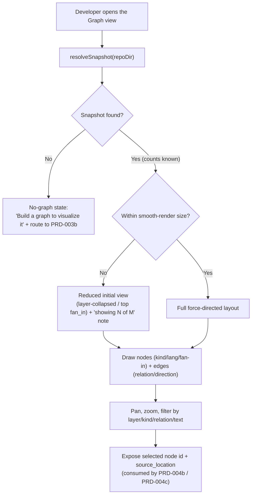

# PRD-004a: Interactive Graph Webview

> **Status:** Backlog
> **Priority:** P2
> **Effort:** L (1-3d)
> **Schema changes:** None
> **Parent:** [`prd-004-cursor-graph-visualizer-index`](./prd-004-cursor-graph-visualizer-index.md)

---

## Overview

This sub-feature is the canvas. It takes the codebase-graph snapshot that already exists on disk and draws it as an interactive, force-directed node-link graph inside the Cursor dashboard Webview. It is the first thing a developer sees when they open the Graph view, and it is the surface every other PRD-004 capability layers on top of: PRD-004b's editor sync highlights nodes here, and PRD-004c's impact overlay colors a subset of these nodes.

The value is comprehension. The codebase graph is the most information-dense artifact Hivemind produces (`src/graph/types.ts:23-41`), and until now a human could only experience it as text tables (`src/graph/render/`) or an external-browser HTML file (`src/dashboard/render.ts`). This pane turns it into a living picture the developer can pan, zoom, filter, and read at a glance, rendered from the exact same bytes the agent VFS reads, so the human view and the agent context are guaranteed to match. Nothing here re-extracts or re-computes the graph; it reads the snapshot and draws it.

---

## Why this matters

A node-link diagram answers questions text cannot. Which files cluster together? Which function is a hub everyone depends on? Which exported symbols are entrypoints nobody calls internally? The snapshot already encodes the answers, the pipeline computes `fan_in`, `fan_out`, and `is_entrypoint` for every node after full cross-file resolution (`src/graph/node-metadata.ts:18-32`), but those answers are buried in capped text output today. The neighborhood renderer caps at 25 entries (`src/graph/render/neighborhood.ts:3`), the impact renderer caps at 80 (`src/graph/render/impact.ts:18`), and the find renderer caps at 50 (`src/graph/vfs-handler.ts:407`), because text has to stay bounded for an agent's context window. A visual canvas has no such ceiling: it can show thousands of nodes and let spatial layout, not truncation, manage density.

The graph also already knows its own shape well enough to render meaningfully: nodes carry a `kind` (function, class, method, interface, and so on, `src/graph/types.ts:127-136`), a `language` (`src/graph/types.ts:138-147`), and an `exported` flag; edges carry a `relation` (`imports`, `calls`, `extends`, `implements`, `method_of`, `src/graph/types.ts:169-179`) and a `confidence` label (`src/graph/types.ts:181`). Every one of these is a visual encoding the developer can use to make sense of the picture. This pane's job is to map that structured data onto color, size, shape, and grouping, faithfully and legibly.

---

## Goals

- Render the resolved snapshot as an interactive force-directed node-link graph inside the dashboard Webview, loading it via the existing `resolveSnapshot` resolver so the rendered graph and the agent VFS graph are the same snapshot (`src/dashboard/data.ts:141-209`).
- Encode node meaning visually: distinguish node `kind`, surface `exported` vs internal, and size or weight nodes by `fan_in` / `fan_out` so hubs and entrypoints stand out (`src/graph/types.ts:92-125`, `src/graph/node-metadata.ts:18-32`).
- Encode edge meaning visually: distinguish `relation` types and show direction (caller to callee, importer to imported), consistent with the directed-multigraph contract (`src/graph/types.ts:23-41`).
- Let the developer filter and focus the graph: by layer (`layerOf`, `src/graph/render/layers.ts:21-30`), by node kind, by edge relation, and by a text match on node id/label consistent with the VFS `find` semantics (`src/graph/vfs-handler.ts:322-360`).
- Stay performant at the snapshot sizes Hivemind produces by applying level-of-detail or an intelligently filtered initial view above a node/edge threshold, instead of attempting to force-lay-out everything at once.
- Render honest states for every non-happy path: no snapshot, a stale snapshot, an oversized graph, and a malformed snapshot each get a coherent, explained view, never a blank canvas or a crash.

## Non-Goals

- **Loading or parsing strategy beyond the existing resolver.** This pane consumes `resolveSnapshot` output (`src/dashboard/data.ts:141-209`); it does not re-derive the snapshot location, re-validate the content hash, or re-extract source.
- **Editor navigation.** Click-to-open and cursor-to-node highlighting are PRD-004b. This pane renders the graph and exposes node identity; it does not own editor interaction.
- **Impact / blast-radius coloring.** Highlighting dependents of unstaged changes is PRD-004c. This pane provides the base rendering and a highlight API that PRD-004c drives.
- **Triggering builds.** A "Build" or "Refresh" action routes to PRD-003b's settings manager (`prd-003b-settings-manager.md`); this pane does not invoke `hivemind graph build` itself.
- **Editing the graph or the code.** Nodes are read-only visual representations; the pane does not rename, delete, or move symbols.
- **Inventing new graph metrics.** Node weighting uses the metadata already on the snapshot (`fan_in`, `fan_out`, `is_entrypoint`); this pane does not compute new centrality measures.

---

## What the pane renders

The renderer maps snapshot fields directly to visual encodings. This table is the contract between the snapshot shape and the drawn graph.

| Visual element | Driven by | Source |
|---|---|---|
| A node | One `GraphNode` (`id` is the stable key, `label` is the display name) | `src/graph/types.ts:92-100` |
| Node shape / icon | `kind` (function, class, method, interface, type_alias, enum, const, variable, module) | `src/graph/types.ts:127-136` |
| Node accent (language) | `language` (typescript, javascript, python, go, rust, java, ruby, c, cpp) | `src/graph/types.ts:138-147` |
| Node size / weight | `fan_in` and `fan_out` (incoming/outgoing degree in the resolved graph) | `src/graph/node-metadata.ts:18-32` |
| Entrypoint marker | `is_entrypoint` (`exported && fan_in === 0`) | `src/graph/types.ts:123-124` |
| Public/internal cue | `exported` | `src/graph/types.ts:104-105` |
| An edge | One `GraphEdge` from `source` to `target` | `src/graph/types.ts:149-167` |
| Edge style | `relation` (imports, calls, extends, implements, method_of) | `src/graph/types.ts:169-179` |
| Edge certainty cue | `confidence` (EXTRACTED, INFERRED, AMBIGUOUS) | `src/graph/types.ts:181` |
| Layer grouping / clustering | `layerOf(source_file)` (Tests, Hooks, CLI, Graph, Shell/VFS, Embeddings, Skillify, Config, Utils, Core) | `src/graph/render/layers.ts:9-30` |

> Accessibility note: per the PRD-003 presentation rules, encodings must not rely on color alone. Node kind, entrypoint status, and edge relation each need a non-color cue (shape, icon, label, or line style).

---

## Filtering and focus

A whole-repo graph is overwhelming; the pane must let the developer carve it down the way the text endpoints already do, but visually.

- **By layer.** Toggle subsystems on/off using the same path heuristic the text `layers` view uses (`src/graph/render/layers.ts:9-30`), so "show only the Graph and CLI layers" is one action. The "first match wins" ordering of the rules is preserved so a file lands in exactly one layer.
- **By node kind.** Show or hide functions, classes, methods, interfaces, and so on, mapping to `NodeKind` (`src/graph/types.ts:127-136`).
- **By edge relation.** Show or hide `imports`, `calls`, `extends`, `implements`, `method_of` independently (`src/graph/types.ts:169-179`), so a developer can see "just the import structure" or "just the call graph."
- **By text match.** A search box filters/highlights nodes by substring on `id` and `label`, mirroring the VFS `find` ranking (exact label, prefix, label-contains, id-contains, `src/graph/vfs-handler.ts:611-619`) so the visual search and the agent search agree on what matches.
- **Focus a node.** Selecting a node can collapse the view to its neighborhood, the visual analogue of `neighborhood/<file>` and `show/<node>` (`src/graph/render/neighborhood.ts:13-160`, `src/graph/vfs-handler.ts:549-607`), showing only that node and its direct edges.

---

## Performance and level-of-detail

The pane must stay smooth at real snapshot sizes (the snapshot records its own `node_count` and `edge_count`, `src/graph/last-build.ts:35-37`, so the size is known before the full file is parsed).

1. **Read the size cheaply first.** Use the counts from `.last-build.json` (`src/graph/last-build.ts:29-37`) or the `nodeCount`/`edgeCount` the resolver returns (`src/dashboard/data.ts:205-206`) to decide the initial render strategy before laying out anything.
2. **Pick an initial view by size.** Below a threshold, render the full graph. Above it, render a reduced initial view (for example layer-collapsed super-nodes, or the top nodes by `fan_in`) and let the developer expand, rather than attempting a full force layout that freezes the Webview.
3. **Say what was reduced.** Whenever the initial view is filtered for performance, the pane states it ("showing the 500 highest-connectivity symbols; expand a layer to see more") so the developer never mistakes a reduced view for the whole graph.
4. **Incremental layout.** Prefer a layout that can settle progressively and remain interactive (pan/zoom responsive) during settling, rather than blocking until the simulation converges.

---

## The pane's data flow

---

## Honest states

Every failure mode the data layer and VFS already handle gets a visual equivalent here.

| Condition | Underlying behavior | What the pane shows |
|---|---|---|
| No snapshot for repo | `resolveSnapshot` returns `null` (`src/dashboard/data.ts:181`) | "No graph built yet" empty state with a Build action routing to PRD-003b. |
| Snapshot present but stale vs live edits | VFS index warns mtime newer than build (`src/graph/vfs-handler.ts:304`) | The graph renders with a "may be N behind HEAD; rebuild for accuracy" banner. |
| Malformed / truncated snapshot | Resolver and VFS both reject non-array `nodes`/`links` (`src/dashboard/data.ts:197-201`, `src/graph/vfs-handler.ts:207-210`) | An explained error state ("the snapshot looks corrupt; rebuild it"), not a stack trace. |
| Oversized graph | Counts exceed the smooth-render threshold | A reduced initial view plus an explicit "showing N of M" disclosure. |
| Empty graph (zero nodes) | A snapshot with no extractable symbols | "No symbols found in this snapshot" rather than a blank canvas. |

---

## Presentation requirements

- **Editor-native and theme-aware.** The canvas respects Cursor's light/dark theme and uses editor color tokens; it reads as a first-party panel, not an embedded webpage (consistent with PRD-003a presentation rules).
- **Legible at a glance.** Hubs (high `fan_in`), entrypoints (`is_entrypoint`), and layers are visually distinguishable without clicking; a legend explains the encodings.
- **No color-only encoding.** Node kind, entrypoint status, and edge relation each carry a shape/icon/label/line-style cue in addition to any color, for accessibility.
- **Responsive interaction.** Pan, zoom, and filter remain responsive during and after layout settling; the pane never appears frozen while computing a layout.
- **Honest reductions.** Any performance-driven filtering of the initial view is disclosed in the UI, never silent.
- **No secret leakage.** The serialized snapshot payload handed to the Webview and any logs contain only graph structure (local-only read path, `src/graph/vfs-handler.ts:20-22`); no tokens or API keys appear.

---

## Acceptance criteria

| ID | Criterion |
|---|---|
| AC-1 | Given a built snapshot, when the Graph view opens, then a force-directed node-link graph renders from the `resolveSnapshot` output, with the same node and edge counts the resolver reports. |
| AC-2 | Given the rendered graph, when a developer inspects a node, then its `kind`, `language`, `exported` status, and connectivity (`fan_in`/`fan_out`) are visually encoded with non-color cues. |
| AC-3 | Given the rendered graph, when edges are drawn, then each edge shows its `relation` and direction (source to target) consistent with the directed-multigraph contract. |
| AC-4 | Given the filter controls, when the developer filters by layer, node kind, or edge relation, then the visible graph updates to match, using the same layer heuristic and kinds the snapshot/text views use. |
| AC-5 | Given the search box, when the developer types a substring, then matching nodes are highlighted/filtered using the same ranking as the VFS `find` endpoint. |
| AC-6 | Given a snapshot whose size exceeds the smooth-render threshold, when the view opens, then it renders a reduced initial view and discloses "showing N of M," and the editor does not freeze. |
| AC-7 | Given no snapshot exists, when the view opens, then it shows a "no graph yet" empty state with a Build action routing to PRD-003b, not a blank canvas. |
| AC-8 | Given a malformed snapshot, when the view loads it, then it shows an explained error state and offers a rebuild, consistent with the data layer's never-throw contract. |
| AC-9 | Given a selected node, when another PRD-004 capability requests its identity, then the pane exposes the node `id` and `source_location` for editor sync (PRD-004b) and impact highlighting (PRD-004c). |
| AC-10 | Given the Webview payload or logs are inspected, when their contents are examined, then only graph structure appears, with no token or API key value. |

---

## Open questions

- [ ] Which force-layout library performs acceptably inside a Cursor Webview at Hivemind's snapshot sizes, and should 3D be offered as a toggle or deferred entirely?
- [ ] Should the default node granularity be symbol-level (every `GraphNode`), file-level (collapsed by `source_file`), or a collapsible hierarchy, given the snapshot supports both?
- [ ] What exact node/edge count is the smooth-render threshold in a Webview, and is it fixed or adaptive to the machine?
- [ ] When reducing an oversized graph, is "top-N by `fan_in`" or "layer-collapsed super-nodes" the more useful default initial view?
- [ ] Should edge `confidence` (EXTRACTED vs INFERRED vs AMBIGUOUS) be visually distinguished now, given Phase 1 edges are almost entirely EXTRACTED (`src/graph/types.ts:158-160`)?
- [ ] Should the search box reuse the VFS fuzzy fallback (`src/graph/vfs-handler.ts:368-378`) when there is no exact substring match, for parity with agent search?

---

## Related

- [`prd-004-cursor-graph-visualizer-index`](./prd-004-cursor-graph-visualizer-index.md): parent module.
- [`prd-004b-editor-sync`](./prd-004b-editor-sync.md): consumes the node identity and `source_location` this pane exposes.
- [`prd-004c-impact-visualizer`](./prd-004c-impact-visualizer.md): drives the highlight API this pane provides.
- [`../prd-003-cursor-extension-dashboard/prd-003a-kpi-webview.md`](../prd-003-cursor-extension-dashboard/prd-003a-kpi-webview.md): the Webview shell and presentation conventions this pane inherits.
- [`../prd-003-cursor-extension-dashboard/prd-003b-settings-manager.md`](../prd-003-cursor-extension-dashboard/prd-003b-settings-manager.md): owns graph build/refresh the empty/stale states route to.
- Source grounding: `src/graph/types.ts:23-181` (snapshot, node, and edge schema this pane renders), `src/graph/node-metadata.ts:18-32` (`fan_in`/`fan_out`/`is_entrypoint` weighting), `src/graph/render/layers.ts:9-30` (layer heuristic for clustering/filtering), `src/graph/vfs-handler.ts:322-360,611-619` (find/match ranking the search box mirrors), `src/dashboard/data.ts:141-209` (`resolveSnapshot` the pane loads from), `src/graph/last-build.ts:29-37` (cheap `node_count`/`edge_count` for the size decision), `src/dashboard/render.ts` (the external-browser force-directed view this pane brings in-editor).
