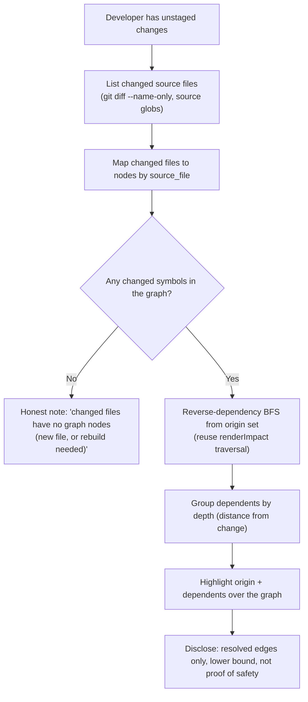

# PRD-004c: Change Impact Visualizer

> **Status:** Backlog
> **Priority:** P2
> **Effort:** L (1-3d)
> **Schema changes:** None
> **Parent:** [`prd-004-cursor-graph-visualizer-index`](./prd-004-cursor-graph-visualizer-index.md)

---

## Overview

This sub-feature answers the question every developer asks before touching shared code: "if I change this, what else could break?" The codebase graph already contains the answer, the transitive set of dependents of any symbol, and the reverse-dependency traversal that computes it is already implemented and tested as the text `impact/` endpoint (`src/graph/render/impact.ts:22-113`). What has never existed is a way to ask that question about the code the developer is *actually editing right now*, and to see the answer as a highlight over the graph rather than a text query they have to phrase by hand.

This pane closes that gap. It reads the developer's unstaged changes, maps the changed files (and the symbols within them) onto graph nodes, runs the same reverse-dependency BFS the text endpoint uses to find the blast radius, and highlights that affected neighborhood over the PRD-004a graph. The value is foresight: the ripple effects of an edit become visible before the edit is finished, so a refactor of a high-`fan_in` utility starts with a clear picture of who depends on it instead of a hopeful guess. And because the underlying traversal is honest about its limits (cross-file resolution is partial, so the result is a lower bound, `src/graph/render/impact.ts:80-82,110-112`), this pane is honest too: it shows what is provably affected and says plainly that more may be.

---

## Why this matters

The blast-radius computation is mature; what is missing is the trigger and the visualization.

1. **The traversal already exists and is honest.** `renderImpact` resolves a symbol, builds a reverse adjacency map over the fully-resolved edges, and runs a depth-bounded BFS to collect every transitive dependent, grouped by distance, with explicit lower-bound caveats (`src/graph/render/impact.ts:36-112`). It is deterministic, AST-only, and already capped for safety (`IMPACT_CAP = 80`, `MAX_DEPTH = 25`, `src/graph/render/impact.ts:18-20`). This pane reuses that logic rather than reinventing dependency analysis.
2. **The change set is knowable.** Hivemind already reasons about unstaged changes elsewhere: the SessionEnd auto-build hook gates rebuilds on `git diff --name-only` over source globs (`src/graph/last-build.ts:11-12`). The same diff identifies which files the developer is currently editing, and the snapshot's `source_file` field maps those files onto nodes (`src/graph/types.ts:99-100`).
3. **Today the connection does not exist.** A developer can run `cat memory/graph/impact/<symbol>` for one symbol they name explicitly (`src/graph/vfs-handler.ts:111-118`), but nothing watches their working tree and nothing draws the result. The information is one manual text query away, phrased per symbol, with no visual blast radius over the code they are touching. This pane makes it automatic and visual.

The result turns the graph from a description of how the code *is* into a forecast of what an in-progress change *will reach*.

---

## Goals

- Detect the developer's unstaged changes and map the changed files to graph nodes using the snapshot's `source_file` field, the same way the auto-build hook identifies dirty source (`src/graph/last-build.ts:11-12`, `src/graph/types.ts:99-100`).
- Compute the blast radius of those changed symbols by reusing the reverse-dependency BFS that powers the text `impact/` endpoint, so the visual result and the agent's text result agree (`src/graph/render/impact.ts:47-69`).
- Highlight the affected neighborhood over the PRD-004a graph: the changed nodes themselves, and their transitive dependents, distinguishable by BFS depth (distance from the change) as the text endpoint groups them (`src/graph/render/impact.ts:88-108`).
- Disclose the honesty caveat prominently: only resolved edges are traversed, so the highlighted set is a lower bound on impact, never a proof of safety (`src/graph/render/impact.ts:80-82,110-112`).
- Keep the overlay live and bounded: it updates as the working tree changes, and it respects the same safety caps (`IMPACT_CAP`, `MAX_DEPTH`) so a pathological graph cannot run the highlight away (`src/graph/render/impact.ts:18-20`).

## Non-Goals

- **Computing dependents from scratch.** The reverse-BFS traversal is owned by `src/graph/render/impact.ts`; this pane drives it and visualizes its output. It does not implement a new dependency analyzer.
- **Rebuilding the graph against dirty files.** This pane maps unstaged changes onto the existing snapshot. Re-extracting dirty files to catch brand-new symbols is an open question, not a committed goal; rebuilds route to PRD-003b.
- **Rendering the base graph or single-node navigation.** Drawing nodes/edges is PRD-004a; click-to-line and cursor-to-node are PRD-004b. This pane only adds an impact highlight layer over them.
- **Staging, committing, or any git mutation.** This pane reads the working-tree diff; it never stages, commits, or alters git state.
- **Guaranteeing completeness.** Because cross-file resolution is partial, the overlay is explicitly a lower bound. Promising "these are all the affected files" is a non-goal and would be dishonest.
- **Test-impact or runtime-coverage analysis.** The overlay reflects static graph dependents, not which tests exercise the code or what runs at execution time.

---

## From unstaged changes to a highlighted blast radius

The pipeline has three stages, each grounded in an existing mechanism.

| Stage | What happens | Reuses |
|---|---|---|
| **1. Detect the change set** | List unstaged/modified source files in the working tree. | The `git diff --name-only` over source globs the auto-build gate already uses (`src/graph/last-build.ts:11-12`). |
| **2. Map files to nodes** | For each changed file, collect the snapshot nodes whose `source_file` matches it; these are the "changed symbols" (origin set). | `GraphNode.source_file` normalization (`src/graph/types.ts:99-100`); the same file-to-node filter PRD-004b and `renderNeighborhood` use (`src/graph/render/neighborhood.ts:49-56`). |
| **3. Traverse and highlight** | Run the reverse-dependency BFS from each origin node, collect transitive dependents grouped by depth, and highlight origin + dependents over the graph. | `renderImpact`'s reverse adjacency + depth-bounded BFS (`src/graph/render/impact.ts:36-69`), within `IMPACT_CAP`/`MAX_DEPTH` (`src/graph/render/impact.ts:18-20`). |

---

## Reusing the impact traversal faithfully

The whole point is parity between what the developer sees and what the agent reads. The traversal must behave identically.

- **Reverse adjacency over resolved edges only.** `renderImpact` keeps only edges whose `source` is a real node and walks them in reverse to find dependents (`src/graph/render/impact.ts:36-45`). The overlay uses the same edge set, so a dependent in the highlight is always a real graph node, never an unresolved import placeholder.
- **Depth grouping is the visual encoding.** The text endpoint groups dependents by BFS depth (`depth 1`, `depth 2`, and so on, `src/graph/render/impact.ts:88-98`). The overlay turns depth into visual distance/intensity, so "directly affected" reads differently from "three hops away."
- **The "via" relation is available.** The traversal records which relation and source first reached each dependent (`viaOf`, `src/graph/render/impact.ts:62-63,101-102`), so the overlay can explain why a node is in the blast radius (reached via a `calls` edge from X), not just that it is.
- **Multi-origin union.** Unstaged changes usually touch several symbols across several files. The overlay runs the traversal from every origin node and unions the results, so the blast radius reflects the whole change set, not one symbol at a time.
- **Caps are preserved.** The same `IMPACT_CAP` and `MAX_DEPTH` bounds apply (`src/graph/render/impact.ts:18-20`); when the true dependent set exceeds the cap, the overlay highlights up to the cap and states the true total, exactly as the text endpoint reports "... and N more" (`src/graph/render/impact.ts:108`).

---

## The honesty caveat, made visible

This is the most important non-functional requirement of the pane, because an over-confident blast radius is worse than none.

- **Resolved edges only.** Cross-file relationships via bare (npm), aliased, barrel, or dynamic imports are not in the graph, and Python cross-file resolution is a follow-up (`src/graph/vfs-handler.ts:297-304`). The traversal therefore yields a lower bound (`src/graph/render/impact.ts:6-12,80-82`).
- **State it where the developer acts.** The overlay must carry the caveat visibly ("resolved dependents only; real impact may be larger"), echoing the text endpoint's own closing note (`src/graph/render/impact.ts:110-112`), so a small highlight is never misread as "safe to change freely."
- **An empty blast radius is not proof of dead code.** When an origin symbol has no resolved dependents, the overlay says so honestly ("no resolved dependents; not proof it is unused"), matching the text endpoint's zero-dependent message (`src/graph/render/impact.ts:79-82`) and the node-detail caveat (`src/graph/vfs-handler.ts:586-588`).
- **Stale snapshots widen the gap.** If the snapshot lags the working tree (the staleness condition PRD-004a and PRD-004b already surface, `src/graph/vfs-handler.ts:304`), the overlay notes that the impact is computed against an older graph and offers the PRD-003b rebuild.

---

## Presentation requirements

- **Origin and dependents are distinct.** The changed symbols and their dependents are visually separable, and dependents are gradated by depth (distance from the change).
- **The caveat is always present.** No blast-radius view renders without its lower-bound disclosure; the highlight never implies completeness.
- **Bounded and calm.** The overlay respects `IMPACT_CAP`/`MAX_DEPTH`, reports true totals when capped, and updates on working-tree changes without thrashing (debounced, like PRD-004b's reverse sync).
- **Explains why a node is highlighted.** On inspecting a highlighted dependent, the developer can see the relation/path by which the change reaches it (from `viaOf`).
- **Honest empty states.** "No unstaged changes," "changed files have no graph nodes yet," and "no resolved dependents" are each specific, calm messages, never a blank highlight or a crash.
- **No secret leakage.** The diff handling and Webview messages carry only file paths, node ids, relations, and depths, never tokens, API keys, or file contents beyond what is needed to identify nodes.

---

## Acceptance criteria

| ID | Criterion |
|---|---|
| AC-1 | Given the developer has unstaged changes, when the impact overlay is enabled, then the changed source files are detected via the same diff mechanism the auto-build gate uses and mapped to graph nodes by `source_file`. |
| AC-2 | Given changed symbols mapped to origin nodes, when the overlay computes impact, then it highlights the transitive dependents found by the same reverse-dependency BFS as the text `impact/` endpoint. |
| AC-3 | Given highlighted dependents, when they are rendered, then they are gradated by BFS depth so directly affected symbols are distinguishable from distant ones. |
| AC-4 | Given the overlay is shown, when any blast radius is highlighted, then a lower-bound caveat is visible stating that only resolved edges are traversed and real impact may be larger. |
| AC-5 | Given an origin symbol with no resolved dependents, when the overlay runs, then it states "no resolved dependents (not proof it is unused)" rather than implying the symbol is safe to delete. |
| AC-6 | Given a dependent set larger than `IMPACT_CAP`, when the overlay highlights, then it caps the highlight, reports the true total, and does not exceed `MAX_DEPTH`. |
| AC-7 | Given changed files that contain no nodes in the current snapshot (new file or stale graph), when the overlay runs, then it shows an honest note and offers a rebuild via PRD-003b, not a blank or erroneous highlight. |
| AC-8 | Given the developer makes further edits, when the working tree changes, then the overlay updates within a debounced interval without thrashing the graph. |
| AC-9 | Given a highlighted dependent is inspected, when its provenance is shown, then the relation and source by which the change reaches it are available (from the traversal's recorded path). |
| AC-10 | Given the diff handling and Webview messages are inspected, when their contents are examined, then only file paths, node ids, relations, and depths appear, with no token, API key, or unnecessary file content. |

---

## Open questions

- [ ] Should changed symbols be detected by mapping `git diff --name-only` files to existing nodes (fast, but blind to brand-new symbols not yet in the snapshot) or by re-extracting dirty files on the fly to catch new declarations?
- [ ] At the file granularity, should the origin set be every node in a changed file, or only the nodes overlapping the changed line ranges from the diff hunks (more precise, but requires hunk-line parsing)?
- [ ] How should the overlay treat a changed file that is entirely new (no prior nodes): show its declared symbols as origins with empty dependents, or prompt a rebuild first?
- [ ] Should the overlay also surface forward dependencies (what the changed symbol calls/imports) in addition to reverse dependents, or stay strictly blast-radius?
- [ ] What is the right default depth limit for the visual highlight (the text endpoint allows up to `MAX_DEPTH = 25`), given a deep highlight may overwhelm the canvas?
- [ ] Should the overlay auto-enable whenever unstaged changes exist, or stay an explicit toggle to avoid surprising developers mid-edit?

---

## Related

- [`prd-004-cursor-graph-visualizer-index`](./prd-004-cursor-graph-visualizer-index.md): parent module.
- [`prd-004a-graph-webview`](./prd-004a-graph-webview.md): renders the base graph and provides the highlight API this overlay drives.
- [`prd-004b-editor-sync`](./prd-004b-editor-sync.md): shares the file-to-node mapping, applied here to a set of changed files rather than a single click.
- [`../prd-003-cursor-extension-dashboard/prd-003b-settings-manager.md`](../prd-003-cursor-extension-dashboard/prd-003b-settings-manager.md): owns the rebuild the stale/new-file states route to.
- Source grounding: `src/graph/render/impact.ts:18-113` (reverse-dependency BFS, depth grouping, `viaOf` provenance, `IMPACT_CAP`/`MAX_DEPTH` caps, lower-bound caveats), `src/graph/last-build.ts:11-12` (the `git diff --name-only` source-change detection this overlay reuses), `src/graph/types.ts:99-100,149-179` (`source_file` for file-to-node mapping, edge `relation` for provenance), `src/graph/render/neighborhood.ts:49-56` (file-to-node filtering pattern), `src/graph/vfs-handler.ts:111-118,297-304,586-588` (the text `impact/` endpoint and the partial-resolution honesty caveats this overlay mirrors).
