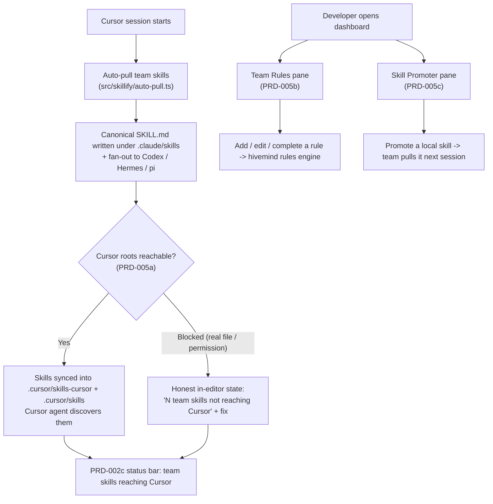

# PRD-005: Cursor-Native Skillify & Rules Bridge

> **Status:** Backlog
> **Priority:** P1
> **Effort:** XL (> 3d)
> **Schema changes:** None

---

## Overview

PRD-002 made Hivemind honest inside Cursor (a status bar that never lies, zero-friction onboarding). PRD-003 made it visible and controllable (live KPI cards, a graphical settings panel, an in-editor session viewer). PRD-004 made the codebase graph explorable (a force-directed map fused with the editor). Each stage took something Hivemind already did in the background and gave it a first-class, in-editor home. PRD-005 does the same for the two assets that make a team feel like one brain instead of many: its **shared skills** and its **shared rules**.

Hivemind already mines reusable skills from real sessions and stores them in the org `skills` table, and every agent's SessionStart hook auto-pulls them so a skill mined by a teammate at 10:01 is available to anyone who opens a session at 10:02 (`src/skillify/auto-pull.ts:1-26`). It already keeps a team-wide rules ledger that is injected into every session's context (`src/rules/read.ts:43-84`). Both engines are rich, tested, and live. But inside Cursor they are effectively invisible and, in the case of skills, partly broken: the pull machinery fans pulled skills out to Codex, Hermes, and pi, and then deliberately skips Cursor with the comment "Cursor has no native skill discovery (only hooks/rules), so it is not a candidate" (`src/skillify/agent-roots.ts:27-28`). That assumption is now wrong. Cursor's active agent discovers skills in `.cursor/skills/` (per project) and `~/.cursor/skills-cursor/` (globally), not in the `.claude/skills/` path Hivemind writes to. So a developer working in Cursor can have a perfectly healthy Hivemind, a full org `skills` table, and a successful auto-pull, and still watch their Cursor agent ignore every team skill, because the bytes landed in a directory Cursor never reads.

PRD-005 delivers the **Cursor-Native Skillify & Rules Bridge**: the stage that closes the path gap and turns both engines into visible, one-click surfaces inside the PRD-003 dashboard. It does three things. It **bridges the path gap**: pulled skills are automatically synced into Cursor's active skill directories so Cursor's agent discovers and uses them the moment they arrive, reusing the existing pull and manifest machinery rather than forking it. It **surfaces the rules ledger**: the active team-wide rules a developer is already governed by become a visible, editable list in the dashboard, with add, edit, and complete as graphical actions over the existing `hivemind rules` engine. And it **makes promotion a single click**: the skills a developer has mined locally are shown in the dashboard, and promoting one so the whole team can pull it stops being a memorized CLI incantation and becomes a button.

This index covers the module-level vision, goals, non-goals, and the three sub-features that compose it. Implementation detail lives in the sub-PRDs.

---

## The problem, from the developer's chair

A developer has onboarded (PRD-002), uses the dashboard (PRD-003), and explores the graph (PRD-004). They work in Cursor all day. The shared-brain promise around skills and rules still fails them in three distinct, compounding ways:

1. **Team skills never reach their Cursor agent.** Auto-pull runs on every session and reports success; the org `skills` table is full; the canonical SKILL.md files land under `~/.claude/skills/<name>--<author>/` and are even symlinked into Codex, Hermes, and pi roots (`src/skillify/pull.ts:579-585`, `src/skillify/agent-roots.ts:48-67`). But the fan-out explicitly excludes Cursor, and Cursor reads `.cursor/skills/` and `~/.cursor/skills-cursor/`, never `.claude/skills/`. The result is the most frustrating kind of failure: everything reports green, and nothing works. The developer's Cursor agent silently lacks every skill the team has mined.
2. **The rules they are governed by are invisible.** A team-wide rule ledger exists and is injected into each session's context up to a cap of ten (`src/rules/read.ts:36-38,83`), shaping how every agent behaves. But the developer cannot see that list without dropping to a terminal and running `hivemind rules list` (`src/commands/rules.ts:188-205`), and they cannot add, edit, or complete a rule without memorizing `hivemind rules add "..."`, `edit <uuid> "..."`, or `done <uuid>` (`src/commands/rules.ts:37-45`). The thing steering their agent is governed entirely from outside the editor.
3. **Promoting a hard-won local skill is a chore.** When a developer mines a useful skill, it defaults to `me` scope and the project install location (`src/skillify/scope-config.ts:44`), so it lives only on their machine and never reaches the team. Sharing it means knowing it exists (the only signal today is a count-only SessionStart banner, `src/skillify/local-mined-banner.ts:32-40`), then remembering the right combination of `hivemind skillify promote <name>`, `scope team`, and `install global` (`src/cli/skillify-spec.ts:53-56`). Most good local skills die on the machine that mined them because the path to sharing is invisible and manual.

Every one of these is a place where Hivemind has already done the hard work, mining, storing, auto-pulling, versioning, and stops one directory or one CLI command short of the developer actually benefiting inside Cursor. PRD-005 closes that final gap for skills and rules the same way PRD-004 closed it for the graph.

---

## Value & success themes

| Theme | What "good" feels like for the developer |
|---|---|
| **Team skills just work in Cursor** | A skill a teammate mined appears in the developer's Cursor agent automatically, with no manual copy, no symlink command, and no knowledge that `.claude/skills/` and `.cursor/skills/` are even different paths. |
| **No silent path gap** | When skills cannot be synced into Cursor's directories (a real file blocks a symlink, a read-only filesystem, a permission denial), the developer is told, in-editor, exactly which skills are not reaching their agent and why, never left with a false green. |
| **The rules steering me are visible** | The team rules that shape every session are a list the developer can read at a glance, and can add to, edit, or close, without leaving Cursor or learning a single subcommand. |
| **Sharing a skill is one click** | A locally mined skill the developer wants the team to have is promoted from a button, and the dashboard confirms it will reach teammates on their next auto-pull. |
| **One engine, one source of truth** | The bridge reads and writes the same org `skills` table, the same `hivemind_rules` ledger, the same pull manifest, and the same canonical config the CLI uses, so the editor, the terminal, and every other agent never disagree about which skills and rules exist. |

---

## Goals

- A developer's pulled team skills are automatically synced into Cursor's active skill directories (`~/.cursor/skills-cursor/` for global pulls, `<project>/.cursor/skills/` for project pulls) so Cursor's agent discovers and uses them without any manual action, reusing the existing pull and manifest machinery (`src/skillify/pull.ts`, `src/skillify/manifest.ts`) rather than a parallel writer.
- The bridge runs as part of the same SessionStart auto-pull that already keeps skills fresh (`src/skillify/auto-pull.ts:75-145`), and is idempotent, bounded, and failure-swallowing on that hot path exactly as the existing pull is, so a Cursor session never blocks or breaks because of a sync attempt.
- Any skill that cannot be synced into Cursor's directories is surfaced as a specific, actionable in-editor state, not a swallowed log line, and the PRD-002c status bar reflects whether the team's skills are actually reaching the Cursor agent.
- The active team-wide rules ledger is rendered as a list in the PRD-003 dashboard, drawn from the same `listRules` reader the CLI uses (`src/rules/read.ts:52-84`), and a developer can add, edit, and complete rules graphically through the same `insertRule` / `editRule` / `markRuleDone` writers (`src/rules/write.ts:84-151`).
- Locally mined skills are shown in the dashboard from the same skillify state the CLI reports (`src/commands/skillify.ts:45-96`), and a developer can promote a chosen skill so the team can pull it, through the existing promotion and scope machinery (`src/commands/skillify.ts:122`, `src/skillify/scope-config.ts`), with one click.
- Every surface degrades gracefully: a fresh install with no pulled skills, no rules, and no locally mined skills renders a coherent empty state with guidance, never a crash or a blank pane, matching the never-throw posture of the data and pull layers.

## Non-Goals

- **Changing how skills are mined or how rules are authored by agents.** The skillify worker (`src/skillify/skillify-worker.ts`), the local miner (`src/commands/mine-local.ts`), and the SessionStart rule injection (`src/hooks/shared/context-renderer.ts`) are upstream and unchanged. PRD-005 syncs, surfaces, and promotes; it does not re-author the engines.
- **Replacing the `hivemind` CLI as the engine.** The CLI and its modules remain the source of truth for pull, unpull, promote, scope, and rules CRUD. The bridge is a graphical and path-level front-end that calls into and reflects those capabilities.
- **Reworking the cross-agent fan-out for Codex, Hermes, and pi.** Those roots already receive skills correctly (`src/skillify/agent-roots.ts:48-67`). PRD-005 adds Cursor as a destination; it does not redesign how the other agents are served.
- **Designing a new rules data model or scope model.** Rules stay `team`-scoped, append-only, version-bumped, and capped at the existing injection limit (`src/rules/write.ts:84-114`, `src/rules/read.ts:36-38`). Skill scope stays `me | team` with `project | global` install (`src/skillify/scope-config.ts:23-35`). PRD-005 surfaces these; it does not change their semantics.
- **A full skill editor or rules-history browser.** Editing a SKILL.md body in-editor, browsing every historical version of a rule, or resolving merge conflicts visually are later concerns. PRD-005 lists, syncs, adds, edits, completes, and promotes.
- **A VS Code (non-Cursor) release.** The target surface is Cursor 1.7+, matching PRD-002, PRD-003, and PRD-004. The path bridge is, by definition, Cursor-specific.

---

## Sub-features

| Sub-PRD | Scope | Status |
|---|---|---|
| [`prd-005a-skillify-bridge`](./prd-005a-skillify-bridge.md) | The Skillify Path Bridge: automatically sync or symlink pulled skills into Cursor's active skill directories (`~/.cursor/skills-cursor/`, `<project>/.cursor/skills/`) so Cursor's agent discovers them, reusing the existing pull fan-out and manifest, with honest reporting of any skill that cannot be synced. | Backlog |
| [`prd-005b-rules-manager`](./prd-005b-rules-manager.md) | The Team Rules Manager: render the active team-wide rules ledger in the dashboard and let a developer add, edit, and complete rules graphically over the existing `hivemind rules` engine. | Backlog |
| [`prd-005c-skill-promoter`](./prd-005c-skill-promoter.md) | The Interactive Skill Promoter: show locally mined skills in the dashboard and let a developer promote a chosen skill to the team in one click, reflecting the result back to the auto-pull loop. | Backlog |

---

## The bridge journey (module-level)

The three sub-features compose into one continuous experience. The path bridge runs both on the SessionStart hot path and on demand from the dashboard; the rules manager and skill promoter are panes in the PRD-003 Webview shell, siblings to the KPI, settings, session, and graph views.

The defining property carried from PRD-002 through PRD-004: **the surface never leaves the developer guessing.** Where the legacy path would silently land skills in a directory Cursor ignores, or force a CLI command to see or change a rule, the bridge syncs automatically, shows the rules plainly, and is honest the moment a skill cannot reach the Cursor agent.

---

## Personas

| Persona | Context | What PRD-005 gives them |
|---|---|---|
| **The Cursor-native teammate (Dana)** | Works entirely in Cursor; expects team skills to "just be there." | Pulled team skills appear in her Cursor agent automatically, with no knowledge that `.claude/skills/` and `.cursor/skills/` differ. |
| **The blocked-sync developer (Sam)** | Has a real file sitting where a Cursor skill symlink should go, so a skill silently never syncs. | A specific in-editor message naming the skills that are not reaching Cursor and the conflict to resolve, instead of a false green. |
| **The rule-curious developer (Priya)** | Wonders why her agent keeps following a convention she did not set. | A visible list of the active team rules steering every session, readable at a glance in the dashboard. |
| **The rule author (Marco)** | Wants to add a team convention and close a stale one, hates CLI UUIDs. | Add, edit, and complete rules from the dashboard, no `hivemind rules edit <uuid>` to memorize. |
| **The skill sharer (Lee)** | Mined a genuinely useful skill locally; it is stuck on his machine. | His locally mined skills listed in the dashboard with a one-click promote that puts the skill in the team's reach on their next auto-pull. |

---

## Acceptance criteria (module-level)

| ID | Criterion |
|---|---|
| AC-1 | Given a developer working in Cursor with pulled team skills, when the bridge runs, then those skills are present in Cursor's active skill directories (`~/.cursor/skills-cursor/` for global, `<project>/.cursor/skills/` for project) so Cursor's agent can discover them, without any manual action. |
| AC-2 | Given the bridge runs as part of SessionStart auto-pull, when it executes, then it is idempotent, bounded by the same timeout budget as the existing pull, and swallows all failures so the Cursor session never blocks or breaks. |
| AC-3 | Given a real file or directory already occupies a Cursor skill path, or a permission/read-only error prevents a sync, when the bridge runs, then the affected skills are reported as not reaching the Cursor agent (never silently dropped) and the PRD-002c status bar reflects a non-green skill-sync state. |
| AC-4 | Given the dashboard is open, when the developer opens the Team Rules pane, then the active team-wide rules render as a list drawn from the same `listRules` reader the CLI uses, newest-first and capped consistently with the SessionStart injection. |
| AC-5 | Given the Team Rules pane, when the developer adds, edits, or completes a rule, then the change is written through the existing `insertRule` / `editRule` / `markRuleDone` engine (append-only, version-bumped) and the list reflects it without a CLI command. |
| AC-6 | Given the dashboard is open, when the developer opens the Skill Promoter pane, then their locally mined skills render from the same skillify state the CLI reports, distinguishing skills already shared with the team from those still local-only. |
| AC-7 | Given a local-only mined skill, when the developer promotes it with one click, then it is shared through the existing promotion and scope machinery so teammates pull it on their next auto-pull, and the pane reflects the new shared state. |
| AC-8 | Given a fresh install with no pulled skills, no rules, and no locally mined skills, when any PRD-005 surface renders, then it shows a coherent empty state with guidance, never a crash or a blank pane. |
| AC-9 | Given any PRD-005 surface, its serialized Webview payload, or its logs are inspected, when their contents are examined, then no token or API key value appears anywhere (defers to PRD-002b secrets rules). |

---

## How PRD-005 reuses what already exists (cross-cutting)

PRD-005's central discipline, inherited from PRD-004, is consumption, not reinvention. Every new capability maps to an engine the codebase already ships. This table is the contract the sub-PRDs inherit.

| New capability | Existing artifact it consumes | Source |
|---|---|---|
| Pulling team skills to local disk | `runPull` (query org table, write canonical SKILL.md, decide write/skip by version) | `src/skillify/pull.ts:456-641` |
| Fanning a pulled skill out to other agents | `fanOutSymlinks` + `detectAgentSkillsRoots` (the pattern Cursor is added to) | `src/skillify/pull.ts:216-251`, `src/skillify/agent-roots.ts:48-84` |
| Tracking what was pulled and reversing it | The pull manifest (`PulledEntry.symlinks`, `recordPull`, `unlinkSymlinks`, `pruneOrphanedEntries`) | `src/skillify/manifest.ts:26-251` |
| Keeping skills fresh on every session | The SessionStart auto-pull (bounded, idempotent, failure-swallowing, opt-out) | `src/skillify/auto-pull.ts:75-145` |
| Reading the active team rules | `listRules` (latest-per-rule_id, status filter, newest-first, limit) | `src/rules/read.ts:52-84` |
| Adding / editing / completing a rule | `insertRule` / `editRule` / `markRuleDone` (append-only, version-bumped) | `src/rules/write.ts:84-151` |
| Listing locally mined skills | The skillify per-project state (`skillsGenerated[]`) and scope/install config | `src/commands/skillify.ts:45-96`, `src/skillify/scope-config.ts:46-68` |
| Promoting a skill to the team | `promoteSkill` (project to global) + scope promotion to the org table | `src/commands/skillify.ts:122`, `src/skillify/scope-promotion.ts:34-41`, `src/skillify/skill-org-publish.ts:108-142` |

---

## Cross-cutting requirements

- **One engine, one source of truth.** The bridge consumes the same org `skills` table, `hivemind_rules` ledger, pull manifest, and canonical config the CLI uses. It maintains no competing store of skills, rules, or pull state.
- **Hot-path safety.** The path bridge inherits the auto-pull contract: bounded by the same timeout budget, idempotent across repeated runs, and all-failures-swallowed so a SessionStart never blocks or fails because of a sync (`src/skillify/auto-pull.ts:10-26`). The opt-out `HIVEMIND_AUTOPULL_DISABLED=1` continues to disable the whole loop.
- **Never clobber user data.** Syncing into Cursor's directories reuses the fan-out's refusal posture: a real (non-symlink) file or directory at a target path is never overwritten; the conflict is reported, not resolved by force (`src/skillify/pull.ts:226-231`).
- **Honesty over optimism.** A skill that cannot reach the Cursor agent is shown as exactly that, never folded into a green "synced" state. The status bar and dashboard never claim the Cursor agent has skills it cannot actually discover.
- **Idempotent writes.** Rule edits reuse the append-only version-bump engine and are safe to repeat; skill syncs reuse the `lstat`-checked, `sameSorted`-skipped symlink machinery and rewrite nothing when the on-disk state already matches (`src/skillify/pull.ts:282-307`).
- **No secret leakage.** No PRD-005 surface, serialized payload, or log renders tokens or API keys; the skills and rules paths are content-only (defers to PRD-002b secrets rules).
- **Lifecycle coherence.** Skill-sync state is reflected consistently by the PRD-002c status bar and the dashboard, and refreshes when an auto-pull or a manual sync runs, so the surfaces never disagree about whether the team's skills are reaching the Cursor agent.

---

## Open questions

- [ ] Should the Cursor sync use symlinks (matching the existing fan-out to Codex/Hermes/pi, `src/skillify/pull.ts:216-251`) or file copies, given Cursor's skill loader behavior on symlinked directories and the Windows non-developer-mode symlink restriction the fan-out already tolerates (`src/skillify/pull.ts:244-248`)?
- [ ] Is `~/.cursor/skills-cursor/` the correct global Cursor skill root and `<project>/.cursor/skills/` the correct project root for the target Cursor version, and should the bridge detect Cursor's presence by a marker directory the way `detectAgentSkillsRoots` detects Codex/Hermes/pi (`src/skillify/agent-roots.ts:48-67`)?
- [ ] Should adding Cursor be a new entry in `detectAgentSkillsRoots` (so it flows through `fanOutSymlinks` and the manifest automatically) or a dedicated Cursor bridge step, given the agent-roots module documents the deliberate Cursor exclusion that must be reversed (`src/skillify/agent-roots.ts:27-28`)?
- [ ] For project-scoped Cursor skills, how does the bridge know the active project root inside a Cursor Webview, and should project syncs target the workspace folder Cursor currently has open rather than `process.cwd()`?
- [ ] Should the rules manager allow editing a rule's text inline (one `editRule` per save) or batch edits, given each save appends a new version row and a chatty editor could inflate the append-only table (`src/rules/write.ts:161-192`)?
- [ ] The `hivemind skillify promote` command moves a skill project to global on the local filesystem (`src/commands/skillify.ts:122`); reaching the team additionally requires the skill to be authored or republished at `team` scope on the org table (`src/skillify/skill-org-publish.ts:108-142`). Should the one-click promoter do both in sequence, and how should it communicate the two-step nature honestly?
- [ ] Should the Team Rules and Skill Promoter panes be tabs in the single PRD-003 dashboard Webview (alongside KPI, settings, session, and graph) or a dedicated "Team" Webview, given they are write surfaces with different refresh cadences than the read-heavy KPI and graph panes?

---

## Related

- [`prd-005a-skillify-bridge`](./prd-005a-skillify-bridge.md): the Cursor path bridge for pulled skills.
- [`prd-005b-rules-manager`](./prd-005b-rules-manager.md): the graphical team rules manager.
- [`prd-005c-skill-promoter`](./prd-005c-skill-promoter.md): the interactive skill promoter.
- [`../prd-002-cursor-extension-core/prd-002-cursor-extension-core-index.md`](../prd-002-cursor-extension-core/prd-002-cursor-extension-core-index.md): the Stage 2 core (health, auth, status bar) this bridge integrates with.
- [`../prd-002-cursor-extension-core/prd-002a-health-check.md`](../prd-002-cursor-extension-core/prd-002a-health-check.md): the health check the skill-sync state extends and re-triggers.
- [`../prd-002-cursor-extension-core/prd-002c-status-bar.md`](../prd-002-cursor-extension-core/prd-002c-status-bar.md): the status bar that reflects whether team skills are reaching the Cursor agent.
- [`../prd-003-cursor-extension-dashboard/prd-003-cursor-extension-dashboard-index.md`](../prd-003-cursor-extension-dashboard/prd-003-cursor-extension-dashboard-index.md): the Stage 3 dashboard whose Webview shell hosts the rules and promoter panes.
- [`../prd-003-cursor-extension-dashboard/prd-003a-kpi-webview.md`](../prd-003-cursor-extension-dashboard/prd-003a-kpi-webview.md): the Webview shell and the "skills created" KPI this stage complements.
- [`../prd-003-cursor-extension-dashboard/prd-003b-settings-manager.md`](../prd-003-cursor-extension-dashboard/prd-003b-settings-manager.md): the settings manager whose canonical-config and re-health pattern the bridge's sync toggle follows.
- [`../prd-004-cursor-graph-visualizer/prd-004-cursor-graph-visualizer-index.md`](../prd-004-cursor-graph-visualizer/prd-004-cursor-graph-visualizer-index.md): the sibling Stage 4 view sharing the same Webview shell and reuse discipline.
- [`../../../knowledge/private/standards/documentation-framework.md`](../../../knowledge/private/standards/documentation-framework.md): documentation standards this PRD conforms to.
- Source grounding: `src/skillify/pull.ts:216-641` (pull, fan-out, backfill), `src/skillify/agent-roots.ts:27-84` (the deliberate Cursor exclusion this bridge reverses), `src/skillify/auto-pull.ts:75-145` (SessionStart auto-pull this bridge rides), `src/skillify/manifest.ts:26-251` (pull manifest and symlink reversal), `src/skillify/scope-config.ts:23-74` (scope/install config), `src/skillify/scope-promotion.ts:34-41` (me to team promotion), `src/skillify/skill-org-publish.ts:108-142` (republish to org table), `src/commands/skillify.ts:45-122` (status + promote), `src/commands/rules.ts:145-255` (rules CLI), `src/rules/read.ts:52-84` (`listRules`), `src/rules/write.ts:84-151` (`insertRule`/`editRule`/`markRuleDone`), `src/skillify/local-mined-banner.ts:32-40` (the count-only local-skill signal this stage replaces visually).
