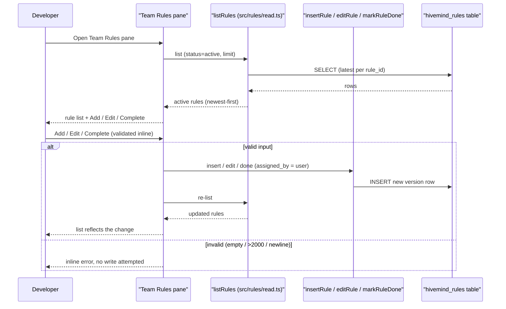

# PRD-005b: Team Rules Manager

> **Status:** Backlog
> **Priority:** P2
> **Effort:** L (1-3d)
> **Schema changes:** None
> **Parent:** [`prd-005-cursor-skillify-bridge-index`](./prd-005-cursor-skillify-bridge-index.md)

---

## Overview

This sub-feature surfaces the team-wide rules ledger inside the dashboard and turns it into a graphical surface a developer can read and edit. Hivemind already keeps a `hivemind_rules` table: an append-only, version-bumped ledger where each edit appends a fresh row and reads take the latest version per `rule_id` (`src/rules/read.ts:1-13`). The active rules are injected into every session's context, capped at ten and newest-first, so they actively steer how each agent behaves (`src/rules/read.ts:36-38,80-83`). The engine is complete: `listRules` reads, and `insertRule`, `editRule`, and `markRuleDone` write (`src/rules/write.ts:84-151`). The only surface today is the CLI: `hivemind rules list`, `add`, `edit <uuid>`, `done <uuid>` (`src/commands/rules.ts:37-45`).

The result is that the rules governing a developer's every session are invisible to them inside Cursor, and changing one means dropping to a terminal and copy-pasting a 36-character UUID into an `edit` or `done` command (`src/commands/rules.ts:133-143`). This sub-feature renders the active ledger as a list in the PRD-003 dashboard Webview and exposes add, edit, and complete as graphical actions over the unchanged engine, so a developer can see exactly what conventions are shaping their agents and curate them without leaving the editor.

The value is legibility and control of the thing steering the team's agents. A rule is no longer an invisible force a developer stumbles into; it is a visible, editable line in a list they own.

---

## Why this matters: the invisible governor

Rules are not passive notes. They are injected into the model-visible context at the start of every session, deduplicated to the latest version per rule and capped:

```52:84:src/rules/read.ts
export async function listRules(
  query: QueryFn,
  tableName: string,
  opts: ListRulesOpts = {},
): Promise<RuleRow[]> {
  const safe = sqlIdent(tableName);
  const rows = await query(
    `SELECT ${SELECT_COLS} FROM "${safe}" ORDER BY version DESC, created_at DESC, id DESC`,
  );

  const latest = new Map<string, RuleRow>();
  for (const r of rows) {
    const row = normalize(r);
    if (!row) continue;
    if (!latest.has(row.rule_id)) latest.set(row.rule_id, row);
  }

  const statusFilter = opts.status ?? "active";
  const filtered = [...latest.values()].filter(r =>
    statusFilter === "all" ? true : r.status === statusFilter,
  );

  filtered.sort(
    (a, b) => b.created_at.localeCompare(a.created_at) || b.id.localeCompare(a.id),
  );
  return filtered.slice(0, opts.limit ?? 10);
}
```

Writes are append-only by design, because the Deeplake backend coalesces rapid UPDATEs on the same row; every edit inserts a new version instead (`src/rules/write.ts:1-11,121-137`). The CLI is the only way to drive any of this today, and it requires the full UUID because edit and done do an exact-match select on `rule_id` (`src/commands/rules.ts:133-143`). This sub-feature gives the same engine a face: the list a developer can see, and the buttons that call the same writers without a UUID ever touching their clipboard.

---

## Goals

- Render the active team-wide rules as a list in the PRD-003 dashboard Webview, drawn from the same `listRules` reader the CLI uses, newest-first and consistent with the SessionStart injection cap so a developer sees what the agent actually sees (`src/rules/read.ts:52-84`).
- Let a developer add a new rule from the dashboard, writing through `insertRule` with their identity as `assigned_by` and the plugin version stamped, exactly as the CLI `add` path does (`src/commands/rules.ts:174-180`, `src/rules/write.ts:84-114`).
- Let a developer edit a rule's text from the dashboard, writing through `editRule` so a new version row is appended and the `rule_id` is preserved, with no UUID handling required of the developer (`src/rules/write.ts:121-137`).
- Let a developer mark a rule complete from the dashboard, writing through `markRuleDone` so an audit-trail version row is appended (`src/rules/write.ts:145-151`).
- Enforce the engine's input contract in the UI: the 2000-character cap and the no-newlines rule (one rule per line, a prompt-injection defense) are surfaced as inline validation before a write is attempted (`src/rules/write.ts:51-77`).
- Offer a status filter (active, done, all) and a coherent empty state, matching the CLI's `--status` and "(no rules ...)" behavior (`src/commands/rules.ts:188-205`).

## Non-Goals

- **Changing the rules data model or scope.** Rules stay `team`-scoped, append-only, and version-bumped. v1 hardcodes scope to `team` (`src/rules/write.ts:104`, `src/commands/rules.ts:75-85`); this sub-feature does not introduce per-rule scoping or a new schema.
- **Changing how rules are injected into sessions.** The SessionStart renderer and its cap are upstream (`src/hooks/shared/context-renderer.ts`, `src/rules/read.ts:36-38`). This sub-feature surfaces and edits the ledger; it does not change what gets injected or how.
- **A full version-history browser.** Each edit appends a version row, but browsing or diffing the full history of a rule is out of scope. This sub-feature shows the latest version per rule, matching `listRules`.
- **Relaxing the input constraints.** The 2000-character cap and newline rejection are defense-in-depth against prompt injection (`src/rules/write.ts:65-77`); the UI enforces them and never bypasses them.
- **Authoring the Webview shell.** The shell, theming, and refresh lifecycle are PRD-003a's. This pane lives inside that shell; it does not re-implement it.

---

## The rule list and its actions

The pane is a list of rule rows plus three actions. Each action maps one-to-one to an existing engine function, so the pane introduces no new write logic.

| UI element | Reads / writes | Engine function | Notes |
|---|---|---|---|
| Rule list (active by default) | Reads | `listRules(query, tableName, { status, limit })` | Newest-first, latest-per-`rule_id`, capped consistently with the injection limit (`src/rules/read.ts:80-83`). |
| Per-row metadata | Reads | `RuleRow` fields | Shows `text`, `assigned_by`, `version`, and `status`; the `rule_id` is held internally for edit/done, never shown as a thing to copy. |
| Status filter | Reads | `ListRulesOpts.status` (`active \| done \| all`) | Mirrors the CLI `--status` flag (`src/commands/rules.ts:87-95`). |
| Add rule | Writes | `insertRule({ text, assigned_by, plugin_version })` | `assigned_by` is the logged-in user; scope is hardcoded `team`; status starts `active` (`src/rules/write.ts:84-114`). |
| Edit rule text | Writes | `editRule({ rule_id, text, assigned_by, plugin_version })` | Appends version+1, preserves `rule_id`; the developer edits text, never the UUID (`src/rules/write.ts:121-137`). |
| Complete rule | Writes | `markRuleDone({ rule_id, assigned_by, plugin_version })` | Appends a `done` version row; safe to re-complete (audit trail) (`src/rules/write.ts:145-151`). |

After any write, the pane re-runs `listRules` so the list reflects the new state without a CLI command, matching the dashboard's never-leave-the-developer-guessing posture.

---

## Input validation surfaced inline

The engine rejects two classes of input, and the pane must enforce both before a write so the developer sees a clear inline error rather than a failed write:

```65:77:src/rules/write.ts
function assertValidText(text: string): void {
  if (text.length === 0) throw new Error("Rule text must not be empty");
  if (text.length > MAX_TEXT_LENGTH) {
    throw new Error(`Rule text exceeds ${MAX_TEXT_LENGTH} chars (got ${text.length})`);
  }
  if (/[\r\n\u2028\u2029\u0085]/.test(text)) {
    throw new Error("Rule text must not contain newlines (use one rule per line)");
  }
}
```

1. **Length cap.** The editor shows a live character count against the 2000-character ceiling and blocks submission past it (`MAX_TEXT_LENGTH`, `src/rules/write.ts:51,67-69`).
2. **No newlines.** The input rejects carriage returns, line feeds, and the Unicode line separators the engine guards against, with the engine's own guidance ("use one rule per line"). This is a prompt-injection defense, not a cosmetic rule, so the UI never strips-and-submits silently (`src/rules/write.ts:70-76`).
3. **Non-empty.** Empty text is blocked with the same message the engine would raise.

---

## The pane's data flow



---

## Presentation requirements

- **Native-feeling and readable.** The pane respects Cursor's theme and editor tokens and reads as a first-party surface, consistent with PRD-003a's presentation requirements.
- **No UUID handling.** The developer acts on a rule by its row, never by copy-pasting a UUID; the `rule_id` is internal plumbing (contrast the CLI, which prints the full UUID precisely because edit/done need it, `src/commands/rules.ts:133-143`).
- **Honest empty and not-logged-in states.** No rules renders a coherent empty state; not being logged in surfaces the same guidance the CLI gives ("Not logged in. Run `hivemind login`," `src/commands/rules.ts:56-62`) rather than a blank or broken pane. A legacy install whose rules table does not exist yet renders as an empty list, matching the CLI's missing-table tolerance (`src/commands/rules.ts:194-198`).
- **Optimistic but truthful.** A write shows an in-flight state and reconciles against a fresh `listRules` on completion; a failed write surfaces the engine's error message and leaves the list unchanged.
- **No secret leakage.** The serialized pane payload and any logs show rule text and author name only, never tokens or API keys (defers to PRD-002b).
- **Accessible.** The list is keyboard-navigable and each action is reachable without a pointer; status is conveyed by label, not color alone.

---

## Acceptance criteria

| ID | Criterion |
|---|---|
| AC-1 | Given a logged-in developer, when the Team Rules pane opens, then the active rules render newest-first from `listRules`, capped consistently with the SessionStart injection limit. |
| AC-2 | Given the pane, when the developer adds a rule, then `insertRule` is called with their identity as `assigned_by` and a `team` scope, and the new rule appears in the list without a CLI command. |
| AC-3 | Given an existing rule, when the developer edits its text, then `editRule` appends a new version row, preserves the `rule_id`, and the list shows the updated text and bumped version. |
| AC-4 | Given an existing rule, when the developer marks it complete, then `markRuleDone` appends a `done` version row and the rule leaves the active list (and appears under the done filter). |
| AC-5 | Given the developer types rule text exceeding 2000 characters or containing a newline, when they attempt to submit, then the pane blocks the write and shows an inline error matching the engine's contract. |
| AC-6 | Given the status filter, when the developer selects active, done, or all, then the list reflects that filter, mirroring the CLI `--status` behavior. |
| AC-7 | Given no rules exist (or a legacy install with no rules table), when the pane renders, then it shows a coherent empty state, not a crash or a blank pane. |
| AC-8 | Given the developer is not logged in, when the pane renders, then it surfaces the same login guidance the CLI gives rather than failing silently. |
| AC-9 | Given the pane payload or logs are inspected, when their contents are examined, then no token or API key value appears, and rules are shown by text and author name only. |

---

## Open questions

- [ ] Should rule editing be inline-per-save (one `editRule` per edit, simplest and matching the CLI) or batched, given each save appends a version row and a chatty editor could inflate the append-only table (`src/rules/write.ts:161-192`)?
- [ ] Should the pane expose the `--limit` control the CLI has (`src/commands/rules.ts:97-108`), or always show the injection-cap default of ten so the developer sees exactly what the agent sees (`src/rules/read.ts:83`)?
- [ ] When a developer edits a rule another teammate also edited (a racing version bump), how should the pane present the resulting two-rows-at-same-version case the readers already tie-break deterministically (`src/rules/read.ts:98-104`)?
- [ ] Should completed rules be hideable/restorable from the pane (re-activating a done rule via `editRule` with status active), or is completion treated as terminal in the UI even though the engine allows re-opening?
- [ ] Should the pane visually mark which rules are currently being injected (the top-ten newest-first) versus active-but-below-the-cap rules, so a developer understands why a low-priority active rule may not be steering sessions?

---

## Related

- [`prd-005-cursor-skillify-bridge-index`](./prd-005-cursor-skillify-bridge-index.md): parent module.
- [`prd-005c-skill-promoter`](./prd-005c-skill-promoter.md): the sibling write surface in the same "Team" area of the dashboard.
- [`../prd-003-cursor-extension-dashboard/prd-003a-kpi-webview.md`](../prd-003-cursor-extension-dashboard/prd-003a-kpi-webview.md): the Webview shell this pane lives in.
- [`../prd-003-cursor-extension-dashboard/prd-003b-settings-manager.md`](../prd-003-cursor-extension-dashboard/prd-003b-settings-manager.md): the sibling settings surface whose write-then-reflect pattern this pane follows.
- [`../prd-002-cursor-extension-core/prd-002b-auth-secrets.md`](../prd-002-cursor-extension-core/prd-002b-auth-secrets.md): owns the login state and identity (`assigned_by`) this pane's writes depend on.
- Source grounding: `src/rules/read.ts:19-139` (`RuleRow`, `listRules`, `getRuleLatest`, normalization), `src/rules/write.ts:51-195` (`assertValidText`, `insertRule`, `editRule`, `markRuleDone`, the append-only rationale), `src/commands/rules.ts:37-255` (the CLI surface this pane supersedes in-editor, including the UUID-copy ergonomics it removes), `src/rules/index.ts:1-19` (the stable barrel the pane imports from).
